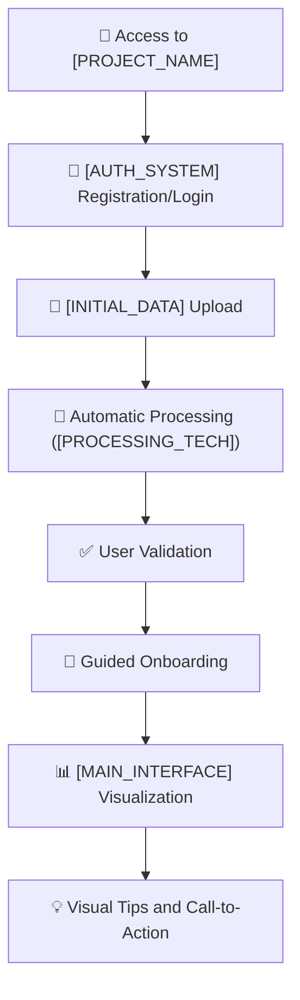
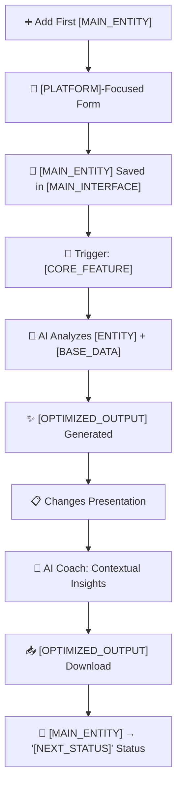
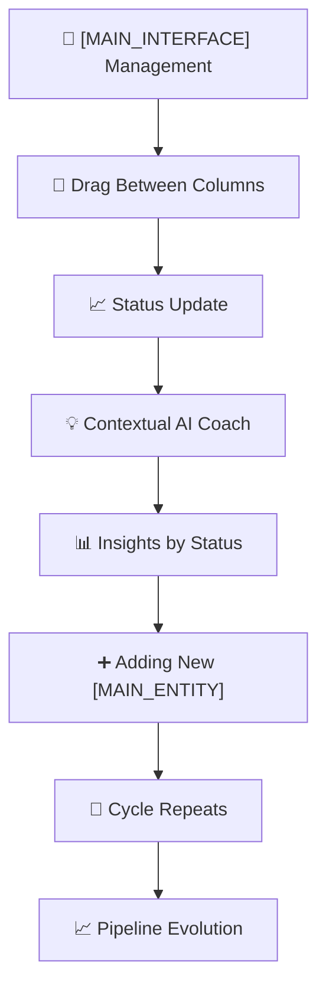
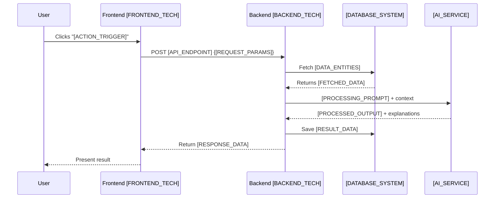

# User Story: Complete MVP Journey - Wizard-Style

**Version**: [VERSION]  
**Creation Date**: [CREATION_DATE]  
**Based on**: [REFERENCE_DOCUMENTS]  
**Strategic Context**: [STRATEGIC_CONTEXT]

## 📋 Executive Summary

This document defines the **complete user journey** in [PROJECT_NAME] MVP, using a **wizard-style** approach with initial focus on **[FOCUS_PLATFORM]**. The journey is structured in **micro-value cycles** that guide the user from first access to the **"AHA! Moment"** - [AHA_MOMENT_DESCRIPTION].

### 🎯 Journey Objective
- **Guide the user** through core functionalities
- **Maximize perceived value** at each step
- **Reduce friction** in onboarding and first interactions
- **Validate value proposition** through the "AHA! Moment"

---

## 🗺️ Complete Journey Mapping

### **Micro-Cycle 1: Foundation & Onboarding**



**Estimated Duration**: 3-5 minutes  
**Value Delivered**: Account created, base resume processed, interface understanding

#### Acceptance Criteria - Micro-Cycle 1:
- [ ] **AC-MC1-001**: User can register/login via [AUTH_SYSTEM] in less than [TIME_LIMIT] minutes
- [ ] **AC-MC1-002**: [DATA_TYPE] upload accepts [SUPPORTED_FORMATS] formats (maximum [FILE_SIZE]MB)
- [ ] **AC-MC1-003**: Processing extracts at least: [REQUIRED_FIELDS]
- [ ] **AC-MC1-004**: User can edit/correct extracted information before confirming
- [ ] **AC-MC1-005**: Onboarding presents product value in maximum [MAX_SCREENS] screens
- [ ] **AC-MC1-006**: Empty [MAIN_INTERFACE] shows visual tips to add first [MAIN_ENTITY]

---

### **Micro-Cycle 2: First [MAIN_ENTITY] & AHA! Moment**



**Estimated Duration**: [DURATION] minutes  
**Value Delivered**: **AHA! MOMENT** - [AHA_MOMENT_DESCRIPTION]

#### Acceptance Criteria - Micro-Cycle 2:
- [ ] **AC-MC2-001**: [MAIN_ENTITY] form captures: [REQUIRED_FORM_FIELDS]
- [ ] **AC-MC2-002**: [MAIN_ENTITY] is automatically added to "[INITIAL_STATUS]" column in [MAIN_INTERFACE]
- [ ] **AC-MC2-003**: [CORE_FEATURE] happens in less than [PROCESSING_TIME] seconds
- [ ] **AC-MC2-004**: System clearly presents changes made to [OUTPUT] (visual diff)
- [ ] **AC-MC2-005**: AI Coach provides at least [MIN_INSIGHTS] relevant insights about [ENTITY]/[PROCESS]
- [ ] **AC-MC2-006**: [OPTIMIZED_OUTPUT] maintains [QUALITY_STANDARDS] and is downloadable as [OUTPUT_FORMAT]
- [ ] **AC-MC2-007**: User can move [MAIN_ENTITY] to "[NEXT_STATUS]" with one click

---

### **Micro-Cycle 3: Follow-up & Evolution**



**Estimated Duration**: Continuous  
**Value Delivered**: Organized tracking, continuous insights, pipeline growth

#### Acceptance Criteria - Micro-Cycle 3:
- [ ] **AC-MC3-001**: [MAIN_INTERFACE] allows drag-and-drop between columns: [STATUS_FLOW]
- [ ] **AC-MC3-002**: AI Coach provides contextual messages based on [MAIN_ENTITY] status
- [ ] **AC-MC3-003**: System suggests actions based on time in each status
- [ ] **AC-MC3-004**: User can add notes/comments to each [MAIN_ENTITY]
- [ ] **AC-MC3-005**: Dashboard shows basic metrics: [KEY_METRICS]

---

## 🎯 Prioritized Features (Framework Applied)

### **Prioritization Matrix - Strategic Analysis Result**

| Feature | User Impact | Dev Effort | Dependencies | Technical Risk | **Total Score** | **Priority** |
|---|---|---|---|---|---|---|
| **[FEATURE_1]** ⭐ | [IMPACT_1] | [EFFORT_1] | [DEPS_1] | [RISK_1] | **[SCORE_1]** | **P0 - CORE** |
| **[FEATURE_2]** | [IMPACT_2] | [EFFORT_2] | [DEPS_2] | [RISK_2] | **[SCORE_2]** | **P0 - CORE** |
| **[FEATURE_3]** | [IMPACT_3] | [EFFORT_3] | [DEPS_3] | [RISK_3] | **[SCORE_3]** | **P1 - High** |
| **[FEATURE_4]** | [IMPACT_4] | [EFFORT_4] | [DEPS_4] | [RISK_4] | **[SCORE_4]** | **P1 - High** |
| **[FEATURE_5]** | [IMPACT_5] | [EFFORT_5] | [DEPS_5] | [RISK_5] | **[SCORE_5]** | **P2 - Medium** |
| **[FEATURE_6]** | [IMPACT_6] | [EFFORT_6] | [DEPS_6] | [RISK_6] | **[SCORE_6]** | **P2 - Medium** |
| **[FEATURE_7]** | [IMPACT_7] | [EFFORT_7] | [DEPS_7] | [RISK_7] | **[SCORE_7]** | **P3 - Low** |

**Note**: Score calculated as: (Impact × 2) + (6 - Effort) + (6 - Dependencies) + (6 - Risk)

---

## 📱 Interface Specification ([PLATFORM]-Focused)

### **[MAIN_ENTITY] Form - Essential Fields**

```yaml
Required_Fields:
  - [FIELD_1]: [TYPE_1] ([VALIDATION_1])
  - [FIELD_2]: [TYPE_2] ([VALIDATION_2])
  - [FIELD_3]: [TYPE_3] ([VALIDATION_3])
  
Optional_Fields:
  - [OPTIONAL_FIELD_1]: [TYPE_4] ([VALIDATION_4])
  - [OPTIONAL_FIELD_2]: [TYPE_5]
  - [OPTIONAL_FIELD_3]: [TYPE_6]
  - [OPTIONAL_FIELD_4]: [TYPE_7] ([VALIDATION_5])
  - [OPTIONAL_FIELD_5]: [TYPE_8] ([VALIDATION_6])
  
Automatic_Fields:
  - date_added: timestamp
  - initial_status: "[INITIAL_STATUS]"
  - user_id: foreign_key
```

### **[MAIN_INTERFACE] Columns**

1. **"[STATUS_1]"** - [STATUS_1_DESCRIPTION]
2. **"[STATUS_2]"** - [STATUS_2_DESCRIPTION]
3. **"[STATUS_3]"** - [STATUS_3_DESCRIPTION]
4. **"[STATUS_4]"** - [STATUS_4_DESCRIPTION]
5. **"[STATUS_5]"** - [STATUS_5_DESCRIPTION]

---

## 🤖 AI Coach Specification

### **Contextual Messages by Status**

#### Status: "[STATUS_1]"
- *"[MESSAGE_1A]"*
- *"[MESSAGE_1B]"*

#### Status: "[STATUS_2]"
- *"[MESSAGE_2A]"*
- *"[MESSAGE_2B]"*

#### Status: "[STATUS_3]"
- *"[MESSAGE_3A]"*
- *"[MESSAGE_3B]"*

#### Status: "[STATUS_4]"
- *"[MESSAGE_4A]"*
- *"[MESSAGE_4B]"*

#### Status: "[STATUS_5]"
- *"[MESSAGE_5A]"*
- *"[MESSAGE_5B]"*

---

## 🔄 Data Flow and Integrations

### **[CORE_FEATURE] Pipeline**



---

## 📊 Journey Success Metrics

### **KPIs by Micro-Cycle**

#### Micro-Cycle 1 (Onboarding):
- **Completion Rate**: > [COMPLETION_TARGET]% of users complete [INITIAL_ACTION]
- **Average Time**: < [TIME_TARGET] minutes from registration to [MAIN_INTERFACE]
- **Processing Quality**: > [QUALITY_TARGET]% accuracy in extracted data

#### Micro-Cycle 2 (AHA! Moment):
- **First [CORE_FEATURE] Rate**: > [FEATURE_ADOPTION_TARGET]% use [CORE_FEATURE] on first [MAIN_ENTITY]
- **Result Satisfaction**: > [SATISFACTION_TARGET]/5.0 in [CORE_FEATURE] evaluation
- **Download Rate**: > [DOWNLOAD_TARGET]% download [OUTPUT_ARTIFACT]

#### Micro-Cycle 3 (Retention):
- **[MAIN_ENTITY] per User**: Average > [ENTITY_TARGET] [MAIN_ENTITY] in first month
- **Usage Frequency**: > [FREQUENCY_TARGET] sessions per week
- **[MAIN_INTERFACE] Progression**: > [PROGRESSION_TARGET]% move [MAIN_ENTITY] between statuses

---

## 🚀 Implementation Next Steps

### **Phase 1: Foundation ([PHASE_1_DURATION])**
1. **Configure [AUTH_SYSTEM] authentication**
2. **Implement basic [DATA_TYPE] upload and processing**
3. **Create [MAIN_INTERFACE] structure**
4. **Develop [PLATFORM]-focused [MAIN_ENTITY] form**

### **Phase 2: Core Value ([PHASE_2_DURATION])**
1. **Integrate [AI_SERVICE] for [CORE_FEATURE]**
2. **Implement [CORE_FEATURE] pipeline**
3. **Develop basic AI Coach**
4. **Create [OUTPUT_ARTIFACT] download system**

### **Phase 3: Polish & Launch ([PHASE_3_DURATION])**
1. **Implement guided onboarding**
2. **Add metrics and analytics**
3. **Usability testing**
4. **Deploy and validate with beta users**

---

## 📚 Related Documents

- [[MASTER_PLAN_DOCUMENT]] - Overview and objectives
- [[SRS_DOCUMENT]] - Requirements specification
- [[ARCHITECTURE_DOCUMENT]] - High-level architecture
- [[PROJECT_MANAGEMENT_DOCS]] - Task management

---

**Strategic Notes**:
- Initial focus on **[PLATFORM]** reduces complexity and improves data quality
- **Wizard-style** approach naturally guides user through value flow
- **"AHA! Moment"** ([AHA_MOMENT_DESCRIPTION]) is strategically positioned in second micro-cycle
- Each micro-cycle delivers **incremental value** and can be validated independently

--- END OF DOCUMENT [DOCUMENT_NAME] ([VERSION]) ---