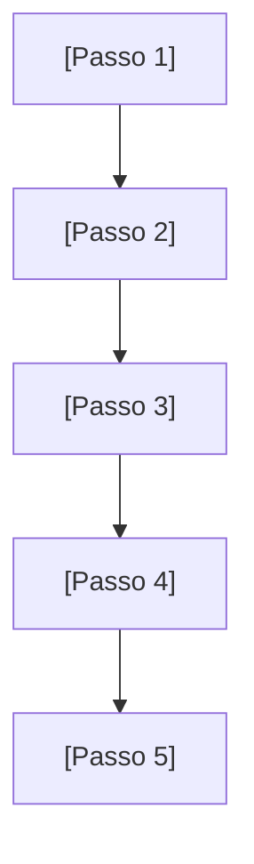
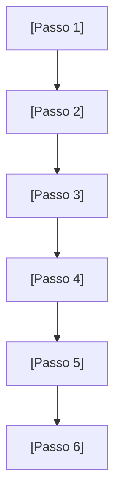

# História de Usuário: Jornada Completa do MVP

**Versão**: 1.0  
**Data de Criação**: [DATA_CRIACAO]  
**Baseado em**: [DOCUMENTOS_BASE]  
**Contexto Estratégico**: [CONTEXTO_ESTRATEGICO]

## 📋 Sumário Executivo

Este documento define a **jornada completa do usuário** no [NOME_DO_PROJETO] MVP, utilizando uma abordagem estruturada com foco inicial no **[PLATAFORMA_FOCO]**. A jornada é estruturada em **micro-ciclos de valor** que conduzem o usuário desde o primeiro acesso até o **"Momento AHA!"** - [MOMENTO_AHA].

### 🎯 Objetivo da Jornada
- **Conduzir o usuário** de forma guiada através das funcionalidades core
- **Maximizar o valor percebido** em cada etapa
- **Reduzir a fricção** no onboarding e primeiras interações
- **Validar a proposta de valor** através do "Momento AHA!"

---

## 🗺️ Mapeamento da Jornada Completa

### **Micro-Ciclo 1: [Nome do Primeiro Ciclo]**



**Duração Estimada**: [X-Y minutos]  
**Valor Entregue**: [Descrição do valor entregue]

#### Critérios de Aceitação - Micro-Ciclo 1:
- [ ] **AC-MC1-001**: [Critério de aceite 1]
- [ ] **AC-MC1-002**: [Critério de aceite 2]
- [ ] **AC-MC1-003**: [Critério de aceite 3]
- [ ] **AC-MC1-004**: [Critério de aceite 4]
- [ ] **AC-MC1-005**: [Critério de aceite 5]

---

### **Micro-Ciclo 2: [Nome do Segundo Ciclo - Momento AHA!]**



**Duração Estimada**: [X-Y minutos]  
**Valor Entregue**: **MOMENTO AHA!** - [Descrição do momento AHA]

#### Critérios de Aceitação - Micro-Ciclo 2:
- [ ] **AC-MC2-001**: [Critério de aceite 1]
- [ ] **AC-MC2-002**: [Critério de aceite 2]
- [ ] **AC-MC2-003**: [Critério de aceite 3]
- [ ] **AC-MC2-004**: [Critério de aceite 4]
- [ ] **AC-MC2-005**: [Critério de aceite 5]

---

### **Micro-Ciclo 3: [Nome do Terceiro Ciclo]**


**Duração Estimada**: [Contínua/X minutos]  
**Valor Entregue**: [Descrição do valor entregue]

#### Critérios de Aceitação - Micro-Ciclo 3:
- [ ] **AC-MC3-001**: [Critério de aceite 1]
- [ ] **AC-MC3-002**: [Critério de aceite 2]
- [ ] **AC-MC3-003**: [Critério de aceite 3]
- [ ] **AC-MC3-004**: [Critério de aceite 4]
- [ ] **AC-MC3-005**: [Critério de aceite 5]

---

## 🎯 Funcionalidades Priorizadas

### **Matriz de Priorização**

| Funcionalidade | Impacto Usuário | Esforço Dev | Dependências | Risco Técnico | **Score Total** | **Prioridade** |
|---|---|---|---|---|---|---|
| **[Funcionalidade 1]** | [1-5] | [1-5] | [1-5] | [1-5] | **[Score]** | **P0 - CORE** |
| **[Funcionalidade 2]** | [1-5] | [1-5] | [1-5] | [1-5] | **[Score]** | **P1 - Alto** |
| **[Funcionalidade 3]** | [1-5] | [1-5] | [1-5] | [1-5] | **[Score]** | **P2 - Médio** |
| **[Funcionalidade 4]** | [1-5] | [1-5] | [1-5] | [1-5] | **[Score]** | **P3 - Baixo** |

**Nota**: Score calculado como: (Impacto × 2) + (6 - Esforço) + (6 - Dependências) + (6 - Risco)

---

## 📱 Especificação da Interface

### **[Nome do Componente] - Campos Essenciais**

```yaml
Campos_Obrigatorios:
  - campo1: tipo (validações)
  - campo2: tipo (validações)
  - campo3: tipo (validações)
  
Campos_Opcionais:
  - campo4: tipo (validações)
  - campo5: tipo (validações)

Validacoes:
  - [Validação 1]
  - [Validação 2]
  - [Validação 3]
```

---

## 📊 Métricas de Sucesso

### **KPIs Principais**
- **[Métrica 1]**: [Valor alvo] ([Descrição])
- **[Métrica 2]**: [Valor alvo] ([Descrição])
- **[Métrica 3]**: [Valor alvo] ([Descrição])

### **Métricas de Engajamento**
- **[Métrica de Engajamento 1]**: [Valor alvo]
- **[Métrica de Engajamento 2]**: [Valor alvo]
- **[Métrica de Engajamento 3]**: [Valor alvo]

---

## 🔄 Próximos Passos

1. **[Próximo Passo 1]**: [Descrição e responsável]
2. **[Próximo Passo 2]**: [Descrição e responsável]
3. **[Próximo Passo 3]**: [Descrição e responsável]

---

## 📚 Glossário

- **[Termo 1]**: [Definição]
- **[Termo 2]**: [Definição]
- **[Termo 3]**: [Definição]

---

## 📖 Referências

### Internas
- [Documento 1]
- [Documento 2]
- [Documento 3]

### Externas
- [Referência Externa 1]
- [Referência Externa 2]

---

## 📝 Histórico de Versões

| Versão | Data | Autor | Alterações |
|--------|------|-------|------------|
| 1.0 | [DATA_CRIACAO] | [NOME_AUTOR] | Versão inicial do template |