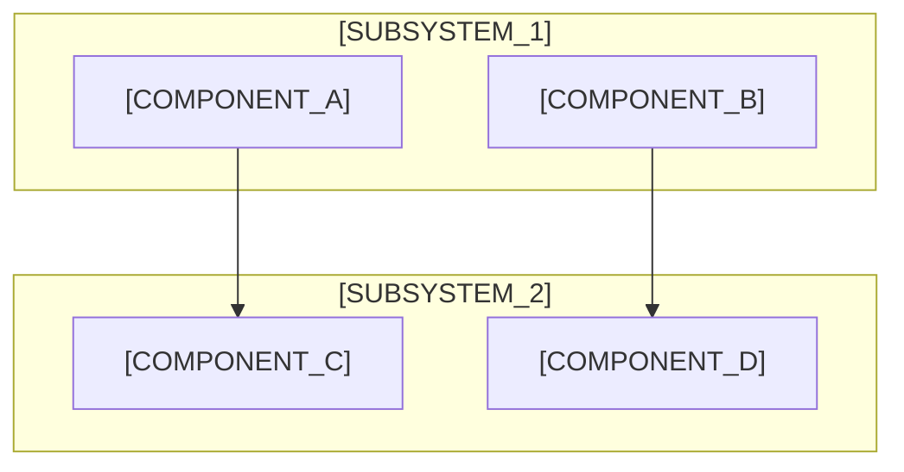

# High-Level Design (HLD) - [PROJECT_NAME]

**Version**: [VERSION_NUMBER]

**Creation Date**: [CREATION_DATE]

**Last Updated**: [LAST_UPDATE_DATE]

**Author**: [AUTHOR_NAME]

**Based on**:
- [REFERENCE_DOCUMENT_1]
- [REFERENCE_DOCUMENT_2]
- [REFERENCE_DOCUMENT_3]

## 1. Introduction

**Version History:**

- **v[VERSION] ([DATE]):** [DESCRIPTION_OF_CHANGES]
- **v[VERSION] ([DATE]):** [DESCRIPTION_OF_CHANGES]

### 1.1. Purpose

[DOCUMENT_PURPOSE_DESCRIPTION]

### 1.2. Scope

[SYSTEM_SCOPE_DESCRIPTION]

### 1.3. Acronyms and Terms

[REFERENCE_TO_GLOSSARY]

## 2. Architecture Overview

[SYSTEM_ARCHITECTURE_DESCRIPTION]

**Main Components:**

1. **[COMPONENT_1]:** [COMPONENT_DESCRIPTION]
2. **[COMPONENT_2]:** [COMPONENT_DESCRIPTION]
3. **[COMPONENT_3]:** [COMPONENT_DESCRIPTION]
4. **[COMPONENT_4]:** [COMPONENT_DESCRIPTION]
5. **[COMPONENT_5]:** [COMPONENT_DESCRIPTION]

## 3. High-Level Architecture Diagram

[ARCHITECTURE_DIAGRAM_DESCRIPTION]

## 4. System Components

### 4.1. [COMPONENT_NAME_1]

**Responsibilities:**
- [RESPONSIBILITY_1]
- [RESPONSIBILITY_2]
- [RESPONSIBILITY_3]

**Technologies:**
- [TECHNOLOGY_1]
- [TECHNOLOGY_2]

**Interfaces:**
- [INTERFACE_1]
- [INTERFACE_2]

### 4.2. [COMPONENT_NAME_2]

**Responsibilities:**
- [RESPONSIBILITY_1]
- [RESPONSIBILITY_2]
- [RESPONSIBILITY_3]

**Technologies:**
- [TECHNOLOGY_1]
- [TECHNOLOGY_2]

**Interfaces:**
- [INTERFACE_1]
- [INTERFACE_2]

### 4.3. [COMPONENT_NAME_3]

**Responsibilities:**
- [RESPONSIBILITY_1]
- [RESPONSIBILITY_2]
- [RESPONSIBILITY_3]

**Technologies:**
- [TECHNOLOGY_1]
- [TECHNOLOGY_2]

**Interfaces:**
- [INTERFACE_1]
- [INTERFACE_2]

## 5. Data Flow

### 5.1. Main Data Flow

[DATA_FLOW_DESCRIPTION]

### 5.2. Authentication Flow

[AUTHENTICATION_FLOW_DESCRIPTION]

### 5.3. Business Logic Flow

[BUSINESS_LOGIC_FLOW_DESCRIPTION]

## 6. Integration Points

### 6.1. External Services

- **[SERVICE_1]:** [SERVICE_DESCRIPTION]
- **[SERVICE_2]:** [SERVICE_DESCRIPTION]
- **[SERVICE_3]:** [SERVICE_DESCRIPTION]

### 6.2. APIs and Interfaces

- **[API_1]:** [API_DESCRIPTION]
- **[API_2]:** [API_DESCRIPTION]
- **[API_3]:** [API_DESCRIPTION]

## 7. Security Considerations

### 7.1. Authentication and Authorization

[SECURITY_AUTH_DESCRIPTION]

### 7.2. Data Protection

[DATA_PROTECTION_DESCRIPTION]

### 7.3. Communication Security

[COMMUNICATION_SECURITY_DESCRIPTION]

## 8. Performance and Scalability

### 8.1. Performance Requirements

[PERFORMANCE_REQUIREMENTS]

### 8.2. Scalability Strategy

[SCALABILITY_STRATEGY]

### 8.3. Load Balancing

[LOAD_BALANCING_STRATEGY]

## 9. Deployment Architecture

### 9.1. Environment Strategy

[ENVIRONMENT_STRATEGY]

### 9.2. Infrastructure Components

[INFRASTRUCTURE_COMPONENTS]

### 9.3. CI/CD Pipeline

[CICD_PIPELINE_DESCRIPTION]

## 10. Monitoring and Observability

### 10.1. Logging Strategy

[LOGGING_STRATEGY]

### 10.2. Metrics and Monitoring

[MONITORING_STRATEGY]

### 10.3. Alerting

[ALERTING_STRATEGY]

## 11. Risk Assessment

### 11.1. Technical Risks

[TECHNICAL_RISKS]

### 11.2. Mitigation Strategies

[MITIGATION_STRATEGIES]

## 12. Future Considerations

### 12.1. Evolution Path

[EVOLUTION_PATH]

### 12.2. Technology Roadmap

[TECHNOLOGY_ROADMAP]

## 13. Appendices

### 13.1. References

[REFERENCES_LIST]

### 13.2. Glossary

[GLOSSARY_REFERENCE]

### 13.3. Decision Records

[ADR_REFERENCES]