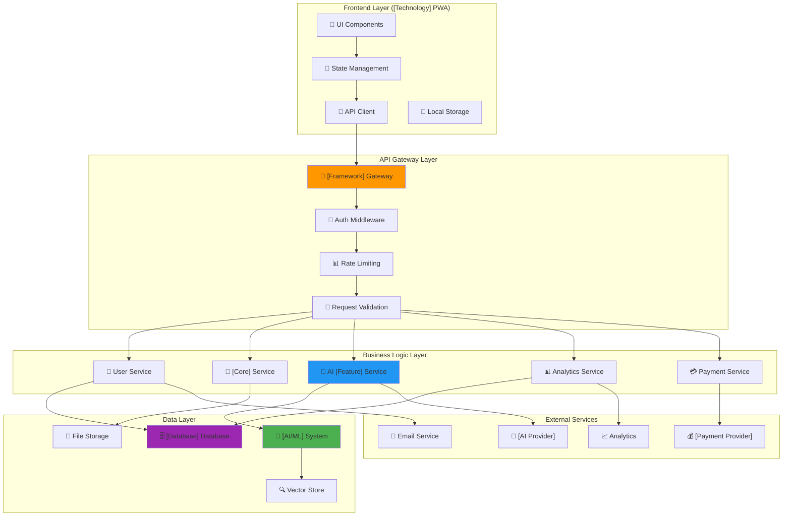

# Consolidated Low-Level Design (LLD) - [Project Name]

**Version**: 1.0  
**Creation Date**: [YYYY-MM-DD]  
**Last Updated**: [YYYY-MM-DD]  
**Author**: @[Agent/Architect Name]  
**Approval**: [Project Owner/Maestro Name]  

**Based on**:
- [[docs/03_Architecture_and_Design/01_HLD.md]] (v1.1)
- [[docs/02_Requirements/01_ERS.md]] (v1.1)
- [[docs/03_Architecture_and_Design/02_ADRs/ADR-002_[Technology_Decision].md]] (v1.0)
- [[docs/03_Architecture_and_Design/03_LLDs/LLD_001_[Specific_Component].md]] (v1.0)

---

## 📋 Executive Summary

This document consolidates the complete **Low-Level Design (LLD)** of the [Project Name] system, detailing the technical implementation of all main components identified in the HLD. The LLD provides detailed specifications of interfaces, data structures, algorithms, and implementation patterns to guide MVP development and future iterations.

**LLD Scope:**
- Detailed specification of core components
- Integration interfaces between modules
- Data structures and models
- Implementation patterns and conventions
- Technical validation and quality criteria

---

## 🏗️ System General Architecture

### Detailed Component Diagram



---

## 🔧 Detailed Specifications by Component

### 1. [Core System Component] (Critical Component)

#### 1.1 [Component] Architecture

**Reference**: [[docs/03_Architecture_and_Design/03_LLDs/LLD_001_[Component_Name].md]]

**Main Components**:

```python
# [Component] Class Structure
class [MainClass]:
    """
    Main class for [functionality description].
    Implements [key features and capabilities].
    """
    
    def __init__(self, config_path: str = None):
        self.config = self._load_config(config_path)
        self.use_[technology] = self._detect_[capability]_compatibility()
        self.[model_component] = [ModelClass]()
        self._initialize_backend()
    
    def [main_method](self, query: str, top_k: int = 5, min_score: float = 0.2) -> List[[ResultType]]:
        """
        [Method description and functionality].
        
        Args:
            query: [Parameter description]
            top_k: [Parameter description]
            min_score: [Parameter description]
            
        Returns:
            [Return value description]
        """
        pass
    
    def _detect_[capability]_compatibility(self) -> bool:
        """
        [Private method description].
        Based on [ADR reference or decision rationale].
        """
        pass

class [ModelClass]:
    """
    [Model class description and purpose].
    """
    
    def __init__(self, model_name: str = "[default_model]"):
        self.model_name = model_name
        self.device = self._get_optimal_device()
        self.model = self._load_model()
    
    def [process_method](self, inputs: List[str], batch_size: int = 32) -> np.ndarray:
        """
        [Processing method description].
        
        Args:
            inputs: [Input parameter description]
            batch_size: [Batch size parameter description]
            
        Returns:
            [Return value description]
        """
        pass

class [IntegrationClass]:
    """
    [Integration class description].
    """
    
    def __init__(self, [dependency]: [DependencyType]):
        self.[dependency] = [dependency]
        self.protocol_handlers = self._setup_handlers()
    
    async def handle_[operation](self, params: dict) -> dict:
        """
        Handler for [operation description].
        
        Args:
            params: [Parameters description]
            
        Returns:
            [Response description]
        """
        pass
```

#### 1.2 [Component] Data Structures

```python
# Data Models
@dataclass
class [ResultClass]:
    """[Result class description]."""
    content: str
    metadata: Dict[str, Any]
    score: float
    rank: int
    source_file: str
    chunk_index: int

@dataclass
class [DataChunk]:
    """[Data chunk description]."""
    content: str
    embedding: np.ndarray
    metadata: [MetadataClass]
    chunk_id: str

@dataclass
class [MetadataClass]:
    """[Metadata description]."""
    source_file: str
    chunk_index: int
    total_chunks: int
    category: str
    created_at: datetime
    file_hash: str

# Configuration
class [ComponentConfig]:
    """[Component] system configuration."""
    
    # [Model/Technology] Configuration
    [MODEL_NAME] = "[default_model]"
    [DIMENSION] = 1024
    
    # Processing
    CHUNK_SIZE = 1000
    CHUNK_OVERLAP = 200
    
    # Search/Query
    DEFAULT_TOP_K = 5
    MIN_SIMILARITY_SCORE = 0.2
    
    # Performance
    BATCH_SIZE = 32
    USE_FP16 = True
    CACHE_SIZE = 1000
```

### 2. API Backend ([Framework])

#### 2.1 Endpoint Structure

```python
# Main API Structure
from [framework] import [Framework], Depends, HTTPException
from [framework].middleware.cors import CORSMiddleware
from [framework].security import HTTPBearer

app = [Framework](
    title="[Project Name] API",
    version="1.0.0",
    description="API for [project description]"
)

# Middleware
app.add_middleware(
    CORSMiddleware,
    allow_origins=["*"],  # Configure for production
    allow_credentials=True,
    allow_methods=["*"],
    allow_headers=["*"],
)

# Routers
from routers import auth, users, [core_feature], [ai_feature], payments

app.include_router(auth.router, prefix="/api/v1/auth", tags=["authentication"])
app.include_router(users.router, prefix="/api/v1/users", tags=["users"])
app.include_router([core_feature].router, prefix="/api/v1/[feature]", tags=["[feature]"])
app.include_router([ai_feature].router, prefix="/api/v1/[ai-feature]", tags=["[ai-feature]"])
app.include_router(payments.router, prefix="/api/v1/payments", tags=["payments"])
```

#### 2.2 Data Models ([Validation Library])

```python
# Request/Response Models
from [validation_library] import BaseModel, EmailStr, Field
from typing import Optional, List, Dict, Any
from datetime import datetime
from enum import Enum

class UserRole(str, Enum):
    """User roles."""
    FREE = "free"
    PREMIUM = "premium"
    ADMIN = "admin"

class UserCreate(BaseModel):
    """User creation model."""
    email: EmailStr
    password: str = Field(..., min_length=8)
    full_name: str = Field(..., min_length=2, max_length=100)
    phone: Optional[str] = None

class UserResponse(BaseModel):
    """User response model."""
    id: str
    email: EmailStr
    full_name: str
    role: UserRole
    created_at: datetime
    is_active: bool
    
    class Config:
        from_attributes = True

class [FeatureRequest](BaseModel):
    """Request for [feature description]."""
    file_content: str  # Base64 encoded
    file_name: str
    target_[parameter]: Optional[str] = None
    additional_context: Optional[str] = None

class [FeatureResponse](BaseModel):
    """Response for [feature description]."""
    analysis_id: str
    overall_score: float = Field(..., ge=0, le=100)
    insights: List[str]
    improvements: List[str]
    strengths: List[str]
    weaknesses: List[str]
    optimized_sections: Dict[str, str]
    created_at: datetime

class [AIFeatureRequest](BaseModel):
    """Request for [AI feature description]."""
    user_message: str = Field(..., min_length=1, max_length=1000)
    context: Optional[Dict[str, Any]] = None
    session_id: Optional[str] = None

class [AIFeatureResponse](BaseModel):
    """Response for [AI feature description]."""
    response: str
    suggestions: List[str]
    session_id: str
    timestamp: datetime
```

#### 2.3 Business Services

```python
# Main Services
class [FeatureService]:
    """Service for [feature description]."""
    
    def __init__(self, ai_client: AIClient, [component_client]: [ComponentClient]):
        self.ai_client = ai_client
        self.[component_client] = [component_client]
    
    async def [main_operation](self, [input_data]: str, user_context: dict) -> [FeatureResponse]:
        """
        [Operation description using AI and context].
        
        Args:
            [input_data]: [Input description]
            user_context: User context
            
        Returns:
            [Return description]
        """
        # 1. Extract structured information
        structured_data = await self._extract_[data_type](input_data)
        
        # 2. Search relevant context
        context = await self.[component_client].search(
            f"[search query template] {structured_data.get('[field]', '')} {structured_data.get('[field2]', '')}"
        )
        
        # 3. Generate analysis with AI
        analysis = await self.ai_client.[ai_method](
            [data_param]=structured_data,
            context=context,
            user_preferences=user_context
        )
        
        return analysis
    
    async def _extract_[data_type](self, [input_data]: str) -> dict:
        """Extract structured data from [input type]."""
        pass

class [AIService]:
    """Service for [AI feature description]."""
    
    def __init__(self, ai_client: AIClient, [component_client]: [ComponentClient]):
        self.ai_client = ai_client
        self.[component_client] = [component_client]
        self.session_manager = SessionManager()
    
    async def process_message(self, message: str, user_id: str, session_id: str = None) -> [AIFeatureResponse]:
        """
        Process user message and generate contextualized response.
        
        Args:
            message: User message
            user_id: User ID
            session_id: Session ID (optional)
            
        Returns:
            AI response
        """
        # 1. Manage session
        session = await self.session_manager.get_or_create_session(user_id, session_id)
        
        # 2. Search relevant context
        context = await self.[component_client].search(message)
        
        # 3. Retrieve conversation history
        conversation_history = await self.session_manager.get_history(session.id)
        
        # 4. Generate response
        response = await self.ai_client.generate_[feature]_response(
            message=message,
            context=context,
            history=conversation_history,
            user_profile=session.user_profile
        )
        
        # 5. Save to session
        await self.session_manager.add_message(session.id, message, response)
        
        return response
```

### 3. Frontend ([Frontend Technology] PWA)

#### 3.1 State Architecture

```[frontend_language]
// State Management with [State Management Library]
import '[state_library]';
import '[http_client]';

// Main Providers
final apiClientProvider = Provider<ApiClient>((ref) {
  return ApiClient(baseUrl: 'https://api.[project-domain].com');
});

final authStateProvider = StateNotifierProvider<AuthNotifier, AuthState>((ref) {
  final apiClient = ref.watch(apiClientProvider);
  return AuthNotifier(apiClient);
});

final userProfileProvider = FutureProvider<UserProfile>((ref) async {
  final authState = ref.watch(authStateProvider);
  if (authState.isAuthenticated) {
    final apiClient = ref.watch(apiClientProvider);
    return await apiClient.getUserProfile(authState.user!.id);
  }
  throw Exception('User not authenticated');
});

// States
class AuthState {
  final User? user;
  final bool isLoading;
  final String? error;
  
  AuthState({
    this.user,
    this.isLoading = false,
    this.error,
  });
  
  bool get isAuthenticated => user != null;
  
  AuthState copyWith({
    User? user,
    bool? isLoading,
    String? error,
  }) {
    return AuthState(
      user: user ?? this.user,
      isLoading: isLoading ?? this.isLoading,
      error: error ?? this.error,
    );
  }
}

class AuthNotifier extends StateNotifier<AuthState> {
  final ApiClient _apiClient;
  
  AuthNotifier(this._apiClient) : super(AuthState());
  
  Future<void> login(String email, String password) async {
    state = state.copyWith(isLoading: true, error: null);
    
    try {
      final response = await _apiClient.login(email, password);
      final user = User.fromJson(response.data);
      
      // Save token locally
      await _saveToken(response.data['access_token']);
      
      state = state.copyWith(
        user: user,
        isLoading: false,
      );
    } catch (e) {
      state = state.copyWith(
        isLoading: false,
        error: e.toString(),
      );
    }
  }
  
  Future<void> logout() async {
    await _clearToken();
    state = AuthState();
  }
  
  Future<void> _saveToken(String token) async {
    // Implement secure storage
  }
  
  Future<void> _clearToken() async {
    // Implement token cleanup
  }
}
```

#### 3.2 Main UI Components

```[frontend_language]
// [Feature] Component
class [FeatureScreen] extends ConsumerStatefulWidget {
  const [FeatureScreen]({Key? key}) : super(key: key);
  
  @override
  ConsumerState<[FeatureScreen]> createState() => _[FeatureScreen]State();
}

class _[FeatureScreen]State extends ConsumerState<[FeatureScreen]>
    with TickerProviderStateMixin {
  
  late AnimationController _scoreAnimationController;
  late Animation<double> _scoreAnimation;
  
  @override
  void initState() {
    super.initState();
    _scoreAnimationController = AnimationController(
      duration: const Duration(seconds: 2),
      vsync: this,
    );
    _scoreAnimation = Tween<double>(
      begin: 0.0,
      end: 1.0,
    ).animate(CurvedAnimation(
      parent: _scoreAnimationController,
      curve: Curves.easeInOut,
    ));
  }
  
  @override
  Widget build(BuildContext context) {
    final [feature]State = ref.watch([feature]Provider);
    
    return Scaffold(
      appBar: AppBar(
        title: const Text('[Feature Title]'),
        backgroundColor: Theme.of(context).colorScheme.primary,
      ),
      body: [feature]State.when(
        data: ([result]) => _build[Feature]Result([result]),
        loading: () => const _LoadingWidget(),
        error: (error, stack) => _buildErrorWidget(error),
      ),
    );
  }
  
  Widget _build[Feature]Result([ResultType] [result]) {
    return SingleChildScrollView(
      padding: const EdgeInsets.all(16.0),
      child: Column(
        crossAxisAlignment: CrossAxisAlignment.start,
        children: [
          // Animated score/result
          AnimatedBuilder(
            animation: _scoreAnimation,
            builder: (context, child) {
              return _ScoreWidget(
                score: [result].[scoreField] * _scoreAnimation.value,
                maxScore: 100,
              );
            },
          ),
          
          const SizedBox(height: 24),
          
          // [Additional UI components]
          _build[Section]([result].[sectionData]),
          
          const SizedBox(height: 16),
          
          // Action buttons
          Row(
            children: [
              Expanded(
                child: ElevatedButton(
                  onPressed: () => _handle[Action](),
                  child: const Text('[Action Text]'),
                ),
              ),
              const SizedBox(width: 16),
              Expanded(
                child: OutlinedButton(
                  onPressed: () => _handle[SecondaryAction](),
                  child: const Text('[Secondary Action]'),
                ),
              ),
            ],
          ),
        ],
      ),
    );
  }
  
  Widget _build[Section]([DataType] data) {
    return Card(
      child: Padding(
        padding: const EdgeInsets.all(16.0),
        child: Column(
          crossAxisAlignment: CrossAxisAlignment.start,
          children: [
            Text(
              '[Section Title]',
              style: Theme.of(context).textTheme.headlineSmall,
            ),
            const SizedBox(height: 8),
            ...data.[items].map((item) => ListTile(
              leading: Icon([icon]),
              title: Text(item.[title]),
              subtitle: Text(item.[description]),
            )),
          ],
        ),
      ),
    );
  }
  
  void _handle[Action]() {
    // Implement action logic
  }
  
  void _handle[SecondaryAction]() {
    // Implement secondary action logic
  }
}

// Loading Widget
class _LoadingWidget extends StatelessWidget {
  const _LoadingWidget();
  
  @override
  Widget build(BuildContext context) {
    return const Center(
      child: Column(
        mainAxisAlignment: MainAxisAlignment.center,
        children: [
          CircularProgressIndicator(),
          SizedBox(height: 16),
          Text('[Loading Message]'),
        ],
      ),
    );
  }
}

// Score Widget
class _ScoreWidget extends StatelessWidget {
  final double score;
  final double maxScore;
  
  const _ScoreWidget({
    required this.score,
    required this.maxScore,
  });
  
  @override
  Widget build(BuildContext context) {
    final percentage = (score / maxScore).clamp(0.0, 1.0);
    
    return Card(
      child: Padding(
        padding: const EdgeInsets.all(24.0),
        child: Column(
          children: [
            Text(
              'Overall Score',
              style: Theme.of(context).textTheme.headlineSmall,
            ),
            const SizedBox(height: 16),
            Stack(
              alignment: Alignment.center,
              children: [
                SizedBox(
                  width: 120,
                  height: 120,
                  child: CircularProgressIndicator(
                    value: percentage,
                    strokeWidth: 8,
                    backgroundColor: Colors.grey[300],
                  ),
                ),
                Text(
                  '${score.toInt()}',
                  style: Theme.of(context).textTheme.headlineMedium?.copyWith(
                    fontWeight: FontWeight.bold,
                  ),
                ),
              ],
            ),
          ],
        ),
      ),
    );
  }
}
```

### 4. Database Schema ([Database Technology])

#### 4.1 Main Tables

```sql
-- Users table
CREATE TABLE users (
    id UUID PRIMARY KEY DEFAULT gen_random_uuid(),
    email VARCHAR(255) UNIQUE NOT NULL,
    full_name VARCHAR(255) NOT NULL,
    phone VARCHAR(20),
    role VARCHAR(20) DEFAULT 'free' CHECK (role IN ('free', 'premium', 'admin')),
    is_active BOOLEAN DEFAULT true,
    created_at TIMESTAMP WITH TIME ZONE DEFAULT NOW(),
    updated_at TIMESTAMP WITH TIME ZONE DEFAULT NOW()
);

-- [Feature] table
CREATE TABLE [feature_table] (
    id UUID PRIMARY KEY DEFAULT gen_random_uuid(),
    user_id UUID REFERENCES users(id) ON DELETE CASCADE,
    file_name VARCHAR(255) NOT NULL,
    file_content TEXT,
    overall_score DECIMAL(5,2) CHECK (overall_score >= 0 AND overall_score <= 100),
    insights JSONB,
    improvements JSONB,
    strengths JSONB,
    weaknesses JSONB,
    optimized_sections JSONB,
    status VARCHAR(20) DEFAULT 'processing' CHECK (status IN ('processing', 'completed', 'failed')),
    created_at TIMESTAMP WITH TIME ZONE DEFAULT NOW(),
    updated_at TIMESTAMP WITH TIME ZONE DEFAULT NOW()
);

-- [AI Feature] sessions table
CREATE TABLE [ai_feature]_sessions (
    id UUID PRIMARY KEY DEFAULT gen_random_uuid(),
    user_id UUID REFERENCES users(id) ON DELETE CASCADE,
    session_data JSONB,
    is_active BOOLEAN DEFAULT true,
    created_at TIMESTAMP WITH TIME ZONE DEFAULT NOW(),
    updated_at TIMESTAMP WITH TIME ZONE DEFAULT NOW()
);

-- [AI Feature] messages table
CREATE TABLE [ai_feature]_messages (
    id UUID PRIMARY KEY DEFAULT gen_random_uuid(),
    session_id UUID REFERENCES [ai_feature]_sessions(id) ON DELETE CASCADE,
    message_type VARCHAR(20) CHECK (message_type IN ('user', 'assistant')),
    content TEXT NOT NULL,
    metadata JSONB,
    created_at TIMESTAMP WITH TIME ZONE DEFAULT NOW()
);

-- Subscriptions table
CREATE TABLE subscriptions (
    id UUID PRIMARY KEY DEFAULT gen_random_uuid(),
    user_id UUID REFERENCES users(id) ON DELETE CASCADE,
    stripe_subscription_id VARCHAR(255) UNIQUE,
    status VARCHAR(20) CHECK (status IN ('active', 'canceled', 'past_due', 'unpaid')),
    current_period_start TIMESTAMP WITH TIME ZONE,
    current_period_end TIMESTAMP WITH TIME ZONE,
    created_at TIMESTAMP WITH TIME ZONE DEFAULT NOW(),
    updated_at TIMESTAMP WITH TIME ZONE DEFAULT NOW()
);

-- Indexes for performance
CREATE INDEX idx_users_email ON users(email);
CREATE INDEX idx_[feature_table]_user_id ON [feature_table](user_id);
CREATE INDEX idx_[feature_table]_created_at ON [feature_table](created_at);
CREATE INDEX idx_[ai_feature]_sessions_user_id ON [ai_feature]_sessions(user_id);
CREATE INDEX idx_[ai_feature]_messages_session_id ON [ai_feature]_messages(session_id);
CREATE INDEX idx_subscriptions_user_id ON subscriptions(user_id);
CREATE INDEX idx_subscriptions_stripe_id ON subscriptions(stripe_subscription_id);
```

#### 4.2 Row Level Security (RLS)

```sql
-- Enable RLS
ALTER TABLE users ENABLE ROW LEVEL SECURITY;
ALTER TABLE [feature_table] ENABLE ROW LEVEL SECURITY;
ALTER TABLE [ai_feature]_sessions ENABLE ROW LEVEL SECURITY;
ALTER TABLE [ai_feature]_messages ENABLE ROW LEVEL SECURITY;
ALTER TABLE subscriptions ENABLE ROW LEVEL SECURITY;

-- Users policies
CREATE POLICY "Users can view own profile" ON users
    FOR SELECT USING (auth.uid() = id);

CREATE POLICY "Users can update own profile" ON users
    FOR UPDATE USING (auth.uid() = id);

-- [Feature] policies
CREATE POLICY "Users can view own [feature] data" ON [feature_table]
    FOR SELECT USING (auth.uid() = user_id);

CREATE POLICY "Users can insert own [feature] data" ON [feature_table]
    FOR INSERT WITH CHECK (auth.uid() = user_id);

CREATE POLICY "Users can update own [feature] data" ON [feature_table]
    FOR UPDATE USING (auth.uid() = user_id);

-- [AI Feature] sessions policies
CREATE POLICY "Users can manage own [ai_feature] sessions" ON [ai_feature]_sessions
    FOR ALL USING (auth.uid() = user_id);

-- [AI Feature] messages policies
CREATE POLICY "Users can view messages from own sessions" ON [ai_feature]_messages
    FOR SELECT USING (
        session_id IN (
            SELECT id FROM [ai_feature]_sessions WHERE user_id = auth.uid()
        )
    );

CREATE POLICY "Users can insert messages to own sessions" ON [ai_feature]_messages
    FOR INSERT WITH CHECK (
        session_id IN (
            SELECT id FROM [ai_feature]_sessions WHERE user_id = auth.uid()
        )
    );

-- Subscriptions policies
CREATE POLICY "Users can view own subscription" ON subscriptions
    FOR SELECT USING (auth.uid() = user_id);
```

### 5. External Integrations

#### 5.1 [AI Provider] Integration

```python
# [AI Provider] Client
class [AIProvider]Client:
    """Client for [AI Provider] API integration."""
    
    def __init__(self, api_key: str, base_url: str = "[provider_base_url]"):
        self.api_key = api_key
        self.base_url = base_url
        self.client = httpx.AsyncClient()
    
    async def [ai_method](self, prompt: str, context: str = None, **kwargs) -> str:
        """
        Generate [AI functionality] using [AI Provider].
        
        Args:
            prompt: Main prompt
            context: Additional context
            **kwargs: Additional parameters
            
        Returns:
            Generated response
        """
        headers = {
            "Authorization": f"Bearer {self.api_key}",
            "Content-Type": "application/json"
        }
        
        payload = {
            "model": "[model_name]",
            "messages": [
                {"role": "system", "content": context or "[default_system_prompt]"},
                {"role": "user", "content": prompt}
            ],
            "temperature": kwargs.get("temperature", 0.7),
            "max_tokens": kwargs.get("max_tokens", 1000)
        }
        
        try:
            response = await self.client.post(
                f"{self.base_url}/[endpoint]",
                headers=headers,
                json=payload
            )
            response.raise_for_status()
            
            result = response.json()
            return result["choices"][0]["message"]["content"]
            
        except httpx.HTTPError as e:
            logger.error(f"[AI Provider] API error: {e}")
            raise
    
    async def [specific_ai_method](self, [input_data]: dict, context: List[str] = None) -> dict:
        """
        Specific [AI functionality] method.
        
        Args:
            [input_data]: Structured input data
            context: Contextual information
            
        Returns:
            Structured analysis result
        """
        context_str = "\n".join(context) if context else ""
        
        prompt = f"""
        [Specific prompt template for the functionality]
        
        Context: {context_str}
        
        [Input Data]:
        {json.dumps([input_data], indent=2)}
        
        Please provide a structured analysis in JSON format with the following fields:
        - [field1]: [description]
        - [field2]: [description]
        - [field3]: [description]
        """
        
        response = await self.[ai_method](prompt)
        
        try:
            return json.loads(response)
        except json.JSONDecodeError:
            logger.error(f"Failed to parse [AI Provider] response: {response}")
            raise ValueError("Invalid response format from [AI Provider]")
```

#### 5.2 [Payment Provider] Integration

```python
# [Payment Provider] Service
class [PaymentProvider]Service:
    """Service for [Payment Provider] integration."""
    
    def __init__(self, api_key: str, webhook_secret: str):
        [payment_provider].api_key = api_key
        self.webhook_secret = webhook_secret
    
    async def create_checkout_session(self, user_id: str, price_id: str, success_url: str, cancel_url: str) -> str:
        """
        Create [Payment Provider] checkout session.
        
        Args:
            user_id: User identifier
            price_id: [Payment Provider] price ID
            success_url: Success redirect URL
            cancel_url: Cancel redirect URL
            
        Returns:
            Checkout session URL
        """
        try:
            session = [payment_provider].checkout.Session.create(
                payment_method_types=['card'],
                line_items=[{
                    'price': price_id,
                    'quantity': 1,
                }],
                mode='subscription',
                success_url=success_url,
                cancel_url=cancel_url,
                client_reference_id=user_id,
                metadata={
                    'user_id': user_id
                }
            )
            
            return session.url
            
        except [payment_provider].error.[PaymentProviderError] as e:
            logger.error(f"[Payment Provider] checkout error: {e}")
            raise
    
    async def handle_webhook(self, payload: bytes, signature: str) -> dict:
        """
        Handle [Payment Provider] webhook events.
        
        Args:
            payload: Webhook payload
            signature: Webhook signature
            
        Returns:
            Event data
        """
        try:
            event = [payment_provider].Webhook.construct_event(
                payload, signature, self.webhook_secret
            )
            
            if event['type'] == 'checkout.session.completed':
                await self._handle_checkout_completed(event['data']['object'])
            elif event['type'] == 'invoice.payment_succeeded':
                await self._handle_payment_succeeded(event['data']['object'])
            elif event['type'] == 'customer.subscription.deleted':
                await self._handle_subscription_cancelled(event['data']['object'])
            
            return event
            
        except ValueError as e:
            logger.error(f"Invalid [Payment Provider] webhook payload: {e}")
            raise
        except [payment_provider].error.SignatureVerificationError as e:
            logger.error(f"Invalid [Payment Provider] webhook signature: {e}")
            raise
    
    async def _handle_checkout_completed(self, session: dict):
        """Handle completed checkout session."""
        user_id = session.get('client_reference_id')
        subscription_id = session.get('subscription')
        
        if user_id and subscription_id:
            # Update user subscription in database
            await self._update_user_subscription(user_id, subscription_id, 'active')
    
    async def _handle_payment_succeeded(self, invoice: dict):
        """Handle successful payment."""
        subscription_id = invoice.get('subscription')
        
        if subscription_id:
            # Update subscription status
            await self._update_subscription_status(subscription_id, 'active')
    
    async def _handle_subscription_cancelled(self, subscription: dict):
        """Handle cancelled subscription."""
        subscription_id = subscription.get('id')
        
        if subscription_id:
            # Update subscription status
            await self._update_subscription_status(subscription_id, 'canceled')
    
    async def _update_user_subscription(self, user_id: str, subscription_id: str, status: str):
        """Update user subscription in database."""
        # Implement database update logic
        pass
    
    async def _update_subscription_status(self, subscription_id: str, status: str):
        """Update subscription status in database."""
        # Implement database update logic
        pass
```

---

## 🔍 Testing Strategy

### 1. Unit Tests

```python
# Test example for [Component]
import pytest
from unittest.mock import Mock, patch
from [project_name].[component] import [MainClass]

class Test[MainClass]:
    """Unit tests for [MainClass]."""
    
    @pytest.fixture
    def [component_instance](self):
        """Create [component] instance for testing."""
        return [MainClass](config_path="test_config.yaml")
    
    @pytest.mark.asyncio
    async def test_[main_method]_success(self, [component_instance]):
        """Test successful [main method] execution."""
        # Arrange
        test_query = "test query"
        expected_results = [[ResultClass](
            content="test content",
            metadata={"source": "test"},
            score=0.95,
            rank=1,
            source_file="test.md",
            chunk_index=0
        )]
        
        with patch.object([component_instance], '_[internal_method]', return_value=expected_results):
            # Act
            results = await [component_instance].[main_method](test_query)
            
            # Assert
            assert len(results) == 1
            assert results[0].content == "test content"
            assert results[0].score == 0.95
    
    @pytest.mark.asyncio
    async def test_[main_method]_empty_query(self, [component_instance]):
        """Test [main method] with empty query."""
        # Act & Assert
        with pytest.raises(ValueError, match="Query cannot be empty"):
            await [component_instance].[main_method]("")
    
    def test_[config_method](self, [component_instance]):
        """Test configuration loading."""
        # Act
        config = [component_instance]._load_config("test_config.yaml")
        
        # Assert
        assert config is not None
        assert '[config_key]' in config

# Test example for API endpoints
from fastapi.testclient import TestClient
from [project_name].main import app

client = TestClient(app)

class TestAPI:
    """Integration tests for API endpoints."""
    
    def test_[endpoint]_success(self):
        """Test successful [endpoint] request."""
        # Arrange
        test_data = {
            "[field1]": "test value",
            "[field2]": "test value 2"
        }
        
        # Act
        response = client.post("/api/v1/[endpoint]", json=test_data)
        
        # Assert
        assert response.status_code == 200
        data = response.json()
        assert "[response_field]" in data
        assert data["[response_field]"] is not None
    
    def test_[endpoint]_validation_error(self):
        """Test [endpoint] with invalid data."""
        # Arrange
        invalid_data = {
            "[field1]": ""  # Invalid empty value
        }
        
        # Act
        response = client.post("/api/v1/[endpoint]", json=invalid_data)
        
        # Assert
        assert response.status_code == 422
        assert "detail" in response.json()
    
    def test_[endpoint]_unauthorized(self):
        """Test [endpoint] without authentication."""
        # Act
        response = client.post("/api/v1/[protected_endpoint]")
        
        # Assert
        assert response.status_code == 401
```

### 2. Integration Tests

```python
# Integration test example
import pytest
import asyncio
from [project_name].[service] import [FeatureService]
from [project_name].[ai_client] import [AIProvider]Client
from [project_name].[component_client] import [ComponentClient]

class TestIntegration:
    """Integration tests for service interactions."""
    
    @pytest.fixture
    async def service_setup(self):
        """Setup services for integration testing."""
        ai_client = [AIProvider]Client(api_key="test_key")
        component_client = [ComponentClient]()
        service = [FeatureService](ai_client, component_client)
        
        return service
    
    @pytest.mark.asyncio
    async def test_[feature]_end_to_end(self, service_setup):
        """Test complete [feature] workflow."""
        service = service_setup
        
        # Arrange
        test_input = "test input data"
        user_context = {"user_id": "test_user", "preferences": {}}
        
        # Act
        result = await service.[main_operation](test_input, user_context)
        
        # Assert
        assert result is not None
        assert result.[score_field] > 0
        assert len(result.[insights_field]) > 0
    
    @pytest.mark.asyncio
    async def test_[ai_feature]_conversation_flow(self, service_setup):
        """Test [AI feature] conversation flow."""
        service = service_setup
        
        # Arrange
        user_id = "test_user"
        messages = [
            "Hello, I need help with [topic]",
            "Can you provide more details about [specific_aspect]?",
            "Thank you for the information"
        ]
        
        session_id = None
        
        # Act & Assert
        for message in messages:
            response = await service.process_message(message, user_id, session_id)
            
            assert response is not None
            assert response.response != ""
            assert response.session_id is not None
            
            # Use same session for conversation continuity
            session_id = response.session_id
```

---

## 📊 Monitoring and Observability

### 1. Metrics Collection

```python
# Instrumentation with Prometheus
from prometheus_client import Counter, Histogram, Gauge
import time

# API Metrics
api_requests_total = Counter(
    'api_requests_total',
    'Total API requests',
    ['method', 'endpoint', 'status']
)

api_request_duration = Histogram(
    'api_request_duration_seconds',
    'API request duration',
    ['method', 'endpoint']
)

# [Component] Metrics
[component]_queries_total = Counter(
    '[component]_queries_total',
    'Total [component] queries',
    ['query_type']
)

[component]_query_duration = Histogram(
    '[component]_query_duration_seconds',
    '[Component] query duration'
)

[component]_results_count = Histogram(
    '[component]_results_count',
    'Number of [component] results returned'
)

# Business Metrics
[feature]_analyses_total = Counter(
    '[feature]_analyses_total',
    'Total [feature] analyses performed',
    ['user_type']
)

[ai_feature]_sessions_active = Gauge(
    '[ai_feature]_sessions_active',
    'Active [AI feature] sessions'
)

# Middleware for instrumentation
class MetricsMiddleware:
    def __init__(self, app):
        self.app = app
    
    async def __call__(self, scope, receive, send):
        if scope["type"] == "http":
            start_time = time.time()
            method = scope["method"]
            path = scope["path"]
            
            # Process request
            await self.app(scope, receive, send)
            
            # Record metrics
            duration = time.time() - start_time
            api_request_duration.labels(method=method, endpoint=path).observe(duration)
            api_requests_total.labels(method=method, endpoint=path, status="200").inc()
        else:
            await self.app(scope, receive, send)
```

### 2. Structured Logging

```python
# Logging configuration
import logging
import json
from datetime import datetime

class StructuredLogger:
    def __init__(self, name: str):
        self.logger = logging.getLogger(name)
        self.logger.setLevel(logging.INFO)
        
        handler = logging.StreamHandler()
        formatter = logging.Formatter('%(message)s')
        handler.setFormatter(formatter)
        self.logger.addHandler(handler)
    
    def log(self, level: str, message: str, **kwargs):
        log_entry = {
            "timestamp": datetime.utcnow().isoformat(),
            "level": level,
            "message": message,
            "service": "[project-name]-api",
            **kwargs
        }
        
        self.logger.info(json.dumps(log_entry))
    
    def info(self, message: str, **kwargs):
        self.log("INFO", message, **kwargs)
    
    def error(self, message: str, **kwargs):
        self.log("ERROR", message, **kwargs)
    
    def warning(self, message: str, **kwargs):
        self.log("WARNING", message, **kwargs)

# Usage in services
logger = StructuredLogger("[feature]_analysis")

async def [analyze_method]([input_data]: str, user_id: str):
    logger.info(
        "[Feature] analysis started",
        user_id=user_id,
        [input_size]=len([input_data]),
        operation="[feature]_analysis"
    )
    
    try:
        result = await perform_analysis([input_data])
        
        logger.info(
            "[Feature] analysis completed",
            user_id=user_id,
            score=result.[score_field],
            insights_count=len(result.[insights_field]),
            operation="[feature]_analysis"
        )
        
        return result
        
    except Exception as e:
        logger.error(
            "[Feature] analysis failed",
            user_id=user_id,
            error=str(e),
            operation="[feature]_analysis"
        )
        raise
```

---

## 🚀 Implementation Next Steps

### Phase 1: Foundation (Weeks 1-2)
1. **Infrastructure Setup**
   - Setup [Database] with tables and RLS
   - Configure [Backend Framework] base
   - Setup [Frontend Technology] PWA

2. **[Core Component] System**
   - Finalize [integration] integration
   - Performance testing
   - Usage documentation

### Phase 2: Core Features (Weeks 3-6)
1. **Authentication and Users**
   - Login/registration
   - Profile management
   - [Database] Auth integration

2. **[Main Feature] Analysis**
   - Upload and processing
   - AI integration
   - Results interface

### Phase 3: [AI Feature] (Weeks 7-10)
1. **Conversational System**
   - Chat sessions
   - Persistent context
   - [Component] integration

2. **Chat Interface**
   - Conversational UI
   - Message history
   - Smart suggestions

### Phase 4: Optimizations (Weeks 11-12)
1. **Performance and Monitoring**
   - System metrics
   - Performance optimizations
   - Load testing

2. **Polish and Deploy**
   - Final testing
   - Production deployment
   - Final documentation

---

## 📚 Technical References

- **Main HLD**: [[docs/03_Architecture_and_Design/01_HLD.md]]
- **[Component] Specification**: [[docs/03_Architecture_and_Design/03_LLDs/LLD_001_[Component_Name].md]]
- **ADR [Technology Decision]**: [[docs/03_Architecture_and_Design/02_ADRs/ADR-002_[Technology_vs_Alternative].md]]
- **System Requirements**: [[docs/02_Requirements/01_ERS.md]]
- **Style Guide**: [[docs/03_Architecture_and_Design/03_STYLE_GUIDE.md]]
- **API Specifications**: [[docs/03_Architecture_and_Design/00_API_Specs/]]

---

**Status**: ✅ **APPROVED**  
**Next Review**: After Phase 1 implementation  
**Responsible**: @[Agent/Architect Name]  
**Approval**: [Project Owner/Maestro Name]  

---

**Last Updated**: [YYYY-MM-DD]  
**Version**: 1.0 - Complete Initial Consolidation

--- END OF LLD.md DOCUMENT (v1.0) ---