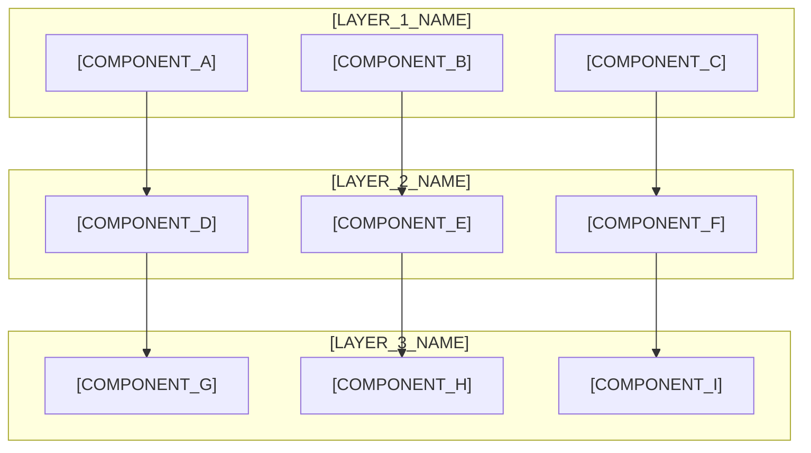
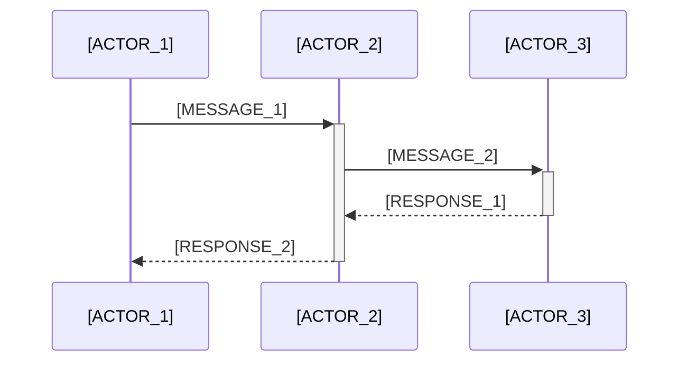

# Low-Level Design (LLD) - [MODULE_NAME]

**Version**: [VERSION_NUMBER]  
**Creation Date**: [CREATION_DATE]  
**Last Updated**: [LAST_UPDATE_DATE]  
**Author**: [AUTHOR_NAME]  
**Approval**: [APPROVER_NAME]  

**Based on**:
- [REFERENCE_DOCUMENT_1]
- [REFERENCE_DOCUMENT_2]
- [REFERENCE_DOCUMENT_3]

---

## 📋 Executive Summary

[EXECUTIVE_SUMMARY_DESCRIPTION]

**LLD Scope:**
- [SCOPE_ITEM_1]
- [SCOPE_ITEM_2]
- [SCOPE_ITEM_3]
- [SCOPE_ITEM_4]

---

## 🏗️ System Architecture Overview

### Detailed Component Diagram



## 🔧 Component Specifications

### [COMPONENT_NAME_1]

**Purpose**: [COMPONENT_PURPOSE]

**Responsibilities**:
- [RESPONSIBILITY_1]
- [RESPONSIBILITY_2]
- [RESPONSIBILITY_3]

**Interface Definition**:

```python
class [ComponentName]:
    def __init__(self, [parameters]):
        [initialization_logic]
    
    def [method_name_1](self, [parameters]) -> [return_type]:
        """[Method description]"""
        [method_implementation]
    
    def [method_name_2](self, [parameters]) -> [return_type]:
        """[Method description]"""
        [method_implementation]
```

**Data Models**:

```python
from pydantic import BaseModel
from typing import Optional, List

class [ModelName](BaseModel):
    [field_1]: [type]
    [field_2]: Optional[[type]] = None
    [field_3]: List[[type]] = []
    
    class Config:
        [configuration_options]
```

### [COMPONENT_NAME_2]

**Purpose**: [COMPONENT_PURPOSE]

**Responsibilities**:
- [RESPONSIBILITY_1]
- [RESPONSIBILITY_2]
- [RESPONSIBILITY_3]

**Interface Definition**:

```python
class [ComponentName]:
    def __init__(self, [parameters]):
        [initialization_logic]
    
    def [method_name_1](self, [parameters]) -> [return_type]:
        """[Method description]"""
        [method_implementation]
    
    def [method_name_2](self, [parameters]) -> [return_type]:
        """[Method description]"""
        [method_implementation]
```

## 📊 Data Flow Specifications

### [FLOW_NAME_1]

**Description**: [FLOW_DESCRIPTION]

**Sequence Diagram**:



**Data Transformations**:
1. [TRANSFORMATION_STEP_1]
2. [TRANSFORMATION_STEP_2]
3. [TRANSFORMATION_STEP_3]

## 🗄️ Database Design

### Entity Relationship Diagram

```mermaid
erDiagram
    [ENTITY_1] {
        [field_type] [field_name_1]
        [field_type] [field_name_2]
        [field_type] [field_name_3]
    }
    
    [ENTITY_2] {
        [field_type] [field_name_1]
        [field_type] [field_name_2]
        [field_type] [field_name_3]
    }
    
    [ENTITY_1] ||--o{ [ENTITY_2] : [relationship_name]
```

### Table Specifications

#### [TABLE_NAME_1]

```sql
CREATE TABLE [table_name] (
    [field_name_1] [data_type] [constraints],
    [field_name_2] [data_type] [constraints],
    [field_name_3] [data_type] [constraints],
    
    PRIMARY KEY ([primary_key_fields]),
    FOREIGN KEY ([foreign_key_field]) REFERENCES [referenced_table]([referenced_field])
);
```

**Indexes**:
- `CREATE INDEX [index_name] ON [table_name] ([indexed_fields]);`

## 🔌 API Specifications

### [ENDPOINT_GROUP_NAME]

#### [HTTP_METHOD] /[endpoint_path]

**Description**: [ENDPOINT_DESCRIPTION]

**Request**:
```json
{
  "[field_1]": "[example_value]",
  "[field_2]": [example_value],
  "[field_3]": {
    "[nested_field]": "[example_value]"
  }
}
```

**Response**:
```json
{
  "status": "success",
  "data": {
    "[field_1]": "[example_value]",
    "[field_2]": [example_value]
  },
  "message": "[success_message]"
}
```

**Error Responses**:
- `400 Bad Request`: [error_description]
- `401 Unauthorized`: [error_description]
- `404 Not Found`: [error_description]
- `500 Internal Server Error`: [error_description]

## 🔒 Security Implementation

### Authentication Flow

[AUTHENTICATION_FLOW_DESCRIPTION]

### Authorization Matrix

| Role | [Permission_1] | [Permission_2] | [Permission_3] |
|------|----------------|----------------|----------------|
| [Role_1] | ✅ | ❌ | ✅ |
| [Role_2] | ✅ | ✅ | ❌ |
| [Role_3] | ✅ | ✅ | ✅ |

### Data Validation

```python
from pydantic import BaseModel, validator

class [ValidationModel](BaseModel):
    [field_name]: [field_type]
    
    @validator('[field_name]')
    def [validation_method](cls, v):
        [validation_logic]
        return v
```

## ⚡ Performance Considerations

### Optimization Strategies

1. **[Strategy_1]**: [Strategy_Description]
2. **[Strategy_2]**: [Strategy_Description]
3. **[Strategy_3]**: [Strategy_Description]

### Caching Implementation

```python
from functools import lru_cache
from typing import [types]

@lru_cache(maxsize=[cache_size])
def [cached_function]([parameters]) -> [return_type]:
    """[Function description]"""
    [function_implementation]
```

### Performance Metrics

- **Response Time**: [target_time]
- **Throughput**: [target_throughput]
- **Memory Usage**: [target_memory]
- **CPU Usage**: [target_cpu]

## 🧪 Testing Strategy

### Unit Tests

```python
import pytest
from [module] import [ComponentName]

class Test[ComponentName]:
    def setup_method(self):
        [setup_code]
    
    def test_[test_case_name](self):
        # Arrange
        [arrange_code]
        
        # Act
        [act_code]
        
        # Assert
        [assert_code]
```

### Integration Tests

[INTEGRATION_TEST_DESCRIPTION]

### Performance Tests

[PERFORMANCE_TEST_DESCRIPTION]

## 🚀 Deployment Specifications

### Environment Configuration

```yaml
# [environment_name].env
[VARIABLE_1]=[value_1]
[VARIABLE_2]=[value_2]
[VARIABLE_3]=[value_3]
```

### Docker Configuration

```dockerfile
FROM [base_image]

WORKDIR [working_directory]

COPY [source] [destination]

RUN [installation_commands]

EXPOSE [port_number]

CMD ["[startup_command]"]
```

## 📈 Monitoring and Logging

### Logging Strategy

```python
import logging
from [logging_framework] import [logger_class]

logger = logging.getLogger(__name__)

def [function_name]([parameters]):
    logger.info("[log_message]")
    try:
        [function_logic]
        logger.debug("[debug_message]")
    except Exception as e:
        logger.error(f"[error_message]: {e}")
        raise
```

### Metrics Collection

- **[Metric_1]**: [Metric_Description]
- **[Metric_2]**: [Metric_Description]
- **[Metric_3]**: [Metric_Description]

## 🔄 Error Handling

### Exception Hierarchy

```python
class [BaseException](Exception):
    """[Base exception description]"""
    pass

class [SpecificException]([BaseException]):
    """[Specific exception description]"""
    pass
```

### Error Recovery Strategies

1. **[Strategy_1]**: [Strategy_Description]
2. **[Strategy_2]**: [Strategy_Description]
3. **[Strategy_3]**: [Strategy_Description]

## 📚 Implementation Guidelines

### Code Standards

- [Standard_1]
- [Standard_2]
- [Standard_3]

### Development Workflow

1. [Step_1]
2. [Step_2]
3. [Step_3]

### Quality Gates

- [Quality_Gate_1]
- [Quality_Gate_2]
- [Quality_Gate_3]

## 📋 Acceptance Criteria

### Functional Requirements

- [ ] [Requirement_1]
- [ ] [Requirement_2]
- [ ] [Requirement_3]

### Non-Functional Requirements

- [ ] [Requirement_1]
- [ ] [Requirement_2]
- [ ] [Requirement_3]

### Technical Requirements

- [ ] [Requirement_1]
- [ ] [Requirement_2]
- [ ] [Requirement_3]

## 📖 References

- [Reference_1]
- [Reference_2]
- [Reference_3]

## 📝 Appendices

### Appendix A: [Title]

[Content]

### Appendix B: [Title]

[Content]