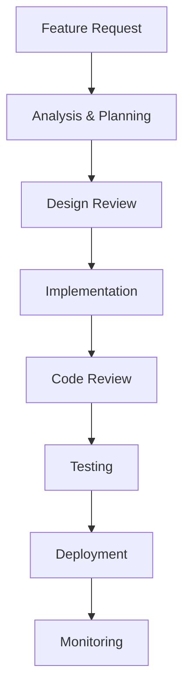

# 🎯 [PROJECT_NAME] - Best Practices Guide

**Version:** [VERSION_NUMBER]
**Date:** [CREATION_DATE]
**Project:** [PROJECT_NAME]
**Scope:** [SCOPE_DESCRIPTION]

---

## 📋 Table of Contents

### **Part I - Practical Implementation Guide**
1. [Configuration and Setup](#configuration-and-setup)
2. [Testing Strategy](#testing-strategy)
3. [Workflow and Orchestration](#workflow-and-orchestration)
4. [Code Quality Standards](#code-quality-standards)
5. [Documentation Practices](#documentation-practices)
6. [Security Guidelines](#security-guidelines)
7. [Performance Optimization](#performance-optimization)
8. [Monitoring and Observability](#monitoring-and-observability)

### **Part II - Technical Implementation**
9. [Architecture Patterns](#architecture-patterns)
10. [Data Management](#data-management)
11. [API Design Guidelines](#api-design-guidelines)
12. [Error Handling](#error-handling)
13. [Deployment Strategies](#deployment-strategies)
14. [Maintenance and Support](#maintenance-and-support)
15. [Limitations and Considerations](#limitations-and-considerations)

---

## ⚙️ Configuration and Setup

### **Environment Setup**

#### Development Environment
```bash
# Environment setup commands
[SETUP_COMMANDS]
```

#### Required Dependencies
- **[DEPENDENCY_1]:** [VERSION] - [PURPOSE]
- **[DEPENDENCY_2]:** [VERSION] - [PURPOSE]
- **[DEPENDENCY_3]:** [VERSION] - [PURPOSE]

### **Configuration Hierarchy**

```
[PROJECT_STRUCTURE]
├── [CONFIG_FOLDER]/
│   ├── [ENV_CONFIG_1]
│   ├── [ENV_CONFIG_2]
│   └── [ENV_CONFIG_3]
└── [OTHER_FOLDERS]/
```

### **Setup Checklist**

#### ✅ **Pre-Configuration**
- [ ] [PRECONFIGURATION_ITEM_1]
- [ ] [PRECONFIGURATION_ITEM_2]
- [ ] [PRECONFIGURATION_ITEM_3]
- [ ] [PRECONFIGURATION_ITEM_4]

#### ✅ **During Configuration**
- [ ] [CONFIGURATION_ITEM_1]
- [ ] [CONFIGURATION_ITEM_2]
- [ ] [CONFIGURATION_ITEM_3]
- [ ] [CONFIGURATION_ITEM_4]

#### ✅ **Post-Configuration**
- [ ] [POSTCONFIGURATION_ITEM_1]
- [ ] [POSTCONFIGURATION_ITEM_2]
- [ ] [POSTCONFIGURATION_ITEM_3]
- [ ] [POSTCONFIGURATION_ITEM_4]

---

## 🧪 Testing Strategy

### **Testing Pyramid**

```
    🎯 End-to-End Tests (Level 3)
         ↑ High Value, Less Frequent
    
    📊 Integration Tests (Level 2)
         ↑ Medium Value, Moderate Frequency
    
    ⚡ Unit Tests (Level 1)
         ↑ High Frequency, Quick Feedback
```

### **When to Use Each Level**

#### **🎯 Level 3 - End-to-End Tests**
- **When:** [WHEN_TO_USE_E2E]
- **Objective:** [E2E_OBJECTIVE]
- **Duration:** [E2E_DURATION]
- **Value:** [E2E_VALUE]

#### **📊 Level 2 - Integration Tests**
- **When:** [WHEN_TO_USE_INTEGRATION]
- **Objective:** [INTEGRATION_OBJECTIVE]
- **Duration:** [INTEGRATION_DURATION]
- **Value:** [INTEGRATION_VALUE]

#### **⚡ Level 1 - Unit Tests**
- **When:** [WHEN_TO_USE_UNIT]
- **Objective:** [UNIT_OBJECTIVE]
- **Duration:** [UNIT_DURATION]
- **Value:** [UNIT_VALUE]

### **Test Coverage Standards**
- **Minimum Coverage:** [MINIMUM_COVERAGE]%
- **Target Coverage:** [TARGET_COVERAGE]%
- **Critical Path Coverage:** [CRITICAL_COVERAGE]%

---

## 🔄 Workflow and Orchestration

### **Development Workflow**



### **Branch Strategy**
- **Main Branch:** [MAIN_BRANCH_STRATEGY]
- **Feature Branches:** [FEATURE_BRANCH_STRATEGY]
- **Release Branches:** [RELEASE_BRANCH_STRATEGY]
- **Hotfix Branches:** [HOTFIX_BRANCH_STRATEGY]

### **Code Review Process**
1. [CODE_REVIEW_STEP_1]
2. [CODE_REVIEW_STEP_2]
3. [CODE_REVIEW_STEP_3]
4. [CODE_REVIEW_STEP_4]

---

## 📝 Code Quality Standards

### **Coding Conventions**

#### **Naming Conventions**
```[LANGUAGE]
// [NAMING_CONVENTION_EXAMPLES]
[CODE_EXAMPLES]
```

#### **Code Structure**
```[LANGUAGE]
// [CODE_STRUCTURE_EXAMPLES]
[STRUCTURE_EXAMPLES]
```

### **Code Quality Metrics**
- **Cyclomatic Complexity:** Max [COMPLEXITY_LIMIT]
- **Function Length:** Max [FUNCTION_LENGTH] lines
- **Class Size:** Max [CLASS_SIZE] lines
- **Nesting Depth:** Max [NESTING_DEPTH] levels

### **Static Analysis Tools**
- **[TOOL_1]:** [TOOL_DESCRIPTION]
- **[TOOL_2]:** [TOOL_DESCRIPTION]
- **[TOOL_3]:** [TOOL_DESCRIPTION]

---

## 📚 Documentation Practices

### **Documentation Types**

#### **Code Documentation**
```[LANGUAGE]
/**
 * [DOCUMENTATION_EXAMPLE]
 * @param {[TYPE]} [PARAM_NAME] - [PARAM_DESCRIPTION]
 * @returns {[TYPE]} [RETURN_DESCRIPTION]
 * @example
 * [USAGE_EXAMPLE]
 */
```

#### **API Documentation**
- **Format:** [API_DOC_FORMAT]
- **Tools:** [API_DOC_TOOLS]
- **Standards:** [API_DOC_STANDARDS]

#### **Architecture Documentation**
- **ADRs (Architecture Decision Records)**
- **System Design Documents**
- **Technical Specifications**

### **Documentation Standards**
- **Update Frequency:** [UPDATE_FREQUENCY]
- **Review Process:** [REVIEW_PROCESS]
- **Maintenance:** [MAINTENANCE_PROCESS]

---

## 🔒 Security Guidelines

### **Security Principles**
- **[SECURITY_PRINCIPLE_1]:** [PRINCIPLE_DESCRIPTION]
- **[SECURITY_PRINCIPLE_2]:** [PRINCIPLE_DESCRIPTION]
- **[SECURITY_PRINCIPLE_3]:** [PRINCIPLE_DESCRIPTION]

### **Authentication & Authorization**
```[LANGUAGE]
// [AUTH_CODE_EXAMPLES]
[SECURITY_CODE_EXAMPLES]
```

### **Data Protection**
- **Encryption:** [ENCRYPTION_STANDARDS]
- **Data Classification:** [DATA_CLASSIFICATION]
- **Access Controls:** [ACCESS_CONTROL_MEASURES]

### **Security Checklist**
- [ ] [SECURITY_CHECK_1]
- [ ] [SECURITY_CHECK_2]
- [ ] [SECURITY_CHECK_3]
- [ ] [SECURITY_CHECK_4]

---

## ⚡ Performance Optimization

### **Performance Standards**
- **Response Time:** < [RESPONSE_TIME]ms
- **Throughput:** > [THROUGHPUT] requests/second
- **Memory Usage:** < [MEMORY_LIMIT]MB
- **CPU Usage:** < [CPU_LIMIT]%

### **Optimization Techniques**

#### **Code-Level Optimizations**
```[LANGUAGE]
// [OPTIMIZATION_EXAMPLES]
[PERFORMANCE_CODE_EXAMPLES]
```

#### **Database Optimizations**
- **Indexing Strategy:** [INDEXING_STRATEGY]
- **Query Optimization:** [QUERY_OPTIMIZATION]
- **Connection Pooling:** [CONNECTION_POOLING]

#### **Caching Strategy**
- **Cache Levels:** [CACHE_LEVELS]
- **Cache Invalidation:** [CACHE_INVALIDATION]
- **Cache Tools:** [CACHE_TOOLS]

---

## 📊 Monitoring and Observability

### **Monitoring Stack**
- **Metrics:** [METRICS_TOOLS]
- **Logging:** [LOGGING_TOOLS]
- **Tracing:** [TRACING_TOOLS]
- **Alerting:** [ALERTING_TOOLS]

### **Key Metrics**
- **Business Metrics:** [BUSINESS_METRICS]
- **Technical Metrics:** [TECHNICAL_METRICS]
- **User Experience Metrics:** [UX_METRICS]

### **Alerting Rules**
```yaml
# [ALERTING_CONFIGURATION_EXAMPLES]
[ALERT_RULES]
```

---

## 🏗️ Architecture Patterns

### **Design Patterns**
- **[PATTERN_1]:** [PATTERN_DESCRIPTION]
- **[PATTERN_2]:** [PATTERN_DESCRIPTION]
- **[PATTERN_3]:** [PATTERN_DESCRIPTION]

### **Architectural Principles**
- **[PRINCIPLE_1]:** [PRINCIPLE_DESCRIPTION]
- **[PRINCIPLE_2]:** [PRINCIPLE_DESCRIPTION]
- **[PRINCIPLE_3]:** [PRINCIPLE_DESCRIPTION]

### **Pattern Implementation**
```[LANGUAGE]
// [PATTERN_IMPLEMENTATION_EXAMPLES]
[ARCHITECTURE_CODE_EXAMPLES]
```

---

## 💾 Data Management

### **Data Architecture**
- **Data Sources:** [DATA_SOURCES]
- **Data Flow:** [DATA_FLOW_DESCRIPTION]
- **Data Storage:** [STORAGE_STRATEGY]

### **Data Quality**
- **Validation Rules:** [VALIDATION_RULES]
- **Data Cleansing:** [CLEANSING_PROCESS]
- **Data Governance:** [GOVERNANCE_POLICIES]

### **Backup and Recovery**
- **Backup Strategy:** [BACKUP_STRATEGY]
- **Recovery Procedures:** [RECOVERY_PROCEDURES]
- **RTO/RPO Targets:** [RTO_RPO_TARGETS]

---

## 🔌 API Design Guidelines

### **RESTful API Standards**
```http
# [API_EXAMPLES]
[REST_API_EXAMPLES]
```

### **API Versioning**
- **Strategy:** [VERSIONING_STRATEGY]
- **Backward Compatibility:** [COMPATIBILITY_RULES]
- **Deprecation Policy:** [DEPRECATION_POLICY]

### **Error Handling**
```json
{
  "error": {
    "code": "[ERROR_CODE]",
    "message": "[ERROR_MESSAGE]",
    "details": "[ERROR_DETAILS]"
  }
}
```

---

## 🚨 Error Handling

### **Error Categories**
- **System Errors:** [SYSTEM_ERROR_HANDLING]
- **Business Logic Errors:** [BUSINESS_ERROR_HANDLING]
- **Validation Errors:** [VALIDATION_ERROR_HANDLING]
- **External Service Errors:** [EXTERNAL_ERROR_HANDLING]

### **Error Handling Patterns**
```[LANGUAGE]
// [ERROR_HANDLING_EXAMPLES]
[ERROR_CODE_EXAMPLES]
```

### **Logging Standards**
- **Log Levels:** [LOG_LEVELS]
- **Log Format:** [LOG_FORMAT]
- **Sensitive Data:** [SENSITIVE_DATA_HANDLING]

---

## 🚀 Deployment Strategies

### **Deployment Patterns**
- **Blue-Green Deployment:** [BLUE_GREEN_STRATEGY]
- **Canary Deployment:** [CANARY_STRATEGY]
- **Rolling Deployment:** [ROLLING_STRATEGY]

### **Infrastructure as Code**
```yaml
# [INFRASTRUCTURE_CODE_EXAMPLES]
[IAC_EXAMPLES]
```

### **CI/CD Pipeline**
```yaml
# [PIPELINE_CONFIGURATION]
[CICD_PIPELINE_EXAMPLES]
```

---

## 🔧 Maintenance and Support

### **Maintenance Schedule**
- **Regular Maintenance:** [MAINTENANCE_SCHEDULE]
- **Security Updates:** [SECURITY_UPDATE_SCHEDULE]
- **Dependency Updates:** [DEPENDENCY_UPDATE_SCHEDULE]

### **Support Procedures**
- **Incident Response:** [INCIDENT_RESPONSE_PROCESS]
- **Escalation Matrix:** [ESCALATION_MATRIX]
- **Communication Plan:** [COMMUNICATION_PLAN]

### **Knowledge Management**
- **Documentation Updates:** [DOC_UPDATE_PROCESS]
- **Lessons Learned:** [LESSONS_LEARNED_PROCESS]
- **Training Materials:** [TRAINING_MATERIALS]

---

## ⚠️ Limitations and Considerations

### **Known Limitations**
- **[LIMITATION_1]:** [LIMITATION_DESCRIPTION]
- **[LIMITATION_2]:** [LIMITATION_DESCRIPTION]
- **[LIMITATION_3]:** [LIMITATION_DESCRIPTION]

### **Technical Debt**
- **Current Technical Debt:** [TECHNICAL_DEBT_ASSESSMENT]
- **Mitigation Plan:** [DEBT_MITIGATION_PLAN]
- **Prevention Strategy:** [DEBT_PREVENTION_STRATEGY]

### **Future Considerations**
- **Scalability:** [SCALABILITY_CONSIDERATIONS]
- **Technology Evolution:** [TECH_EVOLUTION_CONSIDERATIONS]
- **Business Growth:** [BUSINESS_GROWTH_CONSIDERATIONS]

---

## 📋 Implementation Checklist

### **Pre-Implementation**
- [ ] [PRE_IMPL_ITEM_1]
- [ ] [PRE_IMPL_ITEM_2]
- [ ] [PRE_IMPL_ITEM_3]

### **During Implementation**
- [ ] [IMPL_ITEM_1]
- [ ] [IMPL_ITEM_2]
- [ ] [IMPL_ITEM_3]

### **Post-Implementation**
- [ ] [POST_IMPL_ITEM_1]
- [ ] [POST_IMPL_ITEM_2]
- [ ] [POST_IMPL_ITEM_3]

---

## 📚 Resources and References

### **Documentation**
- [REFERENCE_1]: [REFERENCE_LINK_1]
- [REFERENCE_2]: [REFERENCE_LINK_2]
- [REFERENCE_3]: [REFERENCE_LINK_3]

### **Tools and Libraries**
- [TOOL_1]: [TOOL_DESCRIPTION_AND_LINK]
- [TOOL_2]: [TOOL_DESCRIPTION_AND_LINK]
- [TOOL_3]: [TOOL_DESCRIPTION_AND_LINK]

### **Training Materials**
- [TRAINING_1]: [TRAINING_DESCRIPTION_AND_LINK]
- [TRAINING_2]: [TRAINING_DESCRIPTION_AND_LINK]
- [TRAINING_3]: [TRAINING_DESCRIPTION_AND_LINK]

---

## 🔄 Version History

### Version [VERSION_NUMBER] - [DATE]
- [CHANGE_1]
- [CHANGE_2]
- [CHANGE_3]

### Version [VERSION_NUMBER] - [DATE]
- [CHANGE_1]
- [CHANGE_2]
- [CHANGE_3]

---

## 📞 Support and Contact

- **Technical Lead:** [TECH_LEAD_CONTACT]
- **Architecture Team:** [ARCHITECTURE_TEAM_CONTACT]
- **Support Channel:** [SUPPORT_CHANNEL]
- **Documentation:** [DOCUMENTATION_LINK]