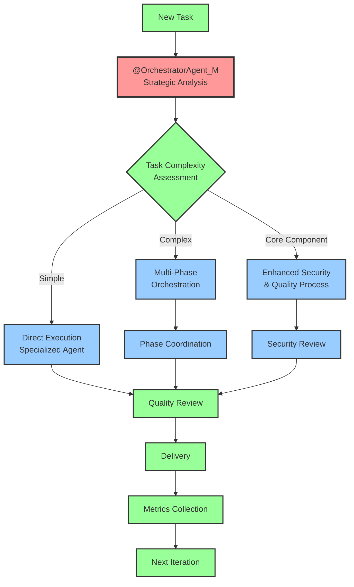
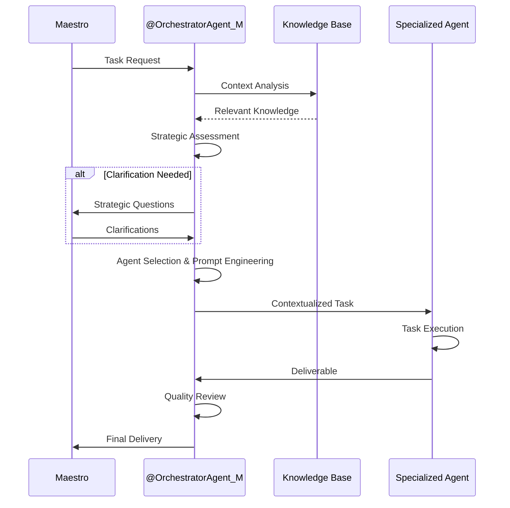
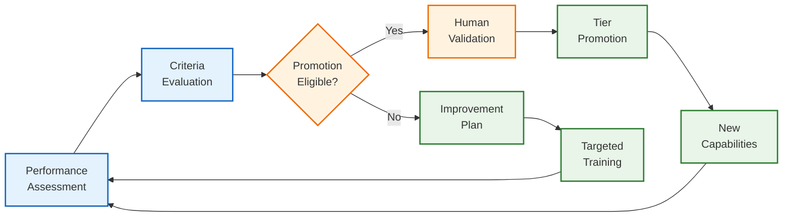
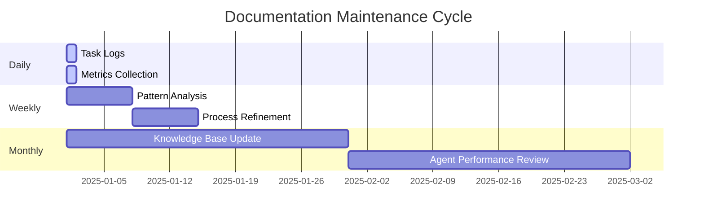
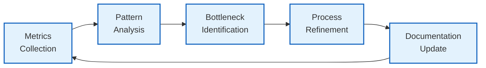
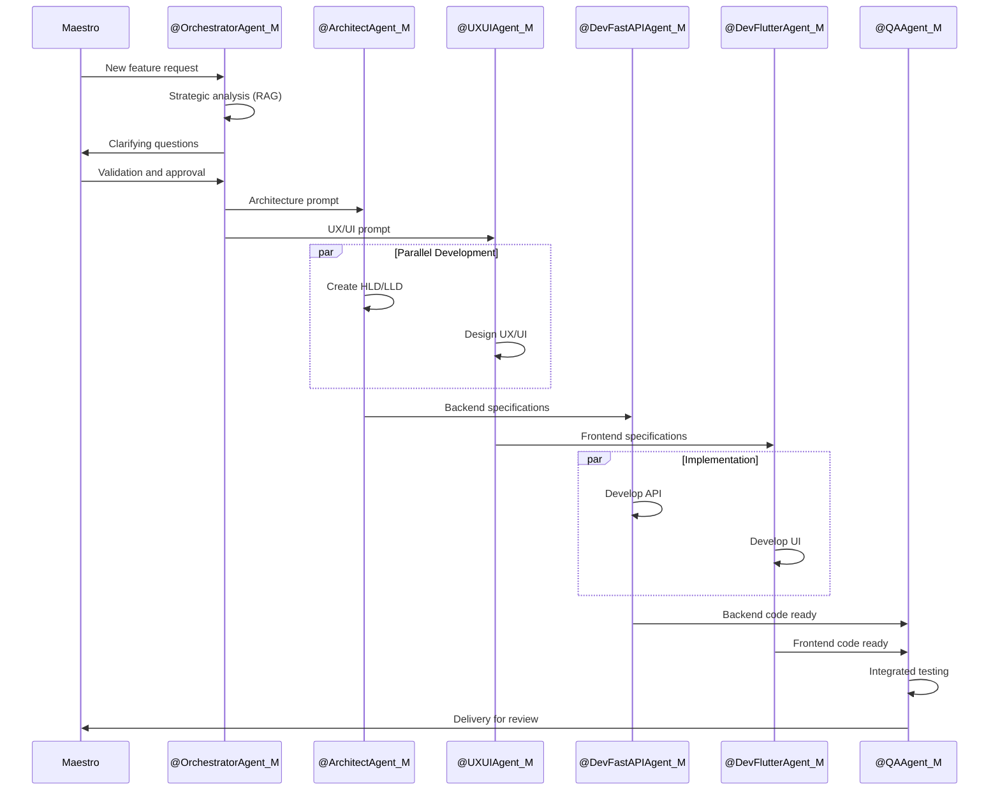
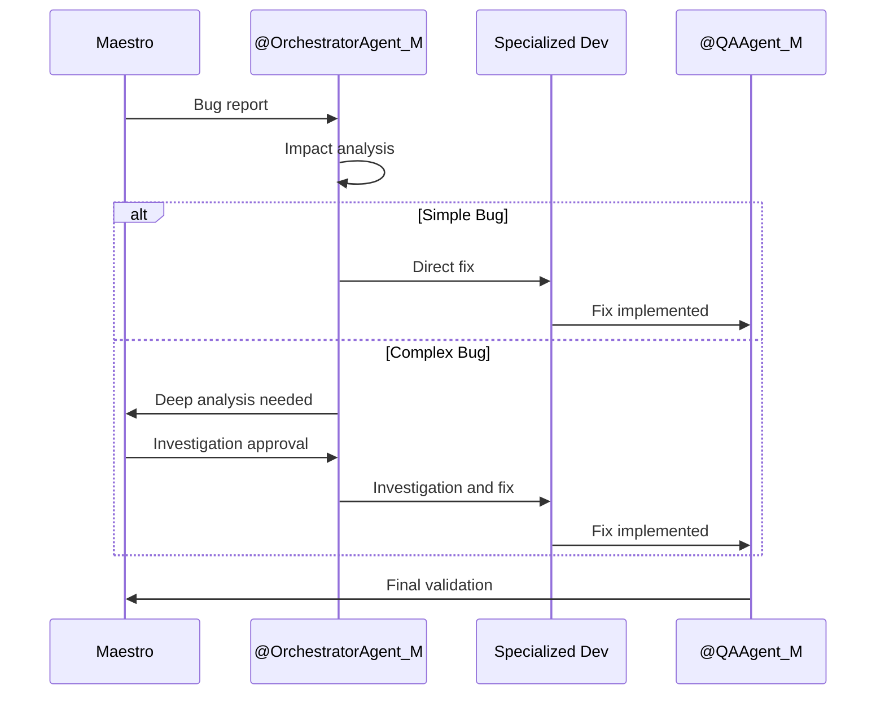
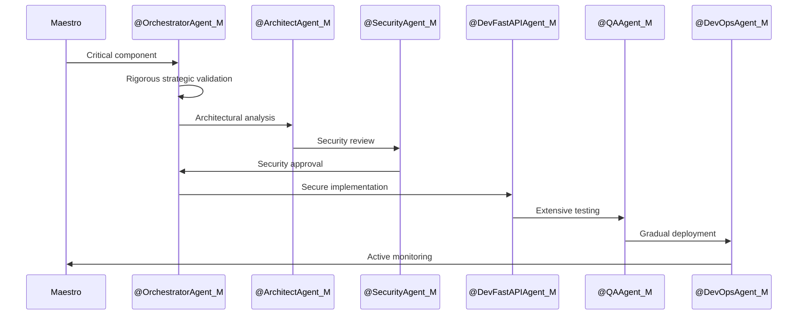

# General Workflow Template

## 1. Overview and Philosophy

### 1.1. Methodology Foundation
**Base Methodology**: "AI-Augmented Solo Agile Development"
**Core Focus**: Intelligent orchestration with domain specialization
**Central Agent**: `@OrchestratorAgent_M` (PM Mentor and Prompt Engineer)
**Specialized Mentors**: Domain-specific agents for each SDLC phase

### 1.2. Workflow Principles
- **Strategic Validation**: Every task undergoes strategic alignment verification
- **Constructive Questioning**: Challenge assumptions before implementation
- **RAG-Driven Analysis**: Leverage knowledge base for informed decisions
- **Core Component Identification**: Distinguish critical vs. standard components
- **Prompt Co-creation**: Collaborative prompt engineering for optimal results
- **Rich Contextualization**: Comprehensive context provision to agents
- **Best Practices Application**: Consistent application of proven methodologies
- **Adaptive Templates**: Dynamic template usage based on task requirements

## 2. Main Development Flow

## 3. Orchestrator Agent (`@OrchestratorAgent_M`)

### 3.1. Core Responsibilities
**Primary Role**: PM Mentor and Prompt Engineer

**Key Functions**:
- **Strategic Validation**: Ensure alignment with project objectives
- **Constructive Questioning**: Challenge assumptions and validate approaches
- **RAG Analysis**: Leverage knowledge base for informed decision-making
- **Core Component Identification**: Distinguish critical system components
- **Prompt Co-creation**: Collaborate on optimal prompt engineering
- **Rich Contextualization**: Provide comprehensive context to specialized agents
- **Best Practices Application**: Ensure consistent methodology application
- **Adaptive Templates**: Select and customize templates based on task requirements

### 3.2. Orchestration Process

### 3.3. Activation Criteria
- **New Task Reception**: All tasks pass through orchestrator first
- **Complexity Assessment**: Evaluate task complexity and requirements
- **Agent Selection**: Choose appropriate specialized agent(s)
- **Context Preparation**: Gather and structure relevant context
- **Quality Assurance**: Review deliverables before final submission

## 4. Agent Evolution Strategy

### 4.1. Maturity Levels

#### Basic Level (Tier 1)
**Characteristics**:
- Follows explicit instructions
- Requires detailed prompts
- Limited autonomous decision-making
- Basic template usage

**Objective Criteria**:
- Task completion rate: >70%
- Instruction adherence: >85%
- Template compliance: >90%
- Revision requests: <30%

#### Intermediate Level (Tier 2)
**Characteristics**:
- Contextual understanding
- Proactive suggestions
- Pattern recognition
- Adaptive template usage

**Objective Criteria**:
- Task completion rate: >85%
- Proactive improvements: >20% of tasks
- Context utilization: >80%
- Revision requests: <15%

#### Advanced Level (Tier 3)
**Characteristics**:
- Strategic thinking
- Cross-domain knowledge
- Innovation capability
- Template creation/modification

**Objective Criteria**:
- Task completion rate: >95%
- Strategic contributions: >40% of tasks
- Innovation instances: >10% of tasks
- Revision requests: <5%

### 4.2. HITL Evolution Process

## 5. Living Documentation and RAG Integration

### 5.1. RAG Strategy for Workflow

**Knowledge Sources**:
- Project documentation (`/.codex/`)
- Best practices repository
- Historical task patterns
- Agent performance data
- Domain-specific knowledge bases

**RAG Technologies**:
- **Vector Database**: FAISS-GPU for high-performance similarity search
- **Embedding Model**: BAAI/bge-m3 for multilingual support
- **Framework**: LangChain for orchestration
- **Runtime**: Python 3.10 for optimal performance

### 5.2. Documentation Update Cycle

## 6. Neurodivergent Considerations

### 6.1. Inclusive Design Principles
- **Clear Structure**: Consistent formatting and organization
- **Immediate Feedback**: Real-time status updates and confirmations
- **Cognitive Flexibility**: Multiple approaches to task completion
- **Overload Reduction**: Chunked information and progressive disclosure
- **Predictable Patterns**: Standardized workflows and templates

### 6.2. Adaptive Features
- **Customizable Interfaces**: Adjustable complexity levels
- **Multiple Input Methods**: Text, voice, and visual options
- **Progress Tracking**: Visual indicators and milestone markers
- **Break Reminders**: Automated wellness check-ins
- **Sensory Considerations**: Reduced visual noise and distractions

## 7. Metrics and Monitoring

### 7.1. Workflow KPIs

| **Metric** | **Target** | **Frequency** |
|------------|------------|---------------|
| **Task Completion Rate** | > 90% | Daily |
| **Average Cycle Time** | < 2 hours (simple tasks) | Weekly |
| **First-Time Right Rate** | > 85% | Weekly |
| **Rework Rate** | < 15% | Weekly |
| **Maestro Satisfaction** | > 8/10 | After each delivery |
| **Agent Accuracy** | > 80% (Basic Level) | Monthly |
| **RAG Coverage** | > 90% successful queries | Monthly |

### 7.2. Continuous Improvement Process

## 8. Task-Specific Flows

### 8.1. Complete Feature Development

### 8.2. Bug Fix

### 8.3. Core Component

## 9. Implementation and Evolution

### 9.1. Immediate Implementation
1. **Maestro Validation**: Aligned workflow approval
2. **Agent Training**: Apply maturity criteria
3. **RAG Integration**: Complete knowledge base setup
4. **Baseline Metrics**: Establish initial indicators

### 9.2. Planned Evolution (6-12 months)
1. **Progressive Automation**: Gradual reduction of manual supervision
2. **Advanced Specialization**: Development of agent-specific expertise
3. **Tool Integration**: Additional MCPs as needed
4. **Performance Optimization**: Data-driven continuous improvement

### 9.3. Strategic Considerations

#### 9.3.1. Reflection Questions
1. **Balance**: How to balance agent autonomy with strategic control?
2. **Scalability**: How does the workflow adapt to project growth?
3. **Quality**: How to maintain consistency with increasing autonomy?
4. **Innovation**: How to incorporate learnings and continuous improvements?

#### 9.3.2. Risks and Mitigations
- **Risk**: Loss of control with excessive automation
  - **Mitigation**: Objective maturity criteria and escalation
- **Risk**: Inconsistency between agents
  - **Mitigation**: Centralized RAG and living documentation
- **Risk**: Orchestrator overload
  - **Mitigation**: Gradual evolution and intelligent delegation

## 10. Related Documents

- **Advanced Methodology Guide** - Base methodology (v1.1)
- **MVP Methodology** - Methodology MVP
- **Requirements Specification** (v1.1) - System requirements
- **High-Level Design** (v1.1) - Architecture overview
- **Core Tools ADR** (v1.1) - Technology decisions
- **AI Agents Overview** - Agent specifications
- **Internal Kanban** - Task management
- **Prompt Templates** - Base prompt library
- **PM Knowledge Base** - Project management resources

## 11. Intelligent Orchestration Considerations

### 11.1. Integration with Methodology v1.1
- **Production-Ready Agents**: Workflow supports Tier 2 and Tier 3 agents
- **Continuous Metrics**: Automated productivity data collection
- **Operational RAG**: Continuous contextualization via knowledge base
- **Specialized Intelligence**: Efficient delegation to specialized agents

### 11.2. Validation Criteria
- ✅ **Efficiency**: Reduced development time
- ✅ **Quality**: Improved deliverable quality
- ✅ **Consistency**: Process standardization
- ✅ **Scalability**: Support for agent team growth

## 12. Version History

### v1.1 (June 2025) - Intelligent Orchestration and Specialized Intelligence
- Updated references to v1.1 documents
- Alignment with Intelligent Orchestration methodology
- Added considerations for Production-Ready agents
- Integration with productivity metrics

### v1.0 (May 2025) - Initial Version
- Base workflow definition
- Establishment of adapted agile processes
- Initial AI agent integration

**Note:** This document (v1.1) is fully aligned with the "Intelligent Orchestration" and "Specialized Intelligence" methodology defined in the Advanced Guide (v1.1), incorporating optimized flows for Production-Ready agents and continuous productivity measurement.

---

**END OF GENERAL_WORKFLOW.md TEMPLATE (v1.0)**

*"True efficiency is not about doing things faster, but about doing the right things with the right strategy."*