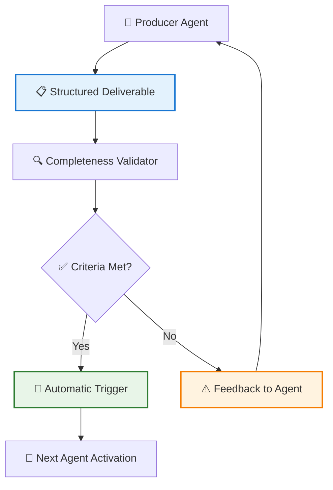
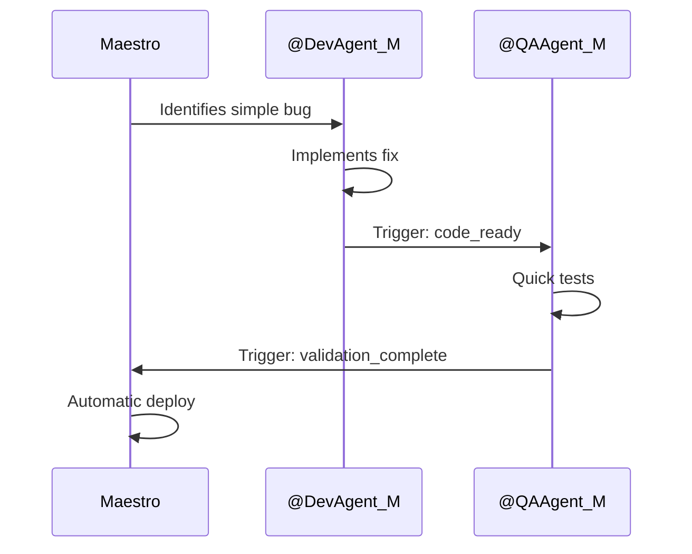
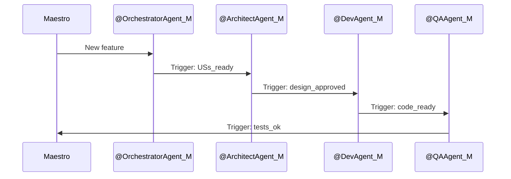
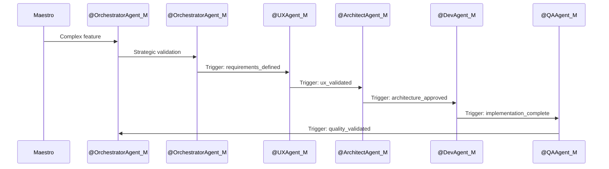

# Deliverables as Flow Triggers System Template

## 1. Introduction

This document details the **Deliverables as Flow Triggers System**, a fundamental component of **Context-Adaptive Development** implemented in AI-augmented projects. The system allows structured outputs from each agent to serve as **automatic triggers** to activate the next agent in the flow, significantly reducing the need for manual orchestration.

### 1.1. System Objectives

- **Automate** transitions between agents based on complete deliverables
- **Standardize** output structure across all agents
- **Reduce** manual orchestration overhead
- **Accelerate** development flow
- **Ensure** traceability and deliverable quality

## 2. System Architecture

### 2.1. Main Components



### 2.2. Standard Deliverable Structure

All deliverables follow a standardized YAML structure:

```yaml
# Base Template for Deliverables
metadata:
  source_agent: "@AgentName"
  timestamp: "YYYY-MM-DDTHH:MM:SSZ"
  version: "X.Y"
  status: "COMPLETE | IN_PROGRESS | BLOCKED"
  track: "EXPRESS | STANDARD | EXPLORATORY | ARCHITECTURAL"
  next_triggers: ["@Agent1", "@Agent2"]
  dependencies_met: ["deliverable_id_1", "deliverable_id_2"]
  
content:
  # Agent-specific content
  main_artifact: "..."
  secondary_artifacts: ["..."]
  strategic_context: "..."
  
completeness_criteria:
  - criterion_1: true/false
  - criterion_2: true/false
  - criterion_n: true/false
  
automatic_triggers:
  - condition: "status == COMPLETE AND all(completeness_criteria)"
    action: "activate_agents(next_triggers)"
    priority: "HIGH | MEDIUM | LOW"
  
metrics:
  execution_time: "HH:MM:SS"
  estimated_complexity: "LOW | MEDIUM | HIGH"
  quality_score: 0.0-1.0
```

## 3. Agent-Specific Specifications

### 3.1. @OrchestratorAgent_M - Product Manager + Product Owner

**Main Deliverables:**
- User Stories (USs)
- Acceptance Criteria (ACs)
- Definition of Ready (DoR)
- Definition of Done (DoD)

**Specific Template:**
```yaml
metadata:
  source_agent: "@OrchestratorAgent_M"
  next_triggers: ["@ArchitectAgent_M", "@UXDesignerAgent_M"]
  
content:
  user_stories:
    - id: "US001"
      title: "..."
      description: "As a [user], I want [functionality] so that [benefit]"
      acceptance_criteria: ["...", "...", "..."]
      priority: "HIGH | MEDIUM | LOW"
      estimation: "XS | S | M | L | XL"
  
  definition_of_ready:
    - "US clearly defined"
    - "Measurable acceptance criteria"
    - "Dependencies identified"
    
  definition_of_done:
    - "Code implemented and tested"
    - "Documentation updated"
    - "Deployment completed"
    
completeness_criteria:
  - all_us_validated: true
  - measurable_criteria: true
  - ers_alignment: true
  - prioritization_defined: true
```

**Activated Triggers:**
- If `track != "EXPRESS"` → `@ArchitectAgent_M`
- If `needs_ux == true` → `@UXDesignerAgent_M`
- If `track == "EXPRESS"` → Direct to development

### 3.2. @ArchitectAgent_M - IT Architect (Unified HLD + LLD)

**Main Deliverables:**
- High-Level Design (HLD)
- Architectural diagrams
- Architecture Decision Records (ADRs)
- Integration specifications

**Specific Template:**
```yaml
metadata:
  source_agent: "@ArchitectAgent_M"
  next_triggers: ["@APIAgent_M", "@UXDesignerAgent_M"]
  
content:
  hld_document:
    version: "X.Y"
    main_components: ["...", "...", "..."]
    integrations: ["...", "...", "..."]
    architectural_decisions: ["...", "...", "..."]
    
  diagrams:
    - type: "General Architecture"
      format: "mermaid"
      content: "..."
    - type: "Data Flow"
      format: "mermaid"
      content: "..."
      
  adrs:
    - id: "ADR001"
      title: "..."
      status: "PROPOSED | ACCEPTED | REJECTED"
      context: "..."
      decision: "..."
      consequences: "..."
      
completeness_criteria:
  - components_defined: true
  - integrations_mapped: true
  - adrs_documented: true
  - diagrams_updated: true
```

**Activated Triggers:**
- If `needs_detailing == true` → Continue with LLD in same agent
- If `needs_api == true` → `@APIDesignerAgent_M`
- If `track == "EXPRESS"` → Skip to development

### 3.3. @UXDesignerAgent_M - UX Designer

**Main Deliverables:**
- User Flows
- Wireframes
- Personas
- Journey Maps

**Specific Template:**
```yaml
metadata:
  source_agent: "@UXDesignerAgent_M"
  next_triggers: ["@UIDesignerAgent_M"]
  
content:
  user_flows:
    - id: "UF001"
      name: "..."
      steps: ["...", "...", "..."]
      pain_points: ["...", "...", "..."]
      
  wireframes:
    - screen: "..."
      type: "LOW_FI | MID_FI | HIGH_FI"
      elements: ["...", "...", "..."]
      
  personas:
    - name: "..."
      profile: "..."
      needs: ["...", "...", "..."]
      frustrations: ["...", "...", "..."]
      
completeness_criteria:
  - user_flows_validated: true
  - wireframes_approved: true
  - personas_defined: true
  - journey_mapped: true
```

### 3.4. @APIDesignerAgent_M - API Designer

**Main Deliverables:**
- OpenAPI specifications
- Endpoint documentation
- Data schemas
- Usage examples

**Specific Template:**
```yaml
metadata:
  source_agent: "@APIDesignerAgent_M"
  next_triggers: ["@DevFastAPIAgent_M"]
  
content:
  openapi_spec:
    version: "3.0.3"
    endpoints:
      - path: "..."
        method: "GET | POST | PUT | DELETE"
        summary: "..."
        parameters: ["...", "...", "..."]
        responses: {"200": "...", "400": "...", "500": "..."}
        
  schemas:
    - name: "..."
      type: "object | array | string | number"
      properties: {"...": "...", "...": "..."}
      
  examples:
    - endpoint: "..."
      request: "..."
      response: "..."
      
completeness_criteria:
  - endpoints_documented: true
  - schemas_validated: true
  - examples_functional: true
  - versioning_defined: true
```

### 3.5. @UIDesignerAgent_M - UI Designer

**Main Deliverables:**
- High-fidelity mockups
- Style Guide
- UI Components
- Visual assets

**Specific Template:**
```yaml
metadata:
  source_agent: "@UIDesignerAgent_M"
  next_triggers: ["@DevFlutterAgent_M"]
  
content:
  mockups:
    - screen: "..."
      resolution: "..."
      format: "SVG | Figma | Adobe XD"
      elements: ["...", "...", "..."]
      
  style_guide:
    colors:
      primary: "#XXXXXX"
      secondary: "#XXXXXX"
      accent: "#XXXXXX"
    typography:
      main_font: "..."
      sizes: ["...", "...", "..."]
    spacing:
      grid: "8px | 12px | 16px"
      
  components:
    - name: "..."
      type: "Button | Input | Card | Modal"
      variations: ["...", "...", "..."]
      
completeness_criteria:
  - mockups_approved: true
  - style_guide_complete: true
  - components_specified: true
  - assets_delivered: true
```

### 3.6. @DevFastAPIAgent_M - Backend Developer

**Main Deliverables:**
- Python/FastAPI code
- Unit tests
- Code documentation
- Migration scripts

**Specific Template:**
```yaml
metadata:
  source_agent: "@DevFastAPIAgent_M"
  next_triggers: ["@QAAgent_M"]
  
content:
  implemented_code:
    files: ["...", "...", "..."]
    endpoints: ["...", "...", "..."]
    models: ["...", "...", "..."]
    services: ["...", "...", "..."]
    
  tests:
    unit:
      coverage: "XX%"
      files: ["...", "...", "..."]
    integration:
      scenarios: ["...", "...", "..."]
      
  documentation:
    docstrings: "Complete"
    readme: "Updated"
    changelog: "Versioned"
    
completeness_criteria:
  - functional_code: true
  - tests_passing: true
  - adequate_coverage: true
  - documentation_updated: true
```

### 3.7. @DevFlutterAgent_M - Frontend Developer

**Main Deliverables:**
- Dart/Flutter code
- Custom widgets
- UI tests
- Integrated assets

**Specific Template:**
```yaml
metadata:
  source_agent: "@DevFlutterAgent_M"
  next_triggers: ["@QAAgent_M"]
  
content:
  implemented_code:
    screens: ["...", "...", "..."]
    widgets: ["...", "...", "..."]
    services: ["...", "...", "..."]
    models: ["...", "...", "..."]
    
  tests:
    widget_tests:
      coverage: "XX%"
      files: ["...", "...", "..."]
    integration_tests:
      scenarios: ["...", "...", "..."]
      
  assets:
    images: ["...", "...", "..."]
    fonts: ["...", "...", "..."]
    
completeness_criteria:
  - ui_implemented: true
  - widgets_functional: true
  - tests_passing: true
  - assets_integrated: true
```

### 3.8. @QAAgent_M - Quality Assurance

**Main Deliverables:**
- Test plans
- Test cases
- Execution reports
- Identified bugs

**Specific Template:**
```yaml
metadata:
  source_agent: "@QAAgent_M"
  next_triggers: ["@DocumentationAgent_M"]
  
content:
  test_plan:
    scope: "..."
    strategy: "..."
    acceptance_criteria: ["...", "...", "..."]
    
  test_cases:
    - id: "TC001"
      scenario: "..."
      steps: ["...", "...", "..."]
      expected_result: "..."
      status: "PASS | FAIL | BLOCKED"
      
  execution:
    total_cases: XX
    cases_passed: XX
    cases_failed: XX
    functional_coverage: "XX%"
    
  bugs_found:
    - id: "BUG001"
      severity: "CRITICAL | HIGH | MEDIUM | LOW"
      description: "..."
      reproduction_steps: ["...", "...", "..."]
      
completeness_criteria:
  - plan_executed: true
  - cases_documented: true
  - bugs_reported: true
  - criteria_validated: true
```

## 4. Automated Flows

### 4.1. Express Flow (Simple Bugs/Adjustments)



### 4.2. Standard Flow (Known Features)



### 4.3. Exploratory Flow (Complex Features)



## 5. Technical Implementation

### 5.1. Validation System

```python
class DeliverableValidator:
    def __init__(self, template_schema):
        self.schema = template_schema
    
    def validate(self, deliverable):
        """Validates if deliverable meets completeness criteria"""
        criteria = deliverable.get('completeness_criteria', {})
        return all(criteria.values())
    
    def get_missing_criteria(self, deliverable):
        """Returns unmet criteria"""
        criteria = deliverable.get('completeness_criteria', {})
        return [k for k, v in criteria.items() if not v]
```

### 5.2. Trigger System

```python
class TriggerSystem:
    def __init__(self):
        self.agent_registry = {}
        self.trigger_rules = {}
    
    def register_agent(self, agent_name, agent_instance):
        """Registers an agent in the system"""
        self.agent_registry[agent_name] = agent_instance
    
    def process_deliverable(self, deliverable):
        """Processes a deliverable and activates triggers"""
        if self.validate_completeness(deliverable):
            self.trigger_next_agents(deliverable)
        else:
            self.send_feedback(deliverable)
    
    def trigger_next_agents(self, deliverable):
        """Activates next agents based on triggers"""
        next_agents = deliverable['metadata']['next_triggers']
        for agent_name in next_agents:
            if agent_name in self.agent_registry:
                self.agent_registry[agent_name].activate(deliverable)
```

### 5.3. Monitoring and Metrics

```python
class FlowMetrics:
    def __init__(self):
        self.metrics = {
            'time_per_track': {},
            'success_rate': {},
            'identified_bottlenecks': [],
            'suggested_optimizations': []
        }
    
    def track_deliverable(self, deliverable):
        """Tracks deliverable metrics"""
        track = deliverable['metadata']['track']
        time = deliverable['metrics']['execution_time']
        
        self.update_track_metrics(track, time)
        self.detect_bottlenecks(deliverable)
    
    def generate_optimization_report(self):
        """Generates optimization suggestions report"""
        return {
            'bottlenecks': self.metrics['identified_bottlenecks'],
            'suggestions': self.metrics['suggested_optimizations'],
            'performance_per_track': self.metrics['time_per_track']
        }
```

## 6. Expected Benefits and Impacts

### 6.1. Operational Efficiency

| **Metric** | **Before (v1.0)** | **After (v2.0)** | **Improvement** |
|------------|------------------|------------------|----------------|
| Average Express track time | 4-6h | 30min-2h | 70-80% |
| Average Standard track time | 2-3 days | 2h-1 day | 60-70% |
| Orchestration overhead | 30-40% | 5-10% | 75-85% |
| Task parallelization | 10-20% | 60-70% | 300-400% |

### 6.2. Quality and Consistency

- **Standardization** of 100% of deliverables
- **Complete traceability** of decisions
- **Automatic validation** of quality criteria
- **Real-time feedback** loops

### 6.3. Scalability

- **Easy addition** of new agents
- **Flexible configuration** of triggers
- **Automatic learning** of patterns
- **Continuous optimization** based on data

## 7. Implementation Roadmap

### 7.1. Phase 1: Base Implementation (Week 1-2)

1. **Define** YAML templates for each agent
2. **Implement** basic validation system
3. **Test** with Express track
4. **Collect** initial metrics

### 7.2. Phase 2: Trigger Automation (Week 3-4)

1. **Develop** automatic trigger system
2. **Integrate** with Standard and Exploratory tracks
3. **Implement** flow monitoring
4. **Refine** completeness criteria

### 7.3. Phase 3: Advanced Optimization (Week 5+)

1. **Add** machine learning for classification
2. **Implement** bottleneck prediction
3. **Develop** metrics dashboard
4. **Automate** flow optimizations

## 8. Implementation Considerations

### 8.1. Technical Challenges

- **Synchronization** between parallel agents
- **Exception and failure** handling
- **Deliverable versioning**
- **State backup and recovery**

### 8.2. Critical Success Factors

- **Agent adherence** to templates
- **Quality** of completeness criteria
- **Continuous monitoring** of performance
- **Data-driven feedback** and adjustments

### 8.3. Risks and Mitigations

| **Risk** | **Impact** | **Mitigation** |
|----------|------------|----------------|
| Automatic validation failure | High | Fallback to manual validation |
| Bottlenecks in specific agents | Medium | Load balancing |
| Context loss between agents | High | Rich metadata in deliverables |
| Maintenance complexity | Medium | Comprehensive documentation and tests |

## 9. Intelligent Orchestration Considerations

### 9.1. Integration with Methodology v1.1
- **Production-Ready Agents**: System supports Tier 2 and Tier 3 agents with automatic triggers
- **Continuous Metrics**: Automatic collection of productivity and quality data
- **Operational RAG**: Continuous contextualization via knowledge base in deliverables
- **Specialized Intelligence**: Efficient delegation based on specific competencies

### 9.2. Methodological Validation Criteria
- ✅ **Efficiency**: 70-85% reduction in orchestration overhead
- ✅ **Quality**: 100% standardization of deliverables
- ✅ **Traceability**: Complete history of decisions and triggers
- ✅ **Scalability**: Support for agent team growth

### 9.3. Living Documentation Alignment
- **Synchronization**: Deliverables automatically synchronized with RAG base
- **Versioning**: Integrated version control with Git
- **References**: Automatic links to related documents
- **Metrics**: Real-time performance dashboards

## 10. Version History

### v1.1 (June 2025) - Intelligent Orchestration and Specialized Intelligence
- Updated references to v1.1 documents
- Alignment with Intelligent Orchestration methodology
- Added considerations for Production-Ready agents
- Integration with productivity and quality metrics
- Synchronization with operational RAG base

### v1.0 (June 2025) - Initial Version
- Definition of base deliverables as triggers system
- Establishment of standardized YAML templates
- Implementation of automated flows
- Initial efficiency metrics

## 11. Related Documents

- **Advanced Methodology Guide** (v1.1) - Base methodology
- **General Workflow** (v1.1) - General workflow
- **Requirements Specification** (v1.1) - Requirements specification
- **High-Level Design** (v1.1) - High-Level Design
- **AI Agents Overview** - Agent overview

**Note:** This document (v1.1) is fully aligned with the "Intelligent Orchestration" and "Specialized Intelligence" methodology defined in the Advanced Guide (v1.1), incorporating advanced flow automation and continuous productivity measurement.

---

**END OF DELIVERABLES_TRIGGER_SYSTEM.md TEMPLATE (v1.0)**

*"Intelligent automation doesn't replace human judgment, but frees time for decisions that truly matter."*