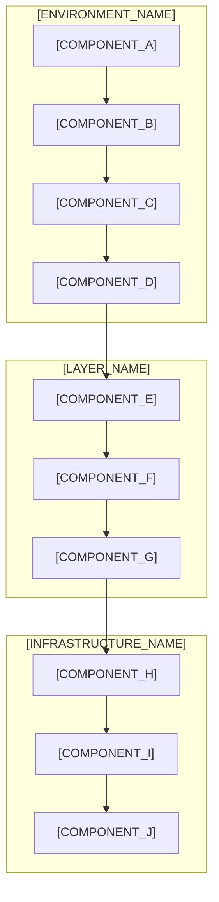

# [LLD_TITLE]

## [LLD_METADATA]

**Versão**: [VERSION]  
**Data de Criação**: [CREATION_DATE]  
**Data de Última Atualização**: [LAST_UPDATE_DATE]  
**Autor**: [AUTHOR]  
**Aprovação**: [APPROVER]  

**Baseado em**:
- [REFERENCE_DOCUMENT_1]
- [REFERENCE_DOCUMENT_2]
- [REFERENCE_DOCUMENT_3]

---

## 📋 Resumo Executivo

[LLD_EXECUTIVE_SUMMARY]

**Objetivos Principais:**
- [OBJECTIVE_1]
- [OBJECTIVE_2]
- [OBJECTIVE_3]
- [OBJECTIVE_4]

---

## 🏗️ Visão Geral da Arquitetura

### Diagrama da Arquitetura



### [ARCHITECTURE_DESCRIPTION]

[ARCHITECTURE_DETAILS]

---

## 🔧 Componentes Detalhados

### [COMPONENT_1_NAME]

**Responsabilidades:**
- [RESPONSIBILITY_1]
- [RESPONSIBILITY_2]
- [RESPONSIBILITY_3]

**Tecnologias:**
- [TECHNOLOGY_1]
- [TECHNOLOGY_2]
- [TECHNOLOGY_3]

**Interfaces:**
- [INTERFACE_1]
- [INTERFACE_2]

### [COMPONENT_2_NAME]

**Responsabilidades:**
- [RESPONSIBILITY_1]
- [RESPONSIBILITY_2]
- [RESPONSIBILITY_3]

**Tecnologias:**
- [TECHNOLOGY_1]
- [TECHNOLOGY_2]
- [TECHNOLOGY_3]

**Interfaces:**
- [INTERFACE_1]
- [INTERFACE_2]

---

## 📊 Estruturas de Dados

### [DATA_STRUCTURE_1]

```typescript
interface [INTERFACE_NAME] {
  [FIELD_1]: [TYPE_1];
  [FIELD_2]: [TYPE_2];
  [FIELD_3]: [TYPE_3];
}
```

### [DATA_STRUCTURE_2]

```typescript
type [TYPE_NAME] = {
  [PROPERTY_1]: [TYPE_1];
  [PROPERTY_2]: [TYPE_2];
  [PROPERTY_3]: [TYPE_3];
};
```

---

## 🔌 Especificações de API

### [API_ENDPOINT_1]

**Endpoint:** `[HTTP_METHOD] [ENDPOINT_PATH]`

**Parâmetros:**
- `[PARAM_1]`: [PARAM_TYPE] - [PARAM_DESCRIPTION]
- `[PARAM_2]`: [PARAM_TYPE] - [PARAM_DESCRIPTION]

**Resposta:**
```json
{
  "[FIELD_1]": "[VALUE_TYPE]",
  "[FIELD_2]": "[VALUE_TYPE]",
  "[FIELD_3]": "[VALUE_TYPE]"
}
```

### [API_ENDPOINT_2]

**Endpoint:** `[HTTP_METHOD] [ENDPOINT_PATH]`

**Parâmetros:**
- `[PARAM_1]`: [PARAM_TYPE] - [PARAM_DESCRIPTION]
- `[PARAM_2]`: [PARAM_TYPE] - [PARAM_DESCRIPTION]

**Resposta:**
```json
{
  "[FIELD_1]": "[VALUE_TYPE]",
  "[FIELD_2]": "[VALUE_TYPE]",
  "[FIELD_3]": "[VALUE_TYPE]"
}
```

---

## ⚙️ Algoritmos e Lógica de Negócio

### [ALGORITHM_1_NAME]

**Descrição:** [ALGORITHM_DESCRIPTION]

**Fluxo:**
1. [STEP_1]
2. [STEP_2]
3. [STEP_3]
4. [STEP_4]

**Complexidade:** [TIME_COMPLEXITY] / [SPACE_COMPLEXITY]

### [ALGORITHM_2_NAME]

**Descrição:** [ALGORITHM_DESCRIPTION]

**Fluxo:**
1. [STEP_1]
2. [STEP_2]
3. [STEP_3]
4. [STEP_4]

**Complexidade:** [TIME_COMPLEXITY] / [SPACE_COMPLEXITY]

---

## 🗄️ Design de Banco de Dados

### [TABLE_1_NAME]

```sql
CREATE TABLE [TABLE_NAME] (
    [FIELD_1] [DATA_TYPE] [CONSTRAINTS],
    [FIELD_2] [DATA_TYPE] [CONSTRAINTS],
    [FIELD_3] [DATA_TYPE] [CONSTRAINTS],
    PRIMARY KEY ([PRIMARY_KEY_FIELD]),
    FOREIGN KEY ([FOREIGN_KEY_FIELD]) REFERENCES [REFERENCED_TABLE]([REFERENCED_FIELD])
);
```

### [TABLE_2_NAME]

```sql
CREATE TABLE [TABLE_NAME] (
    [FIELD_1] [DATA_TYPE] [CONSTRAINTS],
    [FIELD_2] [DATA_TYPE] [CONSTRAINTS],
    [FIELD_3] [DATA_TYPE] [CONSTRAINTS],
    PRIMARY KEY ([PRIMARY_KEY_FIELD]),
    FOREIGN KEY ([FOREIGN_KEY_FIELD]) REFERENCES [REFERENCED_TABLE]([REFERENCED_FIELD])
);
```

---

## 🔒 Considerações de Segurança

### [SECURITY_ASPECT_1]

- [SECURITY_MEASURE_1]
- [SECURITY_MEASURE_2]
- [SECURITY_MEASURE_3]

### [SECURITY_ASPECT_2]

- [SECURITY_MEASURE_1]
- [SECURITY_MEASURE_2]
- [SECURITY_MEASURE_3]

---

## ⚡ Requisitos de Performance

### [PERFORMANCE_METRIC_1]

- **Objetivo:** [PERFORMANCE_TARGET]
- **Medição:** [MEASUREMENT_METHOD]
- **Otimizações:** [OPTIMIZATION_STRATEGIES]

### [PERFORMANCE_METRIC_2]

- **Objetivo:** [PERFORMANCE_TARGET]
- **Medição:** [MEASUREMENT_METHOD]
- **Otimizações:** [OPTIMIZATION_STRATEGIES]

---

## 🚨 Tratamento de Erros

### [ERROR_CATEGORY_1]

**Cenários:**
- [ERROR_SCENARIO_1]
- [ERROR_SCENARIO_2]
- [ERROR_SCENARIO_3]

**Estratégias:**
- [ERROR_HANDLING_STRATEGY_1]
- [ERROR_HANDLING_STRATEGY_2]
- [ERROR_HANDLING_STRATEGY_3]

### [ERROR_CATEGORY_2]

**Cenários:**
- [ERROR_SCENARIO_1]
- [ERROR_SCENARIO_2]
- [ERROR_SCENARIO_3]

**Estratégias:**
- [ERROR_HANDLING_STRATEGY_1]
- [ERROR_HANDLING_STRATEGY_2]
- [ERROR_HANDLING_STRATEGY_3]

---

## 🧪 Estratégia de Testes

### [TEST_CATEGORY_1]

**Escopo:** [TEST_SCOPE]

**Casos de Teste:**
- [TEST_CASE_1]
- [TEST_CASE_2]
- [TEST_CASE_3]

**Ferramentas:** [TESTING_TOOLS]

### [TEST_CATEGORY_2]

**Escopo:** [TEST_SCOPE]

**Casos de Teste:**
- [TEST_CASE_1]
- [TEST_CASE_2]
- [TEST_CASE_3]

**Ferramentas:** [TESTING_TOOLS]

---

## 🚀 Considerações de Deploy

### [DEPLOYMENT_ENVIRONMENT_1]

**Requisitos:**
- [REQUIREMENT_1]
- [REQUIREMENT_2]
- [REQUIREMENT_3]

**Processo:**
1. [DEPLOYMENT_STEP_1]
2. [DEPLOYMENT_STEP_2]
3. [DEPLOYMENT_STEP_3]

### [DEPLOYMENT_ENVIRONMENT_2]

**Requisitos:**
- [REQUIREMENT_1]
- [REQUIREMENT_2]
- [REQUIREMENT_3]

**Processo:**
1. [DEPLOYMENT_STEP_1]
2. [DEPLOYMENT_STEP_2]
3. [DEPLOYMENT_STEP_3]

---

## 📊 Monitoramento e Logging

### [MONITORING_ASPECT_1]

**Métricas:**
- [METRIC_1]: [METRIC_DESCRIPTION]
- [METRIC_2]: [METRIC_DESCRIPTION]
- [METRIC_3]: [METRIC_DESCRIPTION]

**Alertas:**
- [ALERT_CONDITION_1]
- [ALERT_CONDITION_2]
- [ALERT_CONDITION_3]

### [MONITORING_ASPECT_2]

**Métricas:**
- [METRIC_1]: [METRIC_DESCRIPTION]
- [METRIC_2]: [METRIC_DESCRIPTION]
- [METRIC_3]: [METRIC_DESCRIPTION]

**Alertas:**
- [ALERT_CONDITION_1]
- [ALERT_CONDITION_2]
- [ALERT_CONDITION_3]

---

## 📚 Apêndices

### [APPENDIX_A]

[APPENDIX_CONTENT_A]

### [APPENDIX_B]

[APPENDIX_CONTENT_B]

---

## 🔗 Referências

- [REFERENCE_1]
- [REFERENCE_2]
- [REFERENCE_3]
- [REFERENCE_4]
- [REFERENCE_5]

---

**Documento gerado pelo Codex Prime Framework v1.0**  
**Última atualização:** [LAST_UPDATE_TIMESTAMP]