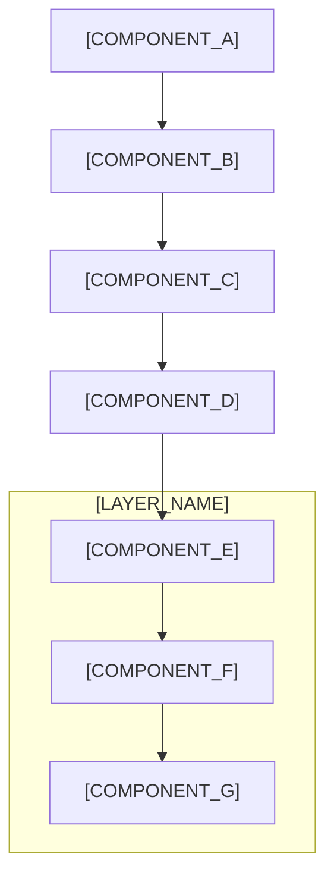

# Low-Level Design - [MODULE_NAME]

**Projeto:** [PROJECT_NAME]  
**Módulo:** [MODULE_DESCRIPTION]  
**Versão:** [VERSION]
**Data de Criação:** [CREATION_DATE]  
**Última Atualização:** [LAST_UPDATE_DATE]  
**Autor:** [AUTHOR]
**Baseado em:** [REFERENCE_DOCUMENTS]

---

## 1. Visão Geral do Módulo

### 1.1. Propósito
[MODULE_PURPOSE_DESCRIPTION]

### 1.2. Objetivos
- [OBJECTIVE_1]
- [OBJECTIVE_2]
- [OBJECTIVE_3]

### 1.3. Escopo
**Incluído:**
- [SCOPE_ITEM_1]
- [SCOPE_ITEM_2]
- [SCOPE_ITEM_3]

**Excluído:**
- [OUT_OF_SCOPE_ITEM_1]
- [OUT_OF_SCOPE_ITEM_2]

---

## 2. Arquitetura do Módulo

### 2.1. Diagrama de Componentes



### 2.2. Componentes Principais

#### [COMPONENT_1_NAME]
**Responsabilidades:**
- [RESPONSIBILITY_1]
- [RESPONSIBILITY_2]
- [RESPONSIBILITY_3]

**Tecnologias:**
- [TECHNOLOGY_1]
- [TECHNOLOGY_2]

#### [COMPONENT_2_NAME]
**Responsabilidades:**
- [RESPONSIBILITY_1]
- [RESPONSIBILITY_2]
- [RESPONSIBILITY_3]

**Tecnologias:**
- [TECHNOLOGY_1]
- [TECHNOLOGY_2]

---

## 3. Estruturas de Dados

### 3.1. [DATA_MODEL_1]

```typescript
interface [INTERFACE_NAME] {
  [FIELD_1]: [TYPE_1];
  [FIELD_2]: [TYPE_2];
  [FIELD_3]: [TYPE_3];
  [FIELD_4]: [TYPE_4];
}
```

### 3.2. [DATA_MODEL_2]

```typescript
type [TYPE_NAME] = {
  [PROPERTY_1]: [TYPE_1];
  [PROPERTY_2]: [TYPE_2];
  [PROPERTY_3]: [TYPE_3];
};
```

---

## 4. APIs e Interfaces

### 4.1. [API_CATEGORY_1]

#### [ENDPOINT_1]
**Método:** `[HTTP_METHOD]`  
**Endpoint:** `[ENDPOINT_PATH]`  
**Descrição:** [ENDPOINT_DESCRIPTION]

**Parâmetros:**
```typescript
{
  [PARAM_1]: [TYPE_1]; // [PARAM_DESCRIPTION_1]
  [PARAM_2]: [TYPE_2]; // [PARAM_DESCRIPTION_2]
  [PARAM_3]: [TYPE_3]; // [PARAM_DESCRIPTION_3]
}
```

**Resposta:**
```typescript
{
  [RESPONSE_FIELD_1]: [TYPE_1];
  [RESPONSE_FIELD_2]: [TYPE_2];
  [RESPONSE_FIELD_3]: [TYPE_3];
}
```

#### [ENDPOINT_2]
**Método:** `[HTTP_METHOD]`  
**Endpoint:** `[ENDPOINT_PATH]`  
**Descrição:** [ENDPOINT_DESCRIPTION]

**Parâmetros:**
```typescript
{
  [PARAM_1]: [TYPE_1]; // [PARAM_DESCRIPTION_1]
  [PARAM_2]: [TYPE_2]; // [PARAM_DESCRIPTION_2]
}
```

**Resposta:**
```typescript
{
  [RESPONSE_FIELD_1]: [TYPE_1];
  [RESPONSE_FIELD_2]: [TYPE_2];
}
```

---

## 5. Lógica de Negócio

### 5.1. [BUSINESS_RULE_1]

**Descrição:** [BUSINESS_RULE_DESCRIPTION]

**Fluxo:**
1. [STEP_1]
2. [STEP_2]
3. [STEP_3]
4. [STEP_4]

**Validações:**
- [VALIDATION_1]
- [VALIDATION_2]
- [VALIDATION_3]

### 5.2. [BUSINESS_RULE_2]

**Descrição:** [BUSINESS_RULE_DESCRIPTION]

**Fluxo:**
1. [STEP_1]
2. [STEP_2]
3. [STEP_3]

**Validações:**
- [VALIDATION_1]
- [VALIDATION_2]

---

## 6. Banco de Dados

### 6.1. [TABLE_1_NAME]

```sql
CREATE TABLE [TABLE_NAME] (
    [FIELD_1] [DATA_TYPE] [CONSTRAINTS],
    [FIELD_2] [DATA_TYPE] [CONSTRAINTS],
    [FIELD_3] [DATA_TYPE] [CONSTRAINTS],
    [FIELD_4] [DATA_TYPE] [CONSTRAINTS],
    
    PRIMARY KEY ([PRIMARY_KEY_FIELD]),
    FOREIGN KEY ([FOREIGN_KEY_FIELD]) REFERENCES [REFERENCED_TABLE]([REFERENCED_FIELD])
);
```

**Índices:**
```sql
CREATE INDEX [INDEX_NAME] ON [TABLE_NAME] ([INDEXED_FIELD]);
CREATE INDEX [INDEX_NAME_2] ON [TABLE_NAME] ([INDEXED_FIELD_1], [INDEXED_FIELD_2]);
```

### 6.2. [TABLE_2_NAME]

```sql
CREATE TABLE [TABLE_NAME] (
    [FIELD_1] [DATA_TYPE] [CONSTRAINTS],
    [FIELD_2] [DATA_TYPE] [CONSTRAINTS],
    [FIELD_3] [DATA_TYPE] [CONSTRAINTS],
    
    PRIMARY KEY ([PRIMARY_KEY_FIELD])
);
```

---

## 7. Segurança

### 7.1. [SECURITY_ASPECT_1]

**Medidas de Segurança:**
- [SECURITY_MEASURE_1]
- [SECURITY_MEASURE_2]
- [SECURITY_MEASURE_3]

**Validações:**
- [VALIDATION_1]
- [VALIDATION_2]

### 7.2. [SECURITY_ASPECT_2]

**Medidas de Segurança:**
- [SECURITY_MEASURE_1]
- [SECURITY_MEASURE_2]

**Controles de Acesso:**
- [ACCESS_CONTROL_1]
- [ACCESS_CONTROL_2]

---

## 8. Performance e Otimização

### 8.1. [PERFORMANCE_ASPECT_1]

**Objetivo:** [PERFORMANCE_TARGET]

**Estratégias:**
- [OPTIMIZATION_STRATEGY_1]
- [OPTIMIZATION_STRATEGY_2]
- [OPTIMIZATION_STRATEGY_3]

**Métricas:**
- [METRIC_1]: [TARGET_VALUE]
- [METRIC_2]: [TARGET_VALUE]

### 8.2. [PERFORMANCE_ASPECT_2]

**Objetivo:** [PERFORMANCE_TARGET]

**Estratégias:**
- [OPTIMIZATION_STRATEGY_1]
- [OPTIMIZATION_STRATEGY_2]

---

## 9. Tratamento de Erros

### 9.1. [ERROR_CATEGORY_1]

**Cenários de Erro:**
- [ERROR_SCENARIO_1]
- [ERROR_SCENARIO_2]
- [ERROR_SCENARIO_3]

**Estratégias de Tratamento:**
- [ERROR_HANDLING_1]
- [ERROR_HANDLING_2]
- [ERROR_HANDLING_3]

### 9.2. [ERROR_CATEGORY_2]

**Cenários de Erro:**
- [ERROR_SCENARIO_1]
- [ERROR_SCENARIO_2]

**Estratégias de Tratamento:**
- [ERROR_HANDLING_1]
- [ERROR_HANDLING_2]

---

## 10. Testes

### 10.1. [TEST_CATEGORY_1]

**Escopo:** [TEST_SCOPE]

**Casos de Teste:**
- [TEST_CASE_1]
- [TEST_CASE_2]
- [TEST_CASE_3]

**Ferramentas:** [TESTING_TOOLS]

### 10.2. [TEST_CATEGORY_2]

**Escopo:** [TEST_SCOPE]

**Casos de Teste:**
- [TEST_CASE_1]
- [TEST_CASE_2]

**Ferramentas:** [TESTING_TOOLS]

---

## 11. Deploy e Configuração

### 11.1. [DEPLOYMENT_ENVIRONMENT_1]

**Requisitos:**
- [REQUIREMENT_1]
- [REQUIREMENT_2]
- [REQUIREMENT_3]

**Configurações:**
```yaml
[CONFIG_KEY_1]: [CONFIG_VALUE_1]
[CONFIG_KEY_2]: [CONFIG_VALUE_2]
[CONFIG_KEY_3]: [CONFIG_VALUE_3]
```

**Processo de Deploy:**
1. [DEPLOY_STEP_1]
2. [DEPLOY_STEP_2]
3. [DEPLOY_STEP_3]

### 11.2. [DEPLOYMENT_ENVIRONMENT_2]

**Requisitos:**
- [REQUIREMENT_1]
- [REQUIREMENT_2]

**Configurações:**
```yaml
[CONFIG_KEY_1]: [CONFIG_VALUE_1]
[CONFIG_KEY_2]: [CONFIG_VALUE_2]
```

---

## 12. Monitoramento e Logging

### 12.1. [MONITORING_ASPECT_1]

**Métricas:**
- [METRIC_1]: [METRIC_DESCRIPTION]
- [METRIC_2]: [METRIC_DESCRIPTION]
- [METRIC_3]: [METRIC_DESCRIPTION]

**Alertas:**
- [ALERT_CONDITION_1]
- [ALERT_CONDITION_2]

### 12.2. [MONITORING_ASPECT_2]

**Logs:**
- [LOG_TYPE_1]: [LOG_DESCRIPTION]
- [LOG_TYPE_2]: [LOG_DESCRIPTION]

**Dashboards:**
- [DASHBOARD_1]: [DASHBOARD_DESCRIPTION]
- [DASHBOARD_2]: [DASHBOARD_DESCRIPTION]

---

## 13. Dependências

### 13.1. Dependências Internas
- [INTERNAL_DEPENDENCY_1]: [DEPENDENCY_DESCRIPTION]
- [INTERNAL_DEPENDENCY_2]: [DEPENDENCY_DESCRIPTION]
- [INTERNAL_DEPENDENCY_3]: [DEPENDENCY_DESCRIPTION]

### 13.2. Dependências Externas
- [EXTERNAL_DEPENDENCY_1]: [DEPENDENCY_DESCRIPTION]
- [EXTERNAL_DEPENDENCY_2]: [DEPENDENCY_DESCRIPTION]

---

## 14. Considerações Futuras

### 14.1. [FUTURE_CONSIDERATION_1]
[CONSIDERATION_DESCRIPTION]

### 14.2. [FUTURE_CONSIDERATION_2]
[CONSIDERATION_DESCRIPTION]

---

## 15. Referências

- [REFERENCE_1]
- [REFERENCE_2]
- [REFERENCE_3]
- [REFERENCE_4]

---

**Documento gerado pelo Codex Prime Framework v1.0**  
**Última atualização:** [LAST_UPDATE_TIMESTAMP]
