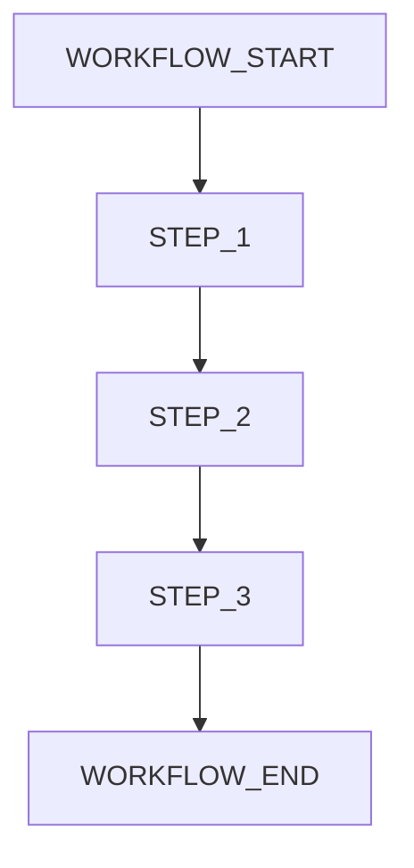

# 🎯 [PROJECT_NAME] - Melhores Práticas

**Versão:** [VERSION]  
**Data:** [DATE]  
**Projeto:** [PROJECT_NAME]  
**Escopo:** [SCOPE_DESCRIPTION]

---

## 📋 Índice

### **Parte I - Guia Prático de Configuração**
1. [Configuração de Componentes](#configuração-de-componentes)
2. [Estratégia de Testes](#estratégia-de-testes)
3. [Orquestração e Workflow](#orquestração-e-workflow)
4. [Melhores Práticas de Desenvolvimento](#melhores-práticas-de-desenvolvimento)
5. [Gestão de Contexto e Dados](#gestão-de-contexto-e-dados)
6. [Debugging e Troubleshooting](#debugging-e-troubleshooting)
7. [Métricas e Avaliação](#métricas-e-avaliação)
8. [Segurança e Compliance](#segurança-e-compliance)

### **Parte II - Diretrizes Técnicas**
9. [Integração de Sistemas](#integração-de-sistemas)
10. [Gerenciamento de Estado](#gerenciamento-de-estado)
11. [Definição e Uso de Ferramentas](#definição-e-uso-de-ferramentas)
12. [Interação com Fontes de Dados](#interação-com-fontes-de-dados)
13. [Estruturação de Configurações](#estruturação-de-configurações)
14. [Capacidades de Orquestração](#capacidades-de-orquestração)
15. [Limitações e Recomendações](#limitações-e-recomendações)

---

## 🔧 Configuração de Componentes

### **Hierarquia de Componentes [PROJECT_NAME]**

```
[COMPONENT_HIERARCHY_DIAGRAM]
```

### **Configuração Base**

```yaml
# [CONFIGURATION_EXAMPLE]
components:
  - name: [COMPONENT_NAME]
    type: [COMPONENT_TYPE]
    config:
      [CONFIGURATION_PARAMETERS]
```

### **Padrões de Nomenclatura**

- **Componentes:** `[NAMING_PATTERN]`
- **Configurações:** `[CONFIG_NAMING_PATTERN]`
- **Variáveis:** `[VARIABLE_NAMING_PATTERN]`

---

## 🧪 Estratégia de Testes

### **Níveis de Teste**

1. **Testes Unitários**
   - [UNIT_TEST_GUIDELINES]
   - Cobertura mínima: [COVERAGE_PERCENTAGE]%

2. **Testes de Integração**
   - [INTEGRATION_TEST_GUIDELINES]
   - Cenários críticos: [CRITICAL_SCENARIOS]

3. **Testes End-to-End**
   - [E2E_TEST_GUIDELINES]
   - Fluxos principais: [MAIN_FLOWS]

### **Ferramentas de Teste**

```bash
# [TEST_COMMANDS]
[TEST_FRAMEWORK] [TEST_PARAMETERS]
```

---

## 🔄 Orquestração e Workflow

### **Fluxo de Trabalho Principal**



### **Padrões de Orquestração**

- **Sequencial:** [SEQUENTIAL_PATTERN]
- **Paralelo:** [PARALLEL_PATTERN]
- **Condicional:** [CONDITIONAL_PATTERN]

---

## 💡 Melhores Práticas de Desenvolvimento

### **Princípios Fundamentais**

1. **[PRINCIPLE_1]**
   - [PRINCIPLE_1_DESCRIPTION]
   - Implementação: [IMPLEMENTATION_DETAILS]

2. **[PRINCIPLE_2]**
   - [PRINCIPLE_2_DESCRIPTION]
   - Implementação: [IMPLEMENTATION_DETAILS]

### **Padrões de Código**

```typescript
// [CODE_PATTERN_EXAMPLE]
interface [INTERFACE_NAME] {
  [PROPERTY]: [TYPE];
  [METHOD](): [RETURN_TYPE];
}
```

---

## 📊 Gestão de Contexto e Dados

### **Estratégia de Dados**

- **Fonte de Dados:** [DATA_SOURCE]
- **Formato:** [DATA_FORMAT]
- **Validação:** [VALIDATION_STRATEGY]

### **Gerenciamento de Estado**

```typescript
// [STATE_MANAGEMENT_EXAMPLE]
interface [STATE_INTERFACE] {
  [STATE_PROPERTIES]
}
```

---

## 🐛 Debugging e Troubleshooting

### **Estratégias de Debug**

1. **Logs Estruturados**
   ```typescript
   // [LOGGING_EXAMPLE]
   logger.[LEVEL]('[MESSAGE]', { [CONTEXT] });
   ```

2. **Métricas de Performance**
   - [PERFORMANCE_METRICS]
   - Thresholds: [PERFORMANCE_THRESHOLDS]

### **Problemas Comuns**

| Problema | Causa | Solução |
|----------|-------|----------|
| [PROBLEM_1] | [CAUSE_1] | [SOLUTION_1] |
| [PROBLEM_2] | [CAUSE_2] | [SOLUTION_2] |

---

## 📈 Métricas e Avaliação

### **KPIs Principais**

- **Performance:** [PERFORMANCE_METRICS]
- **Qualidade:** [QUALITY_METRICS]
- **Confiabilidade:** [RELIABILITY_METRICS]

### **Monitoramento**

```yaml
# [MONITORING_CONFIG]
metrics:
  - name: [METRIC_NAME]
    threshold: [THRESHOLD_VALUE]
    alert: [ALERT_CONDITION]
```

---

## 🔒 Segurança e Compliance

### **Diretrizes de Segurança**

1. **Autenticação**
   - [AUTH_REQUIREMENTS]
   - Implementação: [AUTH_IMPLEMENTATION]

2. **Autorização**
   - [AUTHZ_REQUIREMENTS]
   - Controles: [ACCESS_CONTROLS]

### **Compliance**

- **Padrões:** [COMPLIANCE_STANDARDS]
- **Auditoria:** [AUDIT_REQUIREMENTS]

---

## 🔗 Integração de Sistemas

### **Padrões de Integração**

- **APIs REST:** [REST_GUIDELINES]
- **GraphQL:** [GRAPHQL_GUIDELINES]
- **WebSockets:** [WEBSOCKET_GUIDELINES]

### **Tratamento de Erros**

```typescript
// [ERROR_HANDLING_EXAMPLE]
try {
  [OPERATION]
} catch (error) {
  [ERROR_HANDLING_LOGIC]
}
```

---

## 🎛️ Gerenciamento de Estado

### **Arquitetura de Estado**

```typescript
// [STATE_ARCHITECTURE_EXAMPLE]
interface [APP_STATE] {
  [STATE_MODULES]
}
```

### **Padrões de Mutação**

- **Imutabilidade:** [IMMUTABILITY_PATTERN]
- **Reducers:** [REDUCER_PATTERN]
- **Actions:** [ACTION_PATTERN]

---

## 🛠️ Definição e Uso de Ferramentas

### **Ferramentas Customizadas**

```typescript
// [CUSTOM_TOOL_EXAMPLE]
interface [TOOL_INTERFACE] {
  name: string;
  execute: ([PARAMETERS]) => [RETURN_TYPE];
}
```

### **Configuração de Ferramentas**

```yaml
# [TOOL_CONFIG_EXAMPLE]
tools:
  - name: [TOOL_NAME]
    config: [TOOL_CONFIG]
```

---

## 💾 Interação com Fontes de Dados

### **Estratégias de Acesso**

- **Cache:** [CACHE_STRATEGY]
- **Sincronização:** [SYNC_STRATEGY]
- **Backup:** [BACKUP_STRATEGY]

### **Otimização de Queries**

```sql
-- [QUERY_OPTIMIZATION_EXAMPLE]
SELECT [FIELDS]
FROM [TABLES]
WHERE [CONDITIONS]
ORDER BY [ORDER_CRITERIA];
```

---

## ⚙️ Estruturação de Configurações

### **Hierarquia de Configuração**

```yaml
# [CONFIG_HIERARCHY_EXAMPLE]
app:
  name: [APP_NAME]
  version: [VERSION]
  environment: [ENVIRONMENT]
  
modules:
  [MODULE_CONFIGS]
```

### **Validação de Configuração**

```typescript
// [CONFIG_VALIDATION_EXAMPLE]
const configSchema = z.object({
  [SCHEMA_DEFINITION]
});
```

---

## 🎼 Capacidades de Orquestração

### **Padrões de Orquestração**

- **Saga Pattern:** [SAGA_IMPLEMENTATION]
- **Event Sourcing:** [EVENT_SOURCING_PATTERN]
- **CQRS:** [CQRS_IMPLEMENTATION]

### **Gerenciamento de Workflows**

```typescript
// [WORKFLOW_MANAGEMENT_EXAMPLE]
interface [WORKFLOW_INTERFACE] {
  steps: [STEP_TYPE][];
  execute(): Promise<[RESULT_TYPE]>;
}
```

---

## ⚠️ Limitações e Recomendações

### **Limitações Conhecidas**

1. **[LIMITATION_1]**
   - Descrição: [LIMITATION_DESCRIPTION]
   - Workaround: [WORKAROUND_SOLUTION]

2. **[LIMITATION_2]**
   - Descrição: [LIMITATION_DESCRIPTION]
   - Workaround: [WORKAROUND_SOLUTION]

### **Recomendações Futuras**

- **Curto Prazo:** [SHORT_TERM_RECOMMENDATIONS]
- **Médio Prazo:** [MEDIUM_TERM_RECOMMENDATIONS]
- **Longo Prazo:** [LONG_TERM_RECOMMENDATIONS]

---

## 📚 Referências e Recursos

### **Documentação Técnica**

- [REFERENCE_1]: [REFERENCE_1_URL]
- [REFERENCE_2]: [REFERENCE_2_URL]
- [REFERENCE_3]: [REFERENCE_3_URL]

### **Ferramentas e Bibliotecas**

- [TOOL_1]: [TOOL_1_DESCRIPTION]
- [TOOL_2]: [TOOL_2_DESCRIPTION]
- [TOOL_3]: [TOOL_3_DESCRIPTION]

---

## 📝 Changelog

### **Versão [VERSION] - [DATE]**
- [CHANGE_1]
- [CHANGE_2]
- [CHANGE_3]

### **Versão [PREVIOUS_VERSION] - [PREVIOUS_DATE]**
- [PREVIOUS_CHANGE_1]
- [PREVIOUS_CHANGE_2]

---

**Documento mantido por:** [MAINTAINER_NAME]  
**Última atualização:** [LAST_UPDATE_DATE]  
**Próxima revisão:** [NEXT_REVIEW_DATE]
