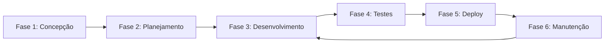

# Fluxo de Trabalho Geral - [NOME_DO_PROJETO]

**Versão**: [VERSAO]
**Status**: [STATUS] (Em Desenvolvimento, Aprovado, Ativo, Arquivado)
**Data de Criação**: [DATA_CRIACAO]
**Data de Última Atualização**: [DATA_ATUALIZACAO]
**Baseado em**: [REFERENCIAS_BASE]

---

## 1. Introdução

### 1.1. Propósito
Este documento define o **Fluxo de Trabalho Geral** para o desenvolvimento do projeto [NOME_DO_PROJETO], estabelecendo os processos, metodologias e práticas que guiarão a execução das atividades do projeto.

### 1.2. Escopo
- **Aplicável a**: [ESCOPO_APLICACAO] (Todo o projeto, Equipe de desenvolvimento, Área específica)
- **Fases Cobertas**: [FASES_COBERTAS] (Concepção, Desenvolvimento, Testes, Deploy, Manutenção)
- **Stakeholders**: [STAKEHOLDERS_ENVOLVIDOS]

### 1.3. Metodologia Base
**Metodologia Principal**: [METODOLOGIA] (Ágil, Scrum, Kanban, Waterfall, Híbrida)

**Características da Metodologia**:
- [CARACTERISTICA_1] - Descrição da primeira característica
- [CARACTERISTICA_2] - Descrição da segunda característica
- [CARACTERISTICA_3] - Descrição da terceira característica

### 1.4. Princípios Fundamentais

1. **[PRINCIPIO_1]**: [DESCRICAO_PRINCIPIO_1]
2. **[PRINCIPIO_2]**: [DESCRICAO_PRINCIPIO_2]
3. **[PRINCIPIO_3]**: [DESCRICAO_PRINCIPIO_3]
4. **[PRINCIPIO_4]**: [DESCRICAO_PRINCIPIO_4]
5. **[PRINCIPIO_5]**: [DESCRICAO_PRINCIPIO_5]

## 2. Estrutura Organizacional

### 2.1. Papéis e Responsabilidades

| **Papel** | **Responsabilidades** | **Pessoa/Equipe** | **Nível de Autoridade** |
|-----------|----------------------|-------------------|------------------------|
| **[PAPEL_1]** | [RESPONSABILIDADES_1] | [RESPONSAVEL_1] | [AUTORIDADE_1] |
| **[PAPEL_2]** | [RESPONSABILIDADES_2] | [RESPONSAVEL_2] | [AUTORIDADE_2] |
| **[PAPEL_3]** | [RESPONSABILIDADES_3] | [RESPONSAVEL_3] | [AUTORIDADE_3] |
| **[PAPEL_4]** | [RESPONSABILIDADES_4] | [RESPONSAVEL_4] | [AUTORIDADE_4] |

### 2.2. Estrutura de Comunicação

#### 2.2.1. Canais de Comunicação
- **[CANAL_1]**: [PROPOSITO_CANAL_1] - [FREQUENCIA_1]
- **[CANAL_2]**: [PROPOSITO_CANAL_2] - [FREQUENCIA_2]
- **[CANAL_3]**: [PROPOSITO_CANAL_3] - [FREQUENCIA_3]

#### 2.2.2. Reuniões Regulares
| **Reunião** | **Frequência** | **Duração** | **Participantes** | **Objetivo** |
|-------------|----------------|-------------|-------------------|-------------|
| [REUNIAO_1] | [FREQ_1] | [DURACAO_1] | [PARTICIPANTES_1] | [OBJETIVO_1] |
| [REUNIAO_2] | [FREQ_2] | [DURACAO_2] | [PARTICIPANTES_2] | [OBJETIVO_2] |
| [REUNIAO_3] | [FREQ_3] | [DURACAO_3] | [PARTICIPANTES_3] | [OBJETIVO_3] |

### 2.3. Matriz RACI

| **Atividade** | **[PAPEL_1]** | **[PAPEL_2]** | **[PAPEL_3]** | **[PAPEL_4]** |
|---------------|---------------|---------------|---------------|---------------|
| [ATIVIDADE_1] | [R/A/C/I] | [R/A/C/I] | [R/A/C/I] | [R/A/C/I] |
| [ATIVIDADE_2] | [R/A/C/I] | [R/A/C/I] | [R/A/C/I] | [R/A/C/I] |
| [ATIVIDADE_3] | [R/A/C/I] | [R/A/C/I] | [R/A/C/I] | [R/A/C/I] |

**Legenda**: R = Responsável, A = Aprovador, C = Consultado, I = Informado

## 3. Fases do Projeto

### 3.1. Visão Geral das Fases

### 3.2. Detalhamento das Fases

#### 3.2.1. Fase 1: Concepção

**Objetivo**: [OBJETIVO_FASE_1]

**Duração Estimada**: [DURACAO_FASE_1]

**Atividades Principais**:
1. [ATIVIDADE_1_1] - [DESCRICAO_ATIVIDADE_1_1]
2. [ATIVIDADE_1_2] - [DESCRICAO_ATIVIDADE_1_2]
3. [ATIVIDADE_1_3] - [DESCRICAO_ATIVIDADE_1_3]

**Entregáveis**:
- [ENTREGAVEL_1_1] - [DESCRICAO_ENTREGAVEL_1_1]
- [ENTREGAVEL_1_2] - [DESCRICAO_ENTREGAVEL_1_2]
- [ENTREGAVEL_1_3] - [DESCRICAO_ENTREGAVEL_1_3]

**Critérios de Conclusão**:
- [ ] [CRITERIO_1_1]
- [ ] [CRITERIO_1_2]
- [ ] [CRITERIO_1_3]

**Responsáveis**: [RESPONSAVEIS_FASE_1]

---

#### 3.2.2. Fase 2: Planejamento

**Objetivo**: [OBJETIVO_FASE_2]

**Duração Estimada**: [DURACAO_FASE_2]

**Atividades Principais**:
1. [ATIVIDADE_2_1] - [DESCRICAO_ATIVIDADE_2_1]
2. [ATIVIDADE_2_2] - [DESCRICAO_ATIVIDADE_2_2]
3. [ATIVIDADE_2_3] - [DESCRICAO_ATIVIDADE_2_3]

**Entregáveis**:
- [ENTREGAVEL_2_1] - [DESCRICAO_ENTREGAVEL_2_1]
- [ENTREGAVEL_2_2] - [DESCRICAO_ENTREGAVEL_2_2]
- [ENTREGAVEL_2_3] - [DESCRICAO_ENTREGAVEL_2_3]

**Critérios de Conclusão**:
- [ ] [CRITERIO_2_1]
- [ ] [CRITERIO_2_2]
- [ ] [CRITERIO_2_3]

**Responsáveis**: [RESPONSAVEIS_FASE_2]

---

#### 3.2.3. Fase 3: Desenvolvimento

**Objetivo**: [OBJETIVO_FASE_3]

**Duração Estimada**: [DURACAO_FASE_3]

**Atividades Principais**:
1. [ATIVIDADE_3_1] - [DESCRICAO_ATIVIDADE_3_1]
2. [ATIVIDADE_3_2] - [DESCRICAO_ATIVIDADE_3_2]
3. [ATIVIDADE_3_3] - [DESCRICAO_ATIVIDADE_3_3]

**Entregáveis**:
- [ENTREGAVEL_3_1] - [DESCRICAO_ENTREGAVEL_3_1]
- [ENTREGAVEL_3_2] - [DESCRICAO_ENTREGAVEL_3_2]
- [ENTREGAVEL_3_3] - [DESCRICAO_ENTREGAVEL_3_3]

**Critérios de Conclusão**:
- [ ] [CRITERIO_3_1]
- [ ] [CRITERIO_3_2]
- [ ] [CRITERIO_3_3]

**Responsáveis**: [RESPONSAVEIS_FASE_3]

---

#### 3.2.4. Fase 4: Testes

**Objetivo**: [OBJETIVO_FASE_4]

**Duração Estimada**: [DURACAO_FASE_4]

**Atividades Principais**:
1. [ATIVIDADE_4_1] - [DESCRICAO_ATIVIDADE_4_1]
2. [ATIVIDADE_4_2] - [DESCRICAO_ATIVIDADE_4_2]
3. [ATIVIDADE_4_3] - [DESCRICAO_ATIVIDADE_4_3]

**Entregáveis**:
- [ENTREGAVEL_4_1] - [DESCRICAO_ENTREGAVEL_4_1]
- [ENTREGAVEL_4_2] - [DESCRICAO_ENTREGAVEL_4_2]
- [ENTREGAVEL_4_3] - [DESCRICAO_ENTREGAVEL_4_3]

**Critérios de Conclusão**:
- [ ] [CRITERIO_4_1]
- [ ] [CRITERIO_4_2]
- [ ] [CRITERIO_4_3]

**Responsáveis**: [RESPONSAVEIS_FASE_4]

---

#### 3.2.5. Fase 5: Deploy

**Objetivo**: [OBJETIVO_FASE_5]

**Duração Estimada**: [DURACAO_FASE_5]

**Atividades Principais**:
1. [ATIVIDADE_5_1] - [DESCRICAO_ATIVIDADE_5_1]
2. [ATIVIDADE_5_2] - [DESCRICAO_ATIVIDADE_5_2]
3. [ATIVIDADE_5_3] - [DESCRICAO_ATIVIDADE_5_3]

**Entregáveis**:
- [ENTREGAVEL_5_1] - [DESCRICAO_ENTREGAVEL_5_1]
- [ENTREGAVEL_5_2] - [DESCRICAO_ENTREGAVEL_5_2]
- [ENTREGAVEL_5_3] - [DESCRICAO_ENTREGAVEL_5_3]

**Critérios de Conclusão**:
- [ ] [CRITERIO_5_1]
- [ ] [CRITERIO_5_2]
- [ ] [CRITERIO_5_3]

**Responsáveis**: [RESPONSAVEIS_FASE_5]

---

#### 3.2.6. Fase 6: Manutenção

**Objetivo**: [OBJETIVO_FASE_6]

**Duração Estimada**: [DURACAO_FASE_6] (Contínua)

**Atividades Principais**:
1. [ATIVIDADE_6_1] - [DESCRICAO_ATIVIDADE_6_1]
2. [ATIVIDADE_6_2] - [DESCRICAO_ATIVIDADE_6_2]
3. [ATIVIDADE_6_3] - [DESCRICAO_ATIVIDADE_6_3]

**Entregáveis**:
- [ENTREGAVEL_6_1] - [DESCRICAO_ENTREGAVEL_6_1]
- [ENTREGAVEL_6_2] - [DESCRICAO_ENTREGAVEL_6_2]
- [ENTREGAVEL_6_3] - [DESCRICAO_ENTREGAVEL_6_3]

**Critérios de Conclusão**:
- [ ] [CRITERIO_6_1]
- [ ] [CRITERIO_6_2]
- [ ] [CRITERIO_6_3]

**Responsáveis**: [RESPONSAVEIS_FASE_6]

## 4. Processos Transversais

### 4.1. Gestão de Mudanças

#### 4.1.1. Processo de Solicitação de Mudança
1. **Identificação**: [PROCESSO_IDENTIFICACAO_MUDANCA]
2. **Avaliação**: [PROCESSO_AVALIACAO_MUDANCA]
3. **Aprovação**: [PROCESSO_APROVACAO_MUDANCA]
4. **Implementação**: [PROCESSO_IMPLEMENTACAO_MUDANCA]
5. **Verificação**: [PROCESSO_VERIFICACAO_MUDANCA]

#### 4.1.2. Comitê de Mudanças
- **Composição**: [MEMBROS_COMITE_MUDANCAS]
- **Frequência de Reuniões**: [FREQUENCIA_COMITE]
- **Critérios de Aprovação**: [CRITERIOS_APROVACAO_MUDANCA]

### 4.2. Gestão de Riscos

#### 4.2.1. Identificação de Riscos
- **Método**: [METODO_IDENTIFICACAO_RISCOS]
- **Frequência**: [FREQUENCIA_IDENTIFICACAO]
- **Responsável**: [RESPONSAVEL_RISCOS]

#### 4.2.2. Matriz de Riscos
| **Risco** | **Probabilidade** | **Impacto** | **Nível** | **Mitigação** | **Responsável** |
|-----------|-------------------|-------------|-----------|---------------|----------------|
| [RISCO_1] | [PROB_1] | [IMPACTO_1] | [NIVEL_1] | [MITIGACAO_1] | [RESP_1] |
| [RISCO_2] | [PROB_2] | [IMPACTO_2] | [NIVEL_2] | [MITIGACAO_2] | [RESP_2] |
| [RISCO_3] | [PROB_3] | [IMPACTO_3] | [NIVEL_3] | [MITIGACAO_3] | [RESP_3] |

### 4.3. Gestão da Qualidade

#### 4.3.1. Padrões de Qualidade
- **[PADRAO_1]**: [DESCRICAO_PADRAO_1]
- **[PADRAO_2]**: [DESCRICAO_PADRAO_2]
- **[PADRAO_3]**: [DESCRICAO_PADRAO_3]

#### 4.3.2. Controle de Qualidade
- **Revisões de Código**: [PROCESSO_REVISAO_CODIGO]
- **Testes Automatizados**: [PROCESSO_TESTES_AUTO]
- **Auditorias**: [PROCESSO_AUDITORIAS]

#### 4.3.3. Métricas de Qualidade
| **Métrica** | **Meta** | **Frequência de Medição** | **Responsável** |
|-------------|----------|---------------------------|----------------|
| [METRICA_1] | [META_1] | [FREQ_1] | [RESP_1] |
| [METRICA_2] | [META_2] | [FREQ_2] | [RESP_2] |
| [METRICA_3] | [META_3] | [FREQ_3] | [RESP_3] |

### 4.4. Gestão de Configuração

#### 4.4.1. Controle de Versão
- **Sistema**: [SISTEMA_CONTROLE_VERSAO]
- **Estratégia de Branching**: [ESTRATEGIA_BRANCHING]
- **Convenções de Nomenclatura**: [CONVENCOES_NOMENCLATURA]

#### 4.4.2. Ambientes
| **Ambiente** | **Propósito** | **Configuração** | **Acesso** |
|--------------|---------------|------------------|------------|
| [AMBIENTE_1] | [PROPOSITO_1] | [CONFIG_1] | [ACESSO_1] |
| [AMBIENTE_2] | [PROPOSITO_2] | [CONFIG_2] | [ACESSO_2] |
| [AMBIENTE_3] | [PROPOSITO_3] | [CONFIG_3] | [ACESSO_3] |

## 5. Ferramentas e Tecnologias

### 5.1. Stack Tecnológico

#### 5.1.1. Desenvolvimento
- **Frontend**: [TECNOLOGIAS_FRONTEND]
- **Backend**: [TECNOLOGIAS_BACKEND]
- **Banco de Dados**: [TECNOLOGIAS_BD]
- **Infraestrutura**: [TECNOLOGIAS_INFRA]

#### 5.1.2. Ferramentas de Desenvolvimento
- **IDE/Editor**: [FERRAMENTAS_IDE]
- **Controle de Versão**: [FERRAMENTAS_VERSAO]
- **CI/CD**: [FERRAMENTAS_CICD]
- **Testes**: [FERRAMENTAS_TESTES]

### 5.2. Ferramentas de Gestão

#### 5.2.1. Gestão de Projeto
- **Ferramenta Principal**: [FERRAMENTA_GESTAO_PROJETO]
- **Funcionalidades Utilizadas**: [FUNCIONALIDADES_GESTAO]
- **Configuração**: [CONFIGURACAO_GESTAO]

#### 5.2.2. Comunicação e Colaboração
- **Chat/Mensagens**: [FERRAMENTA_CHAT]
- **Videoconferência**: [FERRAMENTA_VIDEO]
- **Documentação**: [FERRAMENTA_DOCS]
- **Compartilhamento**: [FERRAMENTA_COMPARTILHAMENTO]

### 5.3. Monitoramento e Observabilidade

#### 5.3.1. Métricas de Sistema
- **Ferramenta de Monitoramento**: [FERRAMENTA_MONITORAMENTO]
- **Métricas Coletadas**: [METRICAS_SISTEMA]
- **Alertas Configurados**: [ALERTAS_SISTEMA]

#### 5.3.2. Logs e Auditoria
- **Sistema de Logs**: [SISTEMA_LOGS]
- **Retenção**: [POLITICA_RETENCAO]
- **Análise**: [FERRAMENTA_ANALISE_LOGS]

## 6. Definição de Pronto (DoD)

### 6.1. Critérios Gerais
- [ ] [CRITERIO_GERAL_1]
- [ ] [CRITERIO_GERAL_2]
- [ ] [CRITERIO_GERAL_3]
- [ ] [CRITERIO_GERAL_4]
- [ ] [CRITERIO_GERAL_5]

### 6.2. Critérios por Tipo de Entregável

#### 6.2.1. Funcionalidade
- [ ] [CRITERIO_FUNC_1]
- [ ] [CRITERIO_FUNC_2]
- [ ] [CRITERIO_FUNC_3]
- [ ] [CRITERIO_FUNC_4]

#### 6.2.2. Documentação
- [ ] [CRITERIO_DOC_1]
- [ ] [CRITERIO_DOC_2]
- [ ] [CRITERIO_DOC_3]

#### 6.2.3. Testes
- [ ] [CRITERIO_TESTE_1]
- [ ] [CRITERIO_TESTE_2]
- [ ] [CRITERIO_TESTE_3]

## 7. Métricas e KPIs

### 7.1. Métricas de Produtividade
| **Métrica** | **Definição** | **Meta** | **Frequência** | **Responsável** |
|-------------|---------------|----------|----------------|----------------|
| [METRICA_PROD_1] | [DEF_1] | [META_1] | [FREQ_1] | [RESP_1] |
| [METRICA_PROD_2] | [DEF_2] | [META_2] | [FREQ_2] | [RESP_2] |
| [METRICA_PROD_3] | [DEF_3] | [META_3] | [FREQ_3] | [RESP_3] |

### 7.2. Métricas de Qualidade
| **Métrica** | **Definição** | **Meta** | **Frequência** | **Responsável** |
|-------------|---------------|----------|----------------|----------------|
| [METRICA_QUAL_1] | [DEF_1] | [META_1] | [FREQ_1] | [RESP_1] |
| [METRICA_QUAL_2] | [DEF_2] | [META_2] | [FREQ_2] | [RESP_2] |
| [METRICA_QUAL_3] | [DEF_3] | [META_3] | [FREQ_3] | [RESP_3] |

### 7.3. Métricas de Negócio
| **Métrica** | **Definição** | **Meta** | **Frequência** | **Responsável** |
|-------------|---------------|----------|----------------|----------------|
| [METRICA_NEG_1] | [DEF_1] | [META_1] | [FREQ_1] | [RESP_1] |
| [METRICA_NEG_2] | [DEF_2] | [META_2] | [FREQ_2] | [RESP_2] |
| [METRICA_NEG_3] | [DEF_3] | [META_3] | [FREQ_3] | [RESP_3] |

## 8. Melhoria Contínua

### 8.1. Retrospectivas
- **Frequência**: [FREQUENCIA_RETROSPECTIVAS]
- **Duração**: [DURACAO_RETROSPECTIVAS]
- **Participantes**: [PARTICIPANTES_RETROSPECTIVAS]
- **Formato**: [FORMATO_RETROSPECTIVAS]

### 8.2. Lições Aprendidas
- **Coleta**: [PROCESSO_COLETA_LICOES]
- **Documentação**: [PROCESSO_DOC_LICOES]
- **Aplicação**: [PROCESSO_APLICACAO_LICOES]

### 8.3. Evolução do Processo
- **Revisão Periódica**: [FREQUENCIA_REVISAO_PROCESSO]
- **Critérios de Mudança**: [CRITERIOS_MUDANCA_PROCESSO]
- **Aprovação**: [PROCESSO_APROVACAO_MUDANCA_PROCESSO]

## 9. Treinamento e Capacitação

### 9.1. Plano de Treinamento
| **Tópico** | **Público-Alvo** | **Duração** | **Formato** | **Responsável** |
|------------|------------------|-------------|-------------|----------------|
| [TOPICO_1] | [PUBLICO_1] | [DURACAO_1] | [FORMATO_1] | [RESP_1] |
| [TOPICO_2] | [PUBLICO_2] | [DURACAO_2] | [FORMATO_2] | [RESP_2] |
| [TOPICO_3] | [PUBLICO_3] | [DURACAO_3] | [FORMATO_3] | [RESP_3] |

### 9.2. Recursos de Aprendizado
- **Documentação Interna**: [RECURSOS_DOC_INTERNA]
- **Cursos Online**: [RECURSOS_CURSOS_ONLINE]
- **Mentoria**: [PROGRAMA_MENTORIA]
- **Comunidades**: [COMUNIDADES_TECNICAS]

## 10. Governança e Compliance

### 10.1. Políticas Aplicáveis
- **[POLITICA_1]**: [DESCRICAO_POLITICA_1]
- **[POLITICA_2]**: [DESCRICAO_POLITICA_2]
- **[POLITICA_3]**: [DESCRICAO_POLITICA_3]

### 10.2. Auditoria e Conformidade
- **Auditorias Internas**: [PROCESSO_AUDITORIA_INTERNA]
- **Auditorias Externas**: [PROCESSO_AUDITORIA_EXTERNA]
- **Relatórios de Conformidade**: [PROCESSO_RELATORIOS_CONFORMIDADE]

### 10.3. Gestão de Incidentes
- **Classificação**: [CLASSIFICACAO_INCIDENTES]
- **Processo de Resposta**: [PROCESSO_RESPOSTA_INCIDENTES]
- **Escalação**: [PROCESSO_ESCALACAO]
- **Post-Mortem**: [PROCESSO_POST_MORTEM]

## 11. Anexos

### 11.1. Templates e Formulários
- [TEMPLATE_1]: [DESCRICAO_TEMPLATE_1]
- [TEMPLATE_2]: [DESCRICAO_TEMPLATE_2]
- [TEMPLATE_3]: [DESCRICAO_TEMPLATE_3]

### 11.2. Checklists
- [CHECKLIST_1]: [DESCRICAO_CHECKLIST_1]
- [CHECKLIST_2]: [DESCRICAO_CHECKLIST_2]
- [CHECKLIST_3]: [DESCRICAO_CHECKLIST_3]

### 11.3. Glossário
| **Termo** | **Definição** |
|-----------|---------------|
| [TERMO_1] | [DEFINICAO_1] |
| [TERMO_2] | [DEFINICAO_2] |
| [TERMO_3] | [DEFINICAO_3] |

---

## Changelog

| Versão | Data | Autor | Alterações |
|--------|------|-------|------------|
| [VERSAO] | [DATA] | [AUTOR] | [DESCRICAO_ALTERACOES] |

---

## Aprovações

| **Papel** | **Nome** | **Data** | **Assinatura** |
|-----------|----------|----------|----------------|
| **Gerente de Projeto** | [NOME_GP] | [DATA_GP] | [ASSINATURA_GP] |
| **Arquiteto de Software** | [NOME_AS] | [DATA_AS] | [ASSINATURA_AS] |
| **Líder Técnico** | [NOME_LT] | [DATA_LT] | [ASSINATURA_LT] |
| **Stakeholder Principal** | [NOME_SP] | [DATA_SP] | [ASSINATURA_SP] |

---

**Nota:** Este documento deve ser revisado e atualizado regularmente para refletir as mudanças no projeto e melhorias identificadas no processo. A aderência a este fluxo de trabalho é fundamental para o sucesso do projeto.