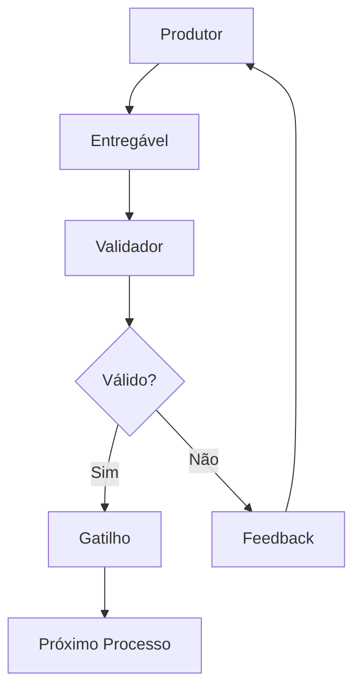

# Sistema de Entregáveis e Gatilhos de Fluxo

## Visão Geral

### Propósito
- [Descrever o objetivo do sistema de entregáveis]
- [Explicar como os entregáveis funcionam como gatilhos]
- [Definir benefícios da automação de fluxo]

### Escopo
- [Definir abrangência do sistema]
- [Listar processos cobertos]
- [Especificar limitações]

### Princípios Fundamentais
- **Automatização**: [Princípio de automação]
- **Padronização**: [Princípio de padronização]
- **Rastreabilidade**: [Princípio de rastreabilidade]
- **Qualidade**: [Princípio de qualidade]

## Arquitetura do Sistema

### Componentes Principais

#### 1. Produtores de Entregáveis
- [Definir quem/o que produz entregáveis]
- [Listar responsabilidades]
- [Especificar padrões de output]

#### 2. Validadores de Completude
- [Definir critérios de validação]
- [Especificar regras de qualidade]
- [Listar verificações automáticas]

#### 3. Sistema de Gatilhos
- [Explicar mecanismo de gatilhos]
- [Definir condições de ativação]
- [Especificar ações automáticas]

#### 4. Orquestrador de Fluxo
- [Definir papel do orquestrador]
- [Especificar lógica de roteamento]
- [Listar regras de priorização]

### Fluxo de Dados



## Estrutura de Entregáveis

### Template Padrão

```yaml
# Metadados do Entregável
entregavel:
  id: "[ID_UNICO]"
  tipo: "[TIPO_ENTREGAVEL]"
  versao: "[VERSAO]"
  timestamp: "[DATA_HORA]"
  produtor: "[RESPONSAVEL]"
  status: "[STATUS]"

# Conteúdo Principal
conteudo:
  titulo: "[TITULO]"
  descricao: "[DESCRICAO]"
  artefatos:
    - tipo: "[TIPO_ARTEFATO]"
      caminho: "[CAMINHO_ARQUIVO]"
      checksum: "[HASH_VERIFICACAO]"

# Critérios de Qualidade
qualidade:
  criterios_atendidos: []
  metricas:
    - nome: "[NOME_METRICA]"
      valor: "[VALOR]"
      unidade: "[UNIDADE]"

# Gatilhos Configurados
gatilhos:
  proximos_processos: []
  condicoes:
    - tipo: "[TIPO_CONDICAO]"
      valor: "[VALOR_ESPERADO]"

# Rastreabilidade
rastreabilidade:
  origem: "[PROCESSO_ORIGEM]"
  dependencias: []
  impacto: []
```

### Tipos de Entregáveis

#### Documentação
- [Especificar tipos de documentos]
- [Definir padrões de formato]
- [Listar critérios de qualidade]

#### Código
- [Especificar tipos de código]
- [Definir padrões de qualidade]
- [Listar verificações automáticas]

#### Configurações
- [Especificar tipos de configuração]
- [Definir padrões de estrutura]
- [Listar validações necessárias]

#### Testes
- [Especificar tipos de teste]
- [Definir critérios de cobertura]
- [Listar métricas de qualidade]

## Sistema de Gatilhos

### Tipos de Gatilhos

#### Gatilhos Automáticos
- **Condição**: [Definir condições de ativação]
- **Ação**: [Especificar ações executadas]
- **Timeout**: [Definir tempo limite]

#### Gatilhos Manuais
- **Aprovação**: [Definir processo de aprovação]
- **Revisão**: [Especificar critérios de revisão]
- **Escalação**: [Definir regras de escalação]

#### Gatilhos Condicionais
- **Regras**: [Definir regras de negócio]
- **Prioridades**: [Especificar critérios de priorização]
- **Exceções**: [Listar tratamento de exceções]

### Configuração de Gatilhos

```yaml
gatilho:
  id: "[ID_GATILHO]"
  nome: "[NOME_GATILHO]"
  tipo: "[automatico|manual|condicional]"
  
  # Condições de Ativação
  condicoes:
    - campo: "[CAMPO_ENTREGAVEL]"
      operador: "[eq|ne|gt|lt|contains]"
      valor: "[VALOR_ESPERADO]"
  
  # Ações a Executar
  acoes:
    - tipo: "[TIPO_ACAO]"
      parametros:
        processo: "[PROCESSO_DESTINO]"
        prioridade: "[ALTA|MEDIA|BAIXA]"
        dados: "[DADOS_CONTEXTO]"
  
  # Configurações Avançadas
  configuracoes:
    timeout: "[TEMPO_LIMITE]"
    retry: "[TENTATIVAS]"
    fallback: "[ACAO_ALTERNATIVA]"
```

## Validação e Qualidade

### Critérios de Validação

#### Estrutura
- [Definir validações de estrutura]
- [Especificar campos obrigatórios]
- [Listar formatos aceitos]

#### Conteúdo
- [Definir validações de conteúdo]
- [Especificar regras de negócio]
- [Listar verificações semânticas]

#### Qualidade
- [Definir métricas de qualidade]
- [Especificar thresholds]
- [Listar critérios de aprovação]

### Processo de Validação

1. **Validação Estrutural**
   - [Verificar formato do entregável]
   - [Validar campos obrigatórios]
   - [Verificar tipos de dados]

2. **Validação de Conteúdo**
   - [Verificar regras de negócio]
   - [Validar consistência]
   - [Verificar completude]

3. **Validação de Qualidade**
   - [Executar métricas de qualidade]
   - [Verificar thresholds]
   - [Gerar relatório de qualidade]

## Monitoramento e Métricas

### KPIs do Sistema

#### Performance
- **Tempo de Processamento**: [Definir métrica]
- **Taxa de Sucesso**: [Definir métrica]
- **Throughput**: [Definir métrica]

#### Qualidade
- **Taxa de Rejeição**: [Definir métrica]
- **Tempo de Correção**: [Definir métrica]
- **Satisfação**: [Definir métrica]

#### Eficiência
- **Automação**: [Definir métrica]
- **Redução de Overhead**: [Definir métrica]
- **ROI**: [Definir métrica]

### Dashboards

#### Dashboard Operacional
- [Definir métricas em tempo real]
- [Especificar alertas]
- [Listar ações corretivas]

#### Dashboard Gerencial
- [Definir métricas estratégicas]
- [Especificar relatórios]
- [Listar indicadores de tendência]

## Configuração e Implementação

### Pré-requisitos

#### Técnicos
- [Listar requisitos de infraestrutura]
- [Especificar dependências]
- [Definir configurações mínimas]

#### Organizacionais
- [Definir papéis e responsabilidades]
- [Especificar processos necessários]
- [Listar treinamentos requeridos]

### Processo de Implementação

1. **Planejamento**
   - [Definir escopo de implementação]
   - [Criar cronograma]
   - [Alocar recursos]

2. **Configuração**
   - [Configurar sistema base]
   - [Definir entregáveis]
   - [Configurar gatilhos]

3. **Testes**
   - [Executar testes unitários]
   - [Realizar testes de integração]
   - [Validar fluxos end-to-end]

4. **Deploy**
   - [Implementar em produção]
   - [Configurar monitoramento]
   - [Treinar usuários]

### Configurações Avançadas

#### Personalização
- [Definir opções de personalização]
- [Especificar extensões]
- [Listar integrações]

#### Escalabilidade
- [Definir estratégias de escala]
- [Especificar limites]
- [Listar otimizações]

## Troubleshooting

### Problemas Comuns

#### Gatilhos Não Ativados
- **Sintomas**: [Descrever sintomas]
- **Causas**: [Listar possíveis causas]
- **Soluções**: [Especificar soluções]

#### Validação Falhando
- **Sintomas**: [Descrever sintomas]
- **Causas**: [Listar possíveis causas]
- **Soluções**: [Especificar soluções]

#### Performance Degradada
- **Sintomas**: [Descrever sintomas]
- **Causas**: [Listar possíveis causas]
- **Soluções**: [Especificar soluções]

### Comandos de Diagnóstico

```bash
# Verificar status do sistema
[comando_status]

# Validar configuração
[comando_validacao]

# Monitorar performance
[comando_monitoramento]

# Logs detalhados
[comando_logs]
```

## Segurança

### Controle de Acesso
- [Definir políticas de acesso]
- [Especificar autenticação]
- [Listar autorizações]

### Auditoria
- [Definir logs de auditoria]
- [Especificar eventos rastreados]
- [Listar relatórios de compliance]

### Proteção de Dados
- [Definir classificação de dados]
- [Especificar criptografia]
- [Listar controles de privacidade]

## Manutenção

### Manutenção Preventiva
- [Definir rotinas de manutenção]
- [Especificar verificações periódicas]
- [Listar atualizações necessárias]

### Backup e Recovery
- [Definir estratégia de backup]
- [Especificar procedimentos de recovery]
- [Listar testes de continuidade]

### Evolução do Sistema
- [Definir processo de evolução]
- [Especificar versionamento]
- [Listar critérios de upgrade]

## Documentação de Referência

### Links Úteis
- [Link para documentação técnica]
- [Link para guias de usuário]
- [Link para APIs]

### Contatos
- **Equipe Técnica**: [contato_tecnico]
- **Suporte**: [contato_suporte]
- **Gestão**: [contato_gestao]

### Recursos Adicionais
- [Listar recursos complementares]
- [Especificar treinamentos]
- [Definir comunidades]

---

## Changelog

### [1.0] - [DATA]
- Versão inicial do template
- Estrutura base definida
- Seções principais criadas

---

## Aprovações

| Papel | Nome | Data | Assinatura |
|-------|------|------|------------|
| Autor | [NOME_AUTOR] | [DATA] | [ASSINATURA] |
| Revisor | [NOME_REVISOR] | [DATA] | [ASSINATURA] |
| Aprovador | [NOME_APROVADOR] | [DATA] | [ASSINATURA] |

---

*Este documento é parte do Codex Prime Framework e deve ser mantido atualizado conforme a evolução do projeto.*