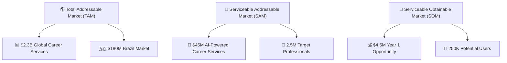
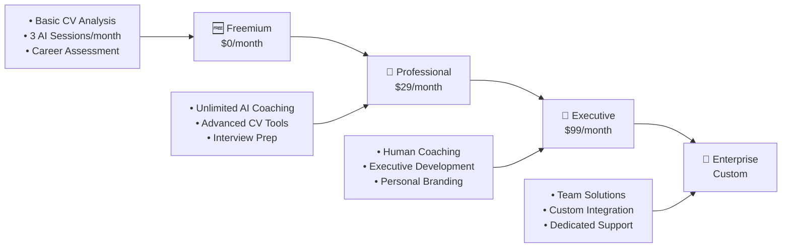
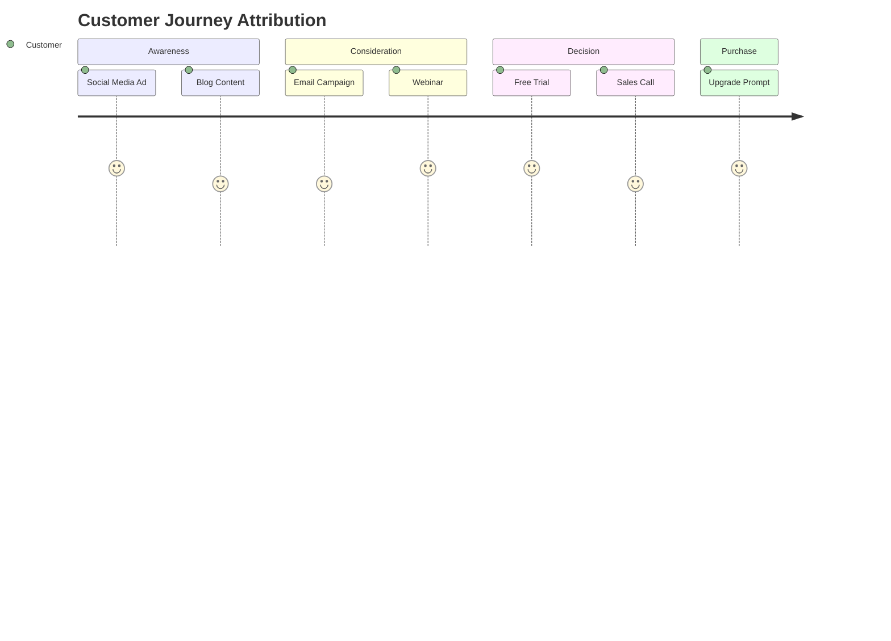
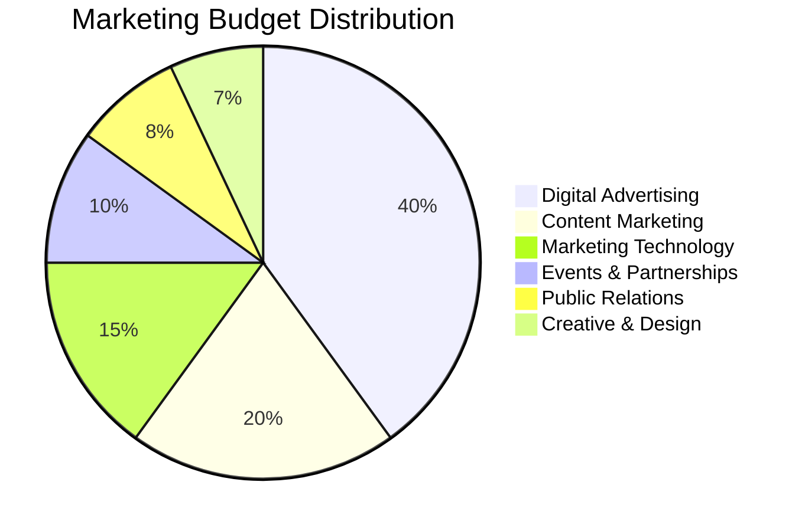

# 🚀 Marketing Strategy - Recoloca.ai Platform

## 📋 Executive Summary

This document outlines the comprehensive marketing strategy for Recoloca.ai, an AI-powered career development platform. Our strategy focuses on establishing market leadership in the career coaching space through data-driven acquisition, engaging content, and exceptional user experience.

### Strategic Objectives

- **Market Position**: Become the #1 AI-powered career development platform in Brazil
- **User Acquisition**: Achieve 100K registered users within 12 months
- **Revenue Growth**: Generate $1M ARR by end of Year 1
- **Brand Recognition**: Establish Recoloca.ai as the trusted career development partner
- **Market Expansion**: Expand to Latin American markets by Year 2

---

## 🎯 Target Market Analysis

### Primary Target Segments

#### 1. **Career Transitioners (35%)**
- **Demographics**: 25-40 years old, college-educated professionals
- **Psychographics**: Ambitious, tech-savvy, seeking career advancement
- **Pain Points**: Unclear career path, outdated skills, interview anxiety
- **Value Proposition**: AI-powered career guidance and skill development

#### 2. **Recent Graduates (30%)**
- **Demographics**: 22-26 years old, university graduates
- **Psychographics**: Eager to start careers, uncertain about market demands
- **Pain Points**: Lack of experience, competitive job market, skill gaps
- **Value Proposition**: Professional CV optimization and interview preparation

#### 3. **Mid-Career Professionals (25%)**
- **Demographics**: 30-45 years old, 5-15 years experience
- **Psychographics**: Seeking leadership roles, higher compensation
- **Pain Points**: Career plateau, leadership skill gaps, market positioning
- **Value Proposition**: Executive coaching and strategic career planning

#### 4. **Career Returners (10%)**
- **Demographics**: 28-50 years old, returning after career breaks
- **Psychographics**: Motivated to re-enter workforce, skill-conscious
- **Pain Points**: Outdated skills, confidence issues, market changes
- **Value Proposition**: Skill assessment and confidence building

### Market Size and Opportunity



---

## 🏆 Brand Positioning & Value Proposition

### Brand Identity

- **Mission**: Empower professionals to achieve their career potential through AI-driven insights
- **Vision**: To be the world's most trusted AI career development partner
- **Values**: Innovation, Empowerment, Transparency, Results-Driven

### Unique Value Proposition

> **"The only AI career coach that combines personalized insights with actionable strategies to accelerate your professional growth."**

#### Key Differentiators

1. **AI-Powered Personalization**
   - Advanced algorithms analyze individual career profiles
   - Personalized recommendations based on market data
   - Continuous learning and adaptation

2. **Comprehensive Career Ecosystem**
   - CV optimization and ATS compatibility
   - Interview preparation and practice
   - Skill gap analysis and development plans
   - Salary negotiation guidance

3. **Real-Time Market Intelligence**
   - Live job market trends and insights
   - Industry-specific career pathways
   - Compensation benchmarking

4. **Measurable Results**
   - Track career progress with KPIs
   - Success rate transparency
   - ROI measurement tools

### Brand Messaging Framework

| Audience | Primary Message | Supporting Points |
|----------|----------------|------------------|
| **Career Transitioners** | "Transform your career with AI-powered guidance" | • Personalized career roadmaps<br>• Industry transition support<br>• Skill development plans |
| **Recent Graduates** | "Launch your career with confidence" | • Professional CV creation<br>• Interview mastery<br>• Market-ready skills |
| **Mid-Career Professionals** | "Accelerate your path to leadership" | • Executive presence development<br>• Strategic career planning<br>• Leadership skill building |
| **Career Returners** | "Confidently re-enter the workforce" | • Skill assessment and updates<br>• Confidence building<br>• Market re-entry strategies |

---

## 📈 Marketing Mix Strategy (4Ps)

### Product Strategy

#### Core Product Offerings

1. **Freemium Tier**
   - Basic CV analysis
   - Limited AI coaching sessions
   - Career assessment tools
   - Community access

2. **Professional Tier ($29/month)**
   - Unlimited AI coaching
   - Advanced CV optimization
   - Interview preparation
   - Salary negotiation tools
   - Priority support

3. **Executive Tier ($99/month)**
   - 1-on-1 human coaching
   - Executive presence development
   - Leadership assessment
   - Personal branding strategy
   - Network building tools

4. **Enterprise Solutions (Custom)**
   - Team career development
   - Talent retention programs
   - Succession planning
   - Custom integrations

#### Product Development Roadmap

**Q1 2025**
- Enhanced AI coaching algorithms
- Mobile app launch (iOS/Android)
- Integration with LinkedIn

**Q2 2025**
- Video interview practice
- Industry-specific career paths
- Mentorship marketplace

**Q3 2025**
- Skills certification programs
- Corporate partnerships
- Advanced analytics dashboard

**Q4 2025**
- International expansion features
- Multi-language support
- Enterprise API platform

### Pricing Strategy

#### Pricing Model: Value-Based Tiered Pricing



#### Pricing Psychology

- **Anchoring**: Executive tier positions Professional tier as "best value"
- **Freemium Conversion**: 15% target conversion rate from free to paid
- **Annual Discounts**: 20% discount for annual subscriptions
- **Student Pricing**: 50% discount for verified students

### Place (Distribution) Strategy

#### Primary Channels

1. **Direct-to-Consumer (70%)**
   - Recoloca.ai website
   - Mobile applications
   - Email marketing
   - Social media

2. **Partnership Channels (20%)**
   - University career centers
   - Professional associations
   - HR consulting firms
   - Recruitment agencies

3. **Affiliate Program (10%)**
   - Career coaches and consultants
   - Influencer partnerships
   - Referral programs
   - Content creators

#### Channel Strategy

- **Omnichannel Experience**: Seamless user journey across all touchpoints
- **Mobile-First**: Prioritize mobile experience for on-the-go professionals
- **Partnership Integration**: White-label solutions for strategic partners
- **Global Accessibility**: Multi-language and multi-currency support

### Promotion Strategy

#### Integrated Marketing Communications

1. **Digital Marketing (60% of budget)**
   - Search Engine Marketing (SEM)
   - Social Media Advertising
   - Content Marketing
   - Email Marketing
   - Influencer Partnerships

2. **Content Marketing (25% of budget)**
   - Blog and SEO content
   - Video tutorials and webinars
   - Podcasts and interviews
   - E-books and whitepapers
   - Case studies and success stories

3. **Public Relations (10% of budget)**
   - Media relations
   - Industry awards and recognition
   - Speaking engagements
   - Thought leadership

4. **Events and Partnerships (5% of budget)**
   - Career fairs and conferences
   - University partnerships
   - Corporate workshops
   - Community events

---

## 🎨 Creative Strategy & Brand Guidelines

### Visual Identity

#### Brand Colors
- **Primary**: #2563EB (Professional Blue)
- **Secondary**: #10B981 (Success Green)
- **Accent**: #F59E0B (Energy Orange)
- **Neutral**: #6B7280 (Professional Gray)

#### Typography
- **Headlines**: Inter Bold
- **Body Text**: Inter Regular
- **UI Elements**: Inter Medium

#### Brand Voice & Tone

- **Professional yet Approachable**: Expert guidance without intimidation
- **Empowering**: Focus on user potential and growth
- **Data-Driven**: Back claims with research and results
- **Supportive**: Understanding of career challenges
- **Forward-Looking**: Focus on future opportunities

### Content Themes

1. **Career Transformation Stories**
   - User success stories
   - Before/after career journeys
   - Industry transition examples

2. **Industry Insights**
   - Job market trends
   - Salary reports
   - Skill demand analysis

3. **Professional Development**
   - Skill-building guides
   - Leadership development
   - Interview techniques

4. **AI and Technology**
   - AI career coaching benefits
   - Technology in recruitment
   - Future of work insights

---

## 📊 Digital Marketing Strategy

### Search Engine Marketing (SEM)

#### SEO Strategy

**Target Keywords (Primary)**
- "career coaching" (22K monthly searches)
- "CV optimization" (8.1K monthly searches)
- "interview preparation" (12K monthly searches)
- "career change" (18K monthly searches)
- "professional development" (15K monthly searches)

**Content Pillars**
1. **Career Guidance** (40% of content)
2. **Professional Skills** (30% of content)
3. **Industry Insights** (20% of content)
4. **Success Stories** (10% of content)

**SEO Tactics**
- Long-tail keyword optimization
- Featured snippet targeting
- Local SEO for Brazilian market
- Technical SEO optimization
- Link building through partnerships

#### Paid Search (Google Ads)

**Campaign Structure**
```
📁 Account: Recoloca.ai
├── 📂 Brand Campaigns
│   ├── 🎯 Brand Terms
│   └── 🎯 Competitor Terms
├── 📂 Generic Campaigns
│   ├── 🎯 Career Coaching
│   ├── 🎯 CV Optimization
│   └── 🎯 Interview Prep
└── 📂 Remarketing Campaigns
    ├── 🎯 Website Visitors
    └── 🎯 App Users
```

**Budget Allocation**
- Brand Campaigns: 20%
- Generic Campaigns: 60%
- Remarketing: 20%

**Target Metrics**
- Cost Per Acquisition (CPA): $25
- Return on Ad Spend (ROAS): 4:1
- Click-Through Rate (CTR): 3.5%
- Quality Score: 8+

### Social Media Marketing

#### Platform Strategy

**LinkedIn (Primary - 50% of social budget)**
- **Audience**: Professional network, decision-makers
- **Content**: Industry insights, career tips, success stories
- **Tactics**: Sponsored content, InMail campaigns, video ads
- **KPIs**: Engagement rate, lead generation, brand awareness

**Instagram (Secondary - 25% of social budget)**
- **Audience**: Younger professionals, visual learners
- **Content**: Behind-the-scenes, user stories, infographics
- **Tactics**: Stories, Reels, influencer partnerships
- **KPIs**: Reach, engagement, website traffic

**YouTube (Growth - 15% of social budget)**
- **Audience**: Learning-focused professionals
- **Content**: Tutorials, webinars, expert interviews
- **Tactics**: Educational content, ads before career videos
- **KPIs**: View time, subscribers, conversion rate

**TikTok (Experimental - 10% of social budget)**
- **Audience**: Gen Z entering workforce
- **Content**: Quick career tips, trending topics
- **Tactics**: Hashtag challenges, micro-influencers
- **KPIs**: Views, shares, brand mentions

#### Content Calendar Framework

**Weekly Content Mix**
- **Monday**: Motivation Monday (inspirational content)
- **Tuesday**: Tip Tuesday (actionable career advice)
- **Wednesday**: Wisdom Wednesday (industry insights)
- **Thursday**: Transformation Thursday (success stories)
- **Friday**: Feature Friday (product highlights)

### Email Marketing Strategy

#### Email Segmentation

1. **Lifecycle Stages**
   - Prospects (not yet users)
   - Free users (freemium tier)
   - Paid subscribers (professional/executive)
   - Churned users (win-back campaigns)

2. **Behavioral Segments**
   - Engagement level (high, medium, low)
   - Feature usage patterns
   - Career stage and goals
   - Industry and role type

#### Email Campaign Types

**Welcome Series (5 emails over 2 weeks)**
1. Welcome & platform introduction
2. Getting started guide
3. Success story and social proof
4. Feature deep-dive
5. Upgrade invitation

**Weekly Newsletter**
- Career insights and trends
- New feature announcements
- User success highlights
- Upcoming events and webinars

**Behavioral Triggers**
- Onboarding completion
- Feature adoption
- Upgrade opportunities
- Re-engagement campaigns

**Target Metrics**
- Open Rate: 25%
- Click-Through Rate: 4%
- Conversion Rate: 2%
- Unsubscribe Rate: <1%

---

## 🤝 Partnership & Influencer Strategy

### Strategic Partnerships

#### University Partnerships
- **Target**: Top 50 universities in Brazil
- **Offering**: Free access for career centers
- **Benefits**: Student pipeline, brand credibility
- **Success Metrics**: Student sign-ups, graduation outcomes

#### Corporate Partnerships
- **Target**: HR departments of Fortune 500 companies
- **Offering**: Employee development programs
- **Benefits**: B2B revenue, user acquisition
- **Success Metrics**: Contract value, employee engagement

#### Professional Associations
- **Target**: Industry-specific professional groups
- **Offering**: Member discounts and exclusive content
- **Benefits**: Targeted audience access, credibility
- **Success Metrics**: Member conversion, retention rates

### Influencer Marketing

#### Influencer Tiers

**Macro-Influencers (100K+ followers)**
- Career coaches and HR experts
- Business leaders and entrepreneurs
- Investment: $5K-$15K per campaign
- Focus: Brand awareness and credibility

**Micro-Influencers (10K-100K followers)**
- Industry professionals and specialists
- Recent career success stories
- Investment: $500-$2K per campaign
- Focus: Authentic recommendations

**Nano-Influencers (1K-10K followers)**
- Satisfied users and brand advocates
- Employee ambassadors
- Investment: Product access + small fee
- Focus: Authentic user-generated content

#### Campaign Types

1. **Product Reviews**: Honest platform evaluations
2. **Success Stories**: Career transformation journeys
3. **Educational Content**: Career tips and insights
4. **Live Sessions**: Q&A and coaching demonstrations

---

## 📈 Growth Marketing & Optimization

### Growth Funnel Analysis

```mermaid
funnel
    title Growth Funnel - Recoloca.ai
    "Awareness" : 100000
    "Interest" : 25000
    "Consideration" : 10000
    "Trial" : 5000
    "Purchase" : 750
    "Retention" : 600
    "Advocacy" : 150
```

#### Funnel Optimization Strategies

**Awareness → Interest (25% conversion)**
- Improve ad targeting and messaging
- Enhance content quality and relevance
- Expand reach through partnerships

**Interest → Consideration (40% conversion)**
- Strengthen value proposition communication
- Provide social proof and testimonials
- Offer valuable lead magnets

**Consideration → Trial (50% conversion)**
- Simplify sign-up process
- Reduce friction in onboarding
- Provide immediate value demonstration

**Trial → Purchase (15% conversion)**
- Improve product experience
- Implement effective nurturing campaigns
- Offer limited-time incentives

**Purchase → Retention (80% retention)**
- Enhance customer success programs
- Provide ongoing value and support
- Implement loyalty programs

**Retention → Advocacy (25% advocacy)**
- Create referral programs
- Encourage user-generated content
- Build community engagement

### A/B Testing Framework

#### Testing Priorities

1. **Landing Page Optimization**
   - Headlines and value propositions
   - Call-to-action buttons
   - Form fields and layout
   - Social proof placement

2. **Email Marketing**
   - Subject lines and send times
   - Content format and length
   - Personalization strategies
   - Call-to-action placement

3. **Ad Creative Testing**
   - Visual elements and messaging
   - Audience targeting
   - Ad formats and placements
   - Bidding strategies

4. **Product Experience**
   - Onboarding flow
   - Feature adoption
   - Upgrade prompts
   - User interface elements

#### Testing Methodology

- **Statistical Significance**: 95% confidence level
- **Minimum Sample Size**: 1,000 users per variant
- **Test Duration**: Minimum 2 weeks
- **Success Metrics**: Conversion rate, engagement, retention

### Referral Program Strategy

#### Program Structure

**Referrer Rewards**
- 1 month free subscription for each successful referral
- Bonus rewards for multiple referrals (3 referrals = 6 months free)
- Exclusive access to premium features

**Referee Benefits**
- 50% discount on first month
- Extended free trial period
- Bonus AI coaching sessions

#### Promotion Tactics

- In-app referral prompts
- Email campaign series
- Social media sharing tools
- Gamification elements

**Target Metrics**
- Referral Rate: 15% of active users
- Conversion Rate: 25% of referred users
- Viral Coefficient: 0.5

---

## 📊 Marketing Analytics & KPIs

### Key Performance Indicators

#### Acquisition Metrics

| Metric | Target | Current | Trend |
|--------|--------|---------|-------|
| **Monthly Active Users (MAU)** | 50K | 12K | ↗️ +15% MoM |
| **Cost Per Acquisition (CPA)** | $25 | $32 | ↘️ -8% MoM |
| **Conversion Rate** | 15% | 12% | ↗️ +2% MoM |
| **Organic Traffic Growth** | 20% MoM | 18% MoM | ↗️ Steady |
| **Social Media Followers** | 100K | 25K | ↗️ +25% MoM |

#### Engagement Metrics

| Metric | Target | Current | Trend |
|--------|--------|---------|-------|
| **Email Open Rate** | 25% | 22% | ↗️ +1% MoM |
| **Click-Through Rate** | 4% | 3.2% | ↗️ +0.3% MoM |
| **Social Engagement Rate** | 5% | 4.1% | ↗️ +0.5% MoM |
| **Content Shares** | 1K/month | 650/month | ↗️ +12% MoM |
| **Video View Rate** | 60% | 55% | ↗️ +3% MoM |

#### Revenue Metrics

| Metric | Target | Current | Trend |
|--------|--------|---------|-------|
| **Monthly Recurring Revenue (MRR)** | $100K | $35K | ↗️ +20% MoM |
| **Customer Lifetime Value (CLV)** | $300 | $245 | ↗️ +5% MoM |
| **Average Revenue Per User (ARPU)** | $35 | $28 | ↗️ +3% MoM |
| **Churn Rate** | 5% | 7% | ↘️ -1% MoM |
| **Net Revenue Retention** | 110% | 105% | ↗️ +2% MoM |

### Attribution Modeling

#### Multi-Touch Attribution



**Attribution Weights**
- First Touch: 20%
- Middle Touches: 40% (distributed)
- Last Touch: 40%

### Reporting Dashboard

#### Executive Dashboard (Weekly)
- Revenue and growth metrics
- User acquisition and retention
- Marketing ROI and efficiency
- Competitive positioning

#### Marketing Dashboard (Daily)
- Campaign performance
- Traffic and conversion metrics
- Content engagement
- Social media metrics

#### Channel Dashboard (Real-time)
- Paid advertising performance
- Organic search rankings
- Email campaign results
- Social media engagement

---

## 💰 Marketing Budget & Resource Allocation

### Annual Marketing Budget: $500K

#### Budget Allocation by Channel



#### Detailed Budget Breakdown

| Category | Annual Budget | Monthly Budget | Key Activities |
|----------|---------------|----------------|----------------|
| **Digital Advertising** | $200K | $16.7K | Google Ads, Social Media Ads, Display |
| **Content Marketing** | $100K | $8.3K | Blog, Video, Podcasts, SEO Tools |
| **Marketing Technology** | $75K | $6.3K | CRM, Analytics, Automation Tools |
| **Events & Partnerships** | $50K | $4.2K | Conferences, Sponsorships, Partnerships |
| **Public Relations** | $40K | $3.3K | PR Agency, Media Relations, Awards |
| **Creative & Design** | $35K | $2.9K | Design Tools, Photography, Video Production |

### Team Structure & Roles

#### Core Marketing Team (6 FTEs)

1. **Marketing Director** (1 FTE)
   - Strategy and planning
   - Team leadership
   - Executive reporting
   - Budget management

2. **Digital Marketing Manager** (1 FTE)
   - Paid advertising campaigns
   - SEM and social media
   - Performance optimization
   - Analytics and reporting

3. **Content Marketing Manager** (1 FTE)
   - Content strategy and creation
   - SEO optimization
   - Blog and video content
   - Editorial calendar

4. **Growth Marketing Specialist** (1 FTE)
   - Conversion optimization
   - A/B testing
   - Email marketing
   - Referral programs

5. **Social Media Manager** (1 FTE)
   - Social media strategy
   - Community management
   - Influencer partnerships
   - User-generated content

6. **Marketing Analyst** (1 FTE)
   - Data analysis and insights
   - Performance reporting
   - Attribution modeling
   - ROI measurement

#### External Partners

- **PR Agency**: $3K/month retainer
- **Creative Agency**: $5K/month for design and video
- **SEO Consultant**: $2K/month for technical SEO
- **Influencer Platform**: $1K/month for influencer management

---

## 🎯 Campaign Planning & Execution

### Q1 2025 Campaign Calendar

#### January: "New Year, New Career" Campaign

**Objective**: Capitalize on New Year career resolutions

**Tactics**:
- Career transformation content series
- Free career assessment promotion
- Social media challenge: #NewYearNewCareer
- Influencer partnerships with career coaches

**Budget**: $45K
**Target**: 5K new sign-ups
**KPIs**: Brand awareness, trial conversions

#### February: "Love Your Career" Campaign

**Objective**: Focus on career satisfaction and passion

**Tactics**:
- Career passion assessment tool
- Success story video series
- Valentine's Day themed content
- Partnership with relationship coaches

**Budget**: $35K
**Target**: 3K new sign-ups
**KPIs**: Engagement, content shares

#### March: "Women's Career Month" Campaign

**Objective**: Support women's career advancement

**Tactics**:
- Women in leadership content
- Female executive interviews
- Scholarship program for women
- Partnership with women's organizations

**Budget**: $40K
**Target**: 4K new sign-ups
**KPIs**: Female user acquisition, brand sentiment

### Campaign Execution Framework

#### Pre-Launch (2 weeks before)
- Creative asset development
- Landing page optimization
- Email sequence setup
- Influencer outreach
- PR pitch preparation

#### Launch Week
- Campaign activation across all channels
- Social media content publishing
- Email campaign deployment
- PR outreach execution
- Performance monitoring

#### Post-Launch (2 weeks after)
- Performance analysis and reporting
- Optimization based on results
- Follow-up campaigns for leads
- Success story collection
- Lessons learned documentation

---

## 🔍 Competitive Analysis & Positioning

### Competitive Landscape

#### Direct Competitors

**1. CareerBuilder AI Coach**
- **Strengths**: Established brand, large user base
- **Weaknesses**: Generic approach, limited personalization
- **Market Share**: 25%
- **Positioning**: "Find your next job faster"

**2. LinkedIn Career Advice**
- **Strengths**: Professional network integration, credibility
- **Weaknesses**: Limited AI capabilities, basic features
- **Market Share**: 35%
- **Positioning**: "Professional networking and career growth"

**3. Zety Career Services**
- **Strengths**: Strong CV tools, affordable pricing
- **Weaknesses**: Limited coaching, no AI personalization
- **Market Share**: 15%
- **Positioning**: "Professional CV and resume builder"

#### Indirect Competitors

- Traditional career coaches
- University career centers
- HR consulting firms
- Online learning platforms

### Competitive Advantages

1. **Advanced AI Technology**
   - Proprietary algorithms for career matching
   - Continuous learning and improvement
   - Personalized recommendations

2. **Comprehensive Platform**
   - End-to-end career development
   - Integrated tools and resources
   - Seamless user experience

3. **Market Focus**
   - Brazilian market specialization
   - Local job market insights
   - Portuguese language optimization

4. **Results-Driven Approach**
   - Measurable outcomes
   - Success rate transparency
   - ROI demonstration

### Competitive Response Strategy

#### Defensive Strategies
- Continuous product innovation
- Strong customer relationships
- Brand loyalty programs
- Intellectual property protection

#### Offensive Strategies
- Aggressive market expansion
- Competitive pricing
- Superior customer experience
- Strategic partnerships

---

## 📅 Implementation Timeline

### Phase 1: Foundation (Months 1-3)

**Month 1**
- Team hiring and onboarding
- Marketing technology setup
- Brand guidelines finalization
- Website optimization

**Month 2**
- Content creation and SEO
- Social media account setup
- Influencer partnership outreach
- Email marketing automation

**Month 3**
- Paid advertising campaign launch
- PR campaign initiation
- Partnership negotiations
- Performance tracking setup

### Phase 2: Growth (Months 4-6)

**Month 4**
- Campaign optimization based on data
- Content marketing scaling
- Referral program launch
- A/B testing implementation

**Month 5**
- International expansion planning
- Advanced feature marketing
- Corporate partnership development
- User-generated content campaigns

**Month 6**
- Mid-year performance review
- Strategy refinement
- Budget reallocation
- Team expansion planning

### Phase 3: Scale (Months 7-12)

**Months 7-9**
- Market expansion execution
- Advanced automation implementation
- Strategic partnership activation
- Brand awareness campaigns

**Months 10-12**
- Year-end optimization
- Next year planning
- Success story compilation
- Award submissions

---

## 🎯 Success Metrics & ROI

### Primary Success Metrics

#### Business Impact
- **Revenue Growth**: $1M ARR target
- **User Acquisition**: 100K registered users
- **Market Share**: 10% of Brazilian market
- **Brand Recognition**: 25% aided awareness

#### Marketing Efficiency
- **Customer Acquisition Cost**: <$25
- **Return on Marketing Investment**: 5:1
- **Marketing Qualified Leads**: 10K/month
- **Conversion Rate**: 15% trial to paid

#### Brand Health
- **Net Promoter Score**: >50
- **Brand Sentiment**: 80% positive
- **Share of Voice**: 15% in category
- **Customer Satisfaction**: 4.5/5 rating

### ROI Calculation Framework

#### Marketing ROI Formula
```
Marketing ROI = (Revenue Attributed to Marketing - Marketing Investment) / Marketing Investment × 100
```

#### Customer Lifetime Value (CLV)
```
CLV = (Average Monthly Revenue × Gross Margin %) / Monthly Churn Rate
```

#### Payback Period
```
Payback Period = Customer Acquisition Cost / (Monthly Revenue × Gross Margin %)
```

### Performance Review Schedule

- **Daily**: Campaign performance monitoring
- **Weekly**: KPI dashboard review
- **Monthly**: Comprehensive performance analysis
- **Quarterly**: Strategy review and optimization
- **Annually**: Complete strategy evaluation

---

## 🚀 Future Opportunities & Innovation

### Emerging Trends

1. **AI and Machine Learning**
   - Advanced personalization algorithms
   - Predictive career analytics
   - Natural language processing

2. **Virtual and Augmented Reality**
   - VR interview simulations
   - AR workplace training
   - Immersive career exploration

3. **Blockchain and Web3**
   - Verified skill credentials
   - Decentralized career networks
   - Token-based incentives

4. **Voice and Conversational AI**
   - Voice-activated coaching
   - Conversational interfaces
   - Audio content consumption

### Innovation Roadmap

#### Short-term (6-12 months)
- Enhanced AI coaching algorithms
- Mobile app advanced features
- Integration with job boards
- Predictive career analytics

#### Medium-term (1-2 years)
- VR interview simulations
- Blockchain skill verification
- Voice-activated coaching
- Global market expansion

#### Long-term (2-5 years)
- AI-powered career ecosystem
- Metaverse career experiences
- Quantum computing applications
- Universal career platform

---

## 📚 Appendices

### Appendix A: Market Research Data
- Industry reports and analysis
- Competitor intelligence
- User survey results
- Focus group insights

### Appendix B: Creative Assets
- Brand guidelines document
- Logo variations and usage
- Color palette and typography
- Template library

### Appendix C: Campaign Templates
- Email campaign templates
- Social media post templates
- Ad creative templates
- Landing page wireframes

### Appendix D: Vendor and Partner Contacts
- Agency contact information
- Influencer database
- Partnership opportunities
- Vendor evaluation criteria

---

**Document Information:**
- **Created**: 2025-01-20
- **Last Updated**: 2025-01-20
- **Version**: 1.0
- **Status**: Active
- **Owner**: @MarketingTeam
- **Next Review**: 2025-04-20